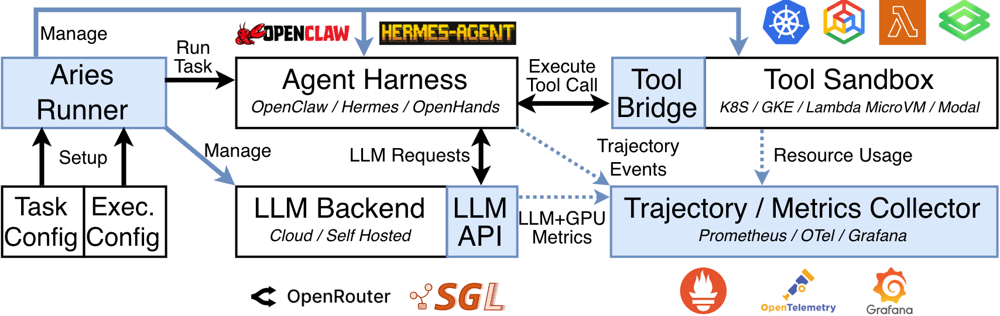

# ARIES: Agent Runtime & Infrastructure Experimentation System

ARIES is an open-source experimentation framework for agent serving systems.
It lets systems researchers run reproducible agent benchmarks while observing
the full task trajectory: repeated model calls, harness decisions, stateful tool
execution, task outcome, and available resource telemetry.

Agent workloads are not isolated LLM requests. An agent repeatedly observes its
state, invokes a model, executes tools in a sandbox, and incorporates the
results into the next step. ARIES treats that ordered, end-to-end trajectory as
the unit of experimentation, so researchers can relate task progress and
correctness to behavior across the agent-serving stack.

## Mission

ARIES aims to help researchers innovate across the software and systems stack
that serves AI agents. Conventional model-serving measurements—such as token
throughput or per-request latency—do not explain delays, resource pressure, or
failures that occur in agent harnesses and tool sandboxes. ARIES bridges that
measurement gap by keeping task semantics independent from the execution stack,
making stateful tool execution consistently observable, and preserving evidence
needed to reconstruct a run.

The framework supports controlled comparisons across agent harnesses, model
backends, and sandbox substrates without changing the benchmark task being
evaluated. It is designed for experiments that connect task success with
end-to-end latency, resource use, and execution behavior—not only model-call
metrics.

## Why ARIES

ARIES is built around three needs of agent-serving research:

- **Preserve task semantics across configurations.** Benchmark tasks and their
evaluation stay separate from the chosen harness, model backend, tool bridge,
sandbox, and telemetry setup.
- **Observe complete agent trajectories.** Run artifacts and correlated
component evidence make it possible to study where an agent spends time and
how execution behavior relates to the final outcome.
- **Make stateful tool execution comparable.** A narrow bridge gives the
harness temporary access to a persistent task environment while sandbox
adapters retain control of lifecycle, isolation, and resource observation.
- **Ground systems research in production behavior. (will be added soon!)** The included
 [Ant Group Agentic LLM Trace 2026](docs/ant-group-agent-LLM-trace.md) captures
engine request logs and harness-environment metrics from a real online
serving workload.

This enables research on questions such as whether tool and harness work—not
inference alone—limits task completion; how retained trajectory context trades
accuracy for serving capacity; and how sandbox resource management and
isolation should evolve for long-running agents.

## ARIES architecture



ARIES separates benchmark task meaning from execution configuration. For every
task, the Runner composes four substitutable roles:

| Role | Responsibility |
| --- | --- |
| `Benchmark` | Loads tasks, keeps verifier material private, prepares the live sandbox, and independently evaluates final task state. |
| `AgentHarness` | Runs the configured agent and its model interaction. |
| `ToolSandbox` | Owns the isolated task environment and confirms its cleanup. |
| `ToolBridge` | Grants one harness temporary, narrow access to one sandbox and positively revokes it. |

The model service and recorder surround this per-task composition. A model
endpoint may be external or, for SGLang, managed for a profile run; neither is a
fifth Runner role.

The lifecycle is deliberately fail-closed: ARIES stops the harness and confirms
that the bridge has been revoked before exposing private verifier material for
evaluation. Evaluation runs against the still-live sandbox and remains separate
from the harness outcome; ARIES then removes the sandbox. This keeps agent
execution, tool access, and scoring under distinct ownership while retaining
replayable private evidence for a run.

Read the [Architecture](docs/design.md) for the complete lifecycle, isolation
gates, concurrency model, artifact boundaries, and extension contract.

## Current implementation

The research framework is intended to support multiple harnesses, benchmarks,
and sandbox substrates. This repository currently wires the following explicit
implementations:

| Role or service | Implementation |
| --- | --- |
| Agent harness | OpenClaw (text and realtime voice modes); Hermes (text) |
| Benchmark | Terminal-Bench 2 |
| Tool sandbox | Docker, using the Moby Go SDK |
| Tool bridge | OpenClaw–Docker SSH bridge; Hermes–Docker SSH bridge |
| Model service | External DeepSeek; external or ARIES-managed SGLang |

See [Supported implementations](docs/supported.md) for ownership,
configuration keys, status, and runnable profiles. ARIES uses explicit
constructors and command switches; it does not discover or register components
at runtime.

## Getting started

ARIES requires Linux, a local Docker Engine, Go, Git, Make, network access to
the configured model service, and access to required image registries.

```sh
make build
./bin/aries profiles/openclaw-tb2-fix-git-deepseek.json
```

Before a run, ARIES idempotently prepares the pinned benchmark checkout and
required container images. `aries setup PROFILE.json` is available to prewarm
those inputs; it does not start a managed runtime, load model weights, or
contact an external model endpoint.

The DeepSeek example requires an API key and can incur charges. The
[Quick start](docs/quick-start.md) covers secure credential setup, the first
run, SGLang alternatives, result inspection, and troubleshooting.

## Research and roadmap

ARIES accompanies the paper [*Rethinking AI Cloud Infrastructure for Agentic
Serving Systems with the Aries Experimentation Framework*](https://arxiv.org/abs/2607.29069).
The paper uses ARIES alongside anonymized production traces to study agent
serving beyond token-centric metrics, including harness and tool critical-path
costs, context-capacity trade-offs, bursty sandbox resources, and sandbox attack
surface.

[Aries Roadmap](https://github.com/orgs/hyscale-lab/projects/7)

Future work may add rigorously tested implementations behind the existing
component boundaries and broaden repeatable experiment workflows. Those are
research directions, not claims of currently supported integrations.

## Industry collaborators

ARIES is built and maintained in collaboration with Amazon Web Services,
Microsoft, AMD Singapore, Ant Group, and NCSpeech.

## Community, contributing, and contact

Contributions are welcome through [GitHub issues](https://github.com/hyscale-lab/aries/issues)
and pull requests. Questions and design proposals can use
the issue tracker so the discussion remains available to the community.

## Maintainers
### Agent Harness, Benchmark, Tool Sandbox, Tool Bridge
- JooYoung Park (jooyoung001 at e.ntu.edu.sg)
- Leonid Kondrashov (leonid001 at e.ntu.edu.sg)

### GPU, Industry Traces
- Chengzhi Lu (chengzhi.lu at ntu.edu.sg), 

## Citation

```bibtex
@misc{kondrashov2026rethinkingaicloudinfrastructure,
title={Rethinking AI Cloud Infrastructure for Agentic Serving Systems with the Aries Experimentation Framework},
author={Leonid Kondrashov and Hongrui Liu and JooYoung Park and Boxi Zhou and Zonghao Liu and Chengzhi Lu and Riccardo Mancini and Esha Choukse and Haris Javaid and German Sviridov and Tao Peng and Chen Zhao and Anastasia Avdeeva and Aleksei Gusev and Marios Kogias and Luo Mai and Dmitrii Ustiugov},
year={2026},
eprint={2607.29069},
archivePrefix={arXiv},
primaryClass={cs.DC},
url={https://arxiv.org/abs/2607.29069},
}
```

## License

ARIES code base is licensed under the [MIT License](LICENSE-CODE).

The trace from Ant Group is under the [CC-BY-4.0](LICENSE).