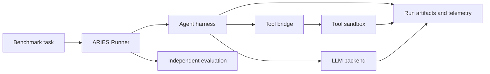
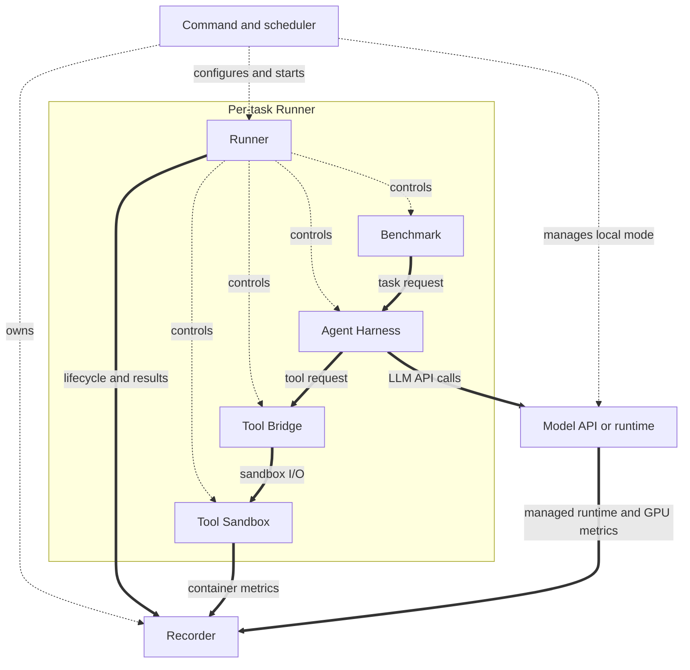

# Architecture

ARIES runs agent benchmarks while keeping the agent, task environment, tool
access, and evaluation under separate ownership. The command layer reads a
profile, constructs a fresh Runner for each admitted task, and records results
without changing the task lifecycle. Multiple task occurrences may run
concurrently; every occurrence still receives its own components and sandbox.

## System overview

Dashed arrows are control and management paths. Solid arrows are logical data
paths; the Runner remains the caller and orchestrator. The ordered safety gates
are described below.

The Runner composes exactly four substitutable roles:

| Role | Responsibility |
| --- | --- |
| [`Benchmark`](design/benchmark.md) | Loads tasks, sanitizes the live sandbox, keeps verifier material private, and evaluates final task state. |
| [`Agent Harness`](design/harness.md) | Runs the configured agent and model interaction without owning the task environment or evaluator. |
| [`Tool Sandbox`](design/sandbox.md) | Starts, exposes a narrow live capability for, and positively stops the task environment. |
| [`Tool Bridge`](design/bridge.md) | Grants one harness temporary access to one sandbox and positively revokes that access. |

The [model runtime](design/runtime.md) is a surrounding platform service. It may
be external or managed by ARIES for the duration of a run, but it is
not a fifth Runner role. Recording and command-level scheduling likewise
surround the four-role task composition rather than expanding it.

## Task lifecycle and isolation gates

For every task the Runner performs this order:

1. load the benchmark task;
2. start the task sandbox;
3. let the benchmark sanitize the live sandbox and confirm verifier paths are absent;
4. start the bridge for that exact sandbox;
5. start and run the harness;
6. positively stop the harness;
7. revoke the bridge and positively confirm access is gone;
8. evaluate the still-running sandbox;
9. stop the sandbox and confirm its resources are absent.

Cleanup follows reverse ownership order and uses bounded cleanup work even when
the run context has been cancelled. Partial starts still trigger cleanup, and
stop operations are safe to repeat. Failures to confirm harness absence or
bridge revocation block evaluation. Verifier tests and solutions are not
uploaded until both isolation gates succeed, so a possibly live agent path
cannot observe them.

Evaluation belongs to the Benchmark and is independent of the AgentHarness.
Harness execution can fail while evaluation still reports the state that was
left behind; ARIES records harness and evaluation outcomes separately. The
sandbox remains live only long enough for that independent evaluation, then is
positively removed.

## Composition, concurrency, and artifacts

Concrete implementations are selected through explicit constructors and
switches in the command wiring. There is no runtime discovery or registration
layer. The command layer can admit independent task occurrences concurrently,
but profile order determines admission and result order, and every admitted
occurrence drains through the full lifecycle.

Run output contains structured lifecycle and outcome records plus component
artifacts. Replayable bridge input, child logs, rendered harness configuration,
and benchmark evaluation evidence are private run artifacts and should be
reviewed before sharing. Model credential values are not stored in profiles,
structured logs, Docker metadata, or results.

## Detailed Design

## Guides

- [Benchmark](design/benchmark.md)
- [Agent harness](design/harness.md)
- [Tool sandbox](design/sandbox.md)
- [Tool bridge](design/bridge.md)
- [Model runtime platform service](design/runtime.md)
- [Supported implementations](supported.md)
- [Quick start](quick-start.md)
