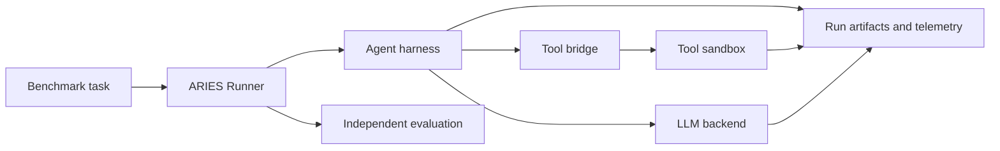
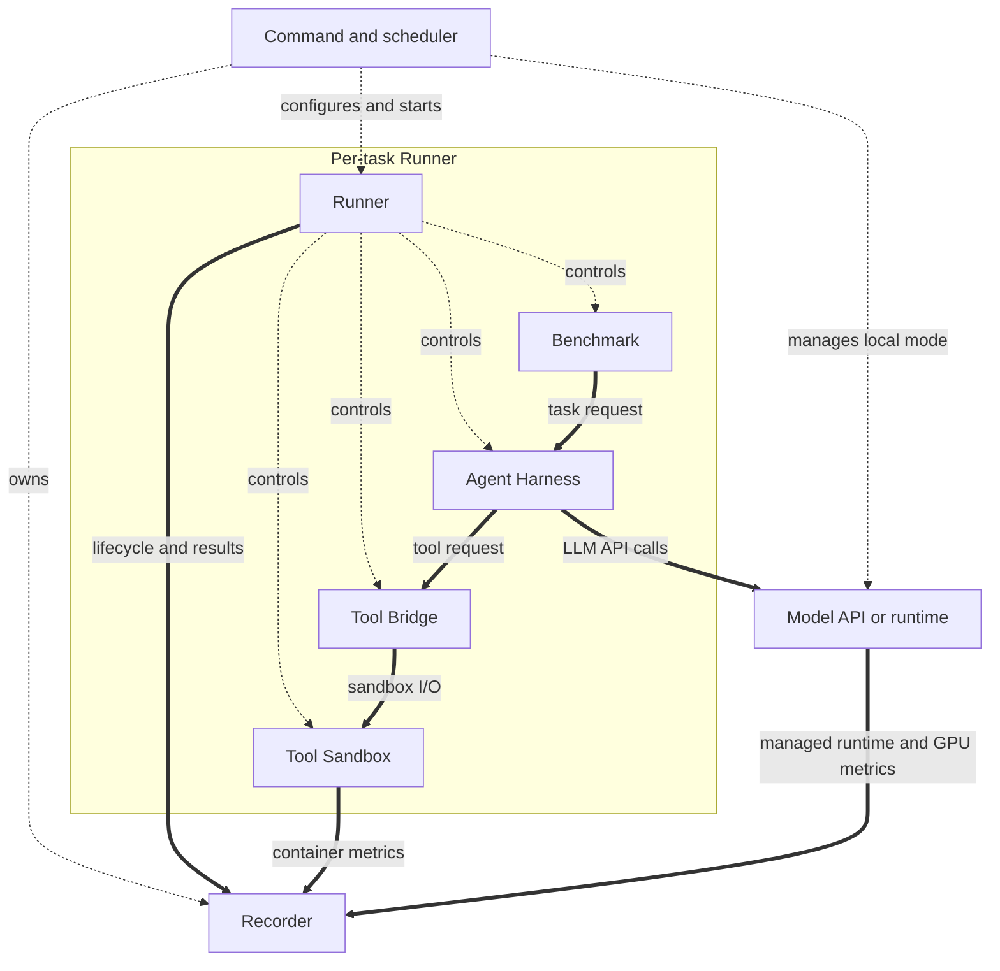

# Design principles

These are the approved design requirements for ARIES. They govern new
implementations and substitutions; current mechanisms and known gaps are labeled
separately below and in the linked contract pages. The concise binding version
for coding agents is [`.agents/design.md`](../.agents/design.md). Update affected
agent and human docs together when the project changes.

ARIES runs, evaluates, and measures agent workloads across model backends, agent
harnesses, tool execution, and sandbox resources. Alternatives must preserve
meaningful measurements and consistent evaluation.

ARIES runs agent benchmarks while keeping the agent, task environment, tool
access, and evaluation under separate ownership. The command layer reads a
profile, constructs a fresh Runner for each admitted task, and records results
without changing the task lifecycle. Multiple task occurrences may run
concurrently; every occurrence still receives its own components and sandbox.

## System overview

```mermaid
flowchart LR
    B[Benchmark task] --> R[ARIES Runner]
    R --> H[Agent harness]
    H --> M[LLM backend]
    H --> T[Tool bridge]
    T --> S[Tool sandbox]
    R --> E[Independent evaluation]
    H --> O[Run artifacts and telemetry]
    S --> O
    M --> O
```

The arrows show logical paths; Runner coordinates the ordered safety gates below.

## Component contracts

The Runner composes exactly four substitutable roles. Each has an explicit
[interface](../pkg/runner/interfaces.go). Implementations must preserve behavior,
resource ownership, and isolation, not merely satisfy Go method signatures:

| Role | Responsibility |
| --- | --- |
| [`Benchmark`](design/benchmark.md) | Loads tasks, sanitizes the live sandbox, keeps verifier material private, and evaluates final task state. |
| [`Agent Harness`](design/harness.md) | Runs the configured agent and model interaction without owning the task environment or evaluator. |
| [`Tool Sandbox`](design/sandbox.md) | Starts, exposes a narrow live capability for, and positively stops the task environment. |
| [`Tool Bridge`](design/bridge.md) | Grants one harness temporary access to one sandbox and positively revokes that access. |

The [model runtime](design/runtime.md) is a surrounding platform service. It may
be external or managed by ARIES for the duration of a run, but it is
not a fifth Runner role. Recording and command-level scheduling likewise
surround the four-role task composition rather than expanding it.

## Deployment independence

Component interfaces define what a component does. The shared
[Deployment contract](design/deployment.md) defines how its execution environment
is created, started, accessed, inspected, and removed. `TaskEnvironment` separately
owns task attachment. Components receive these dependencies explicitly; a logical
component need not be a separately deployed service.

Deployment independence is a design requirement, not a claim that any backend can
already be substituted. Placements must provide the component's required
capabilities and safety guarantees. The current Docker provider and its remaining
portability limits are described in [Docker implementation](implementation/docker.md).
Profile syntax stays in the [deployment guide](configuration.md#deployment-configuration).

## Protocol independence

Tool bridges adapt harness protocols to sandbox capabilities so both can evolve
independently. Substitution must preserve operation semantics, cancellation,
errors, and ownership; matching a transport name is insufficient. Harness-specific
adaptation is required wherever the harness does not speak the chosen protocol.
Current pair-specific SSH mechanisms are described in
[SSH bridges](implementation/ssh-bridges.md); future targets are listed separately
in the [roadmap](supported.md#roadmap).

For example, Runner calls `AgentHarness.Start`, `Run`, and `Stop`. OpenClaw uses
its deployment to host the runtime and obtain its Gateway endpoint, then its
Gateway client handles agent requests. Shutdown uses deployment operations to
confirm runtime absence. Changing hosting and endpoint access must preserve the
Gateway protocol owned by the harness. See [harness implementation](implementation/harnesses.md).

## Task lifecycle and isolation gates

For every task the Runner performs this order:

1. load the benchmark task;
2. start the task sandbox;
3. let the benchmark sanitize the live sandbox and confirm verifier paths are absent;
4. start the bridge for that exact sandbox;
5. start and run the harness;
6. positively stop the harness;
7. revoke the bridge and positively confirm access is gone;
8. evaluate the still-running sandbox;
9. stop the sandbox container, then remove its task network, confirming both are absent.

Cleanup follows reverse ownership order and uses bounded cleanup work even when
the run context has been cancelled. Partial starts still trigger cleanup, and
stop operations are safe to repeat. Failures to confirm harness absence or
bridge revocation block evaluation. Verifier tests and solutions are not
uploaded until both isolation gates succeed, so a possibly live agent path
cannot observe them.

Evaluation belongs to the Benchmark and is independent of the AgentHarness.
Harness execution can fail while evaluation still reports the state that was
left behind; ARIES records harness and evaluation outcomes separately. The
sandbox remains live only long enough for that independent evaluation, then is
positively removed.

## Explicit composition, concurrency, and artifacts

`cmd/aries` selects concrete implementations through small explicit switches.
Construction lives in `internal/app/wiring`, grouped into `benchmark`, `harness`,
`sandbox`, `bridge`, `deployment`, and `runtime` packages, with a file for each
implementation. These helpers translate profile options, construct components,
and close partially constructed resources on failure. Selected deployment
dependencies are passed into harness and sandbox helpers; the helpers do not
repeat the command's implementation selection.

The command supplies these constructors through `app.Wiring`. `internal/app`
owns preparation and scheduling and does not import its wiring subpackages.
Benchmark preparation and execution share the same constructors, including
judge configuration, version pins, and occurrence IDs. Component behavior
remains in `pkg`, and Runner retains lifecycle and isolation ownership.
Dependencies and rollback ownership must stay explicit; do not introduce
registries or generic orchestration frameworks.

The command layer can admit independent task occurrences concurrently,
with profile order determining admission and result order by default. An
[arrival trace](configuration.md#replay-task-arrivals) instead orders selected
occurrences by scaled offset, preserving profile order for ties. Concurrency
still bounds admission, and every admitted occurrence drains through the full
lifecycle.

Run output contains structured lifecycle and outcome records plus component
artifacts. Replayable bridge input, child logs, rendered harness configuration,
and benchmark evaluation evidence are private run artifacts and should be
reviewed before sharing. Model credential values are not stored in profiles,
structured logs, Docker metadata, or results.

## Measurement meaning and current gaps

Measurements must identify their boundary and retain the same meaning across
implementations. Unsupported or unavailable measurements must be distinguishable
from measured zero. This is a requirement, not a guarantee of every current
artifact field.

**Known implementation gap:** the first CPU observation establishes a baseline,
but [`cpuPercent`](../pkg/monitor/recorder.go) returns zero before a rate can be
computed. GPU rows also serialize zero CPU/memory fields that do not describe
CPU/memory observations. [`ResourceSample`](../pkg/monitor/artifacts.go) has
scalar fields without availability markers. Thus a numeric zero alone is not
proof of measured idle CPU or measured zero memory. Consumers must use component
identity and sampling context; the schema does not fully express this design
requirement. Optional GPU gauges do use pointers in
[`GPUResourceReading`](../pkg/core/types.go). No code change accompanies this
documentation reorganization.

Lifecycle and isolation behavior is implemented in
[`Runner`](../pkg/runner/runner.go), with cancellation, failed-start, blocked
isolation, and cleanup coverage in its [tests](../pkg/runner/runner_test.go).
Source inspection establishes the documented paths; it does not substitute for
runtime validation of a new implementation.

Other documented limits are the [deployment portability constraints](design/deployment.md#substitution-and-current-limits),
[DRB download-error classification](implementation/benchmarks.md#known-implementation-gap),
and [HTTP transport policy enforcement](implementation/model-runtime.md#implementation-gap-http-transport-policy).

## Detailed design

```mermaid
flowchart TB
    C[Command and scheduler]
    M[Model API or runtime]
    O[Recorder]

    subgraph E[Per-task Runner]
        direction LR
        R[Runner]
        B[Benchmark]
        H[Agent Harness]
        T[Tool Bridge]
        S[Tool Sandbox]

        R -. controls .-> B
        R -. controls .-> H
        R -. controls .-> T
        R -. controls .-> S

        B ==>|task request| H
        H ==>|tool request| T
        T ==>|sandbox I/O| S
    end

    C -. configures and starts .-> R
    C -. manages local mode .-> M
    C -. owns .-> O

    R ==>|lifecycle and results| O
    H ==>|LLM API calls| M
    S ==>|container metrics| O
    M ==>|managed runtime and GPU metrics| O

```

## Guides

- [Benchmark](design/benchmark.md)
- [Agent harness](design/harness.md)
- [Tool sandbox](design/sandbox.md)
- [Tool bridge](design/bridge.md)
- [Deployment and task environment](design/deployment.md)
- [Concrete implementation details](implementation/README.md)
- [Model runtime platform service](design/runtime.md)
- [Supported implementations](supported.md)
- [Quick start](quick-start.md)

