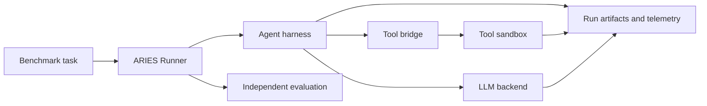
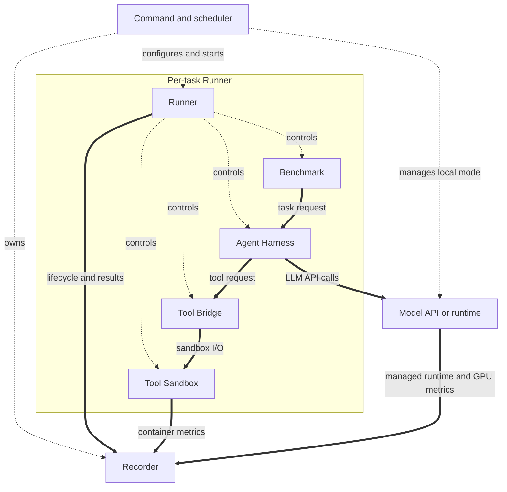

# Architecture

ARIES runs agent benchmarks while keeping the agent, task environment, tool
access, and evaluation under separate ownership. The command layer reads a
profile, constructs a fresh Runner for each admitted task, and records results
without changing the task lifecycle. Multiple task occurrences may run
concurrently; every occurrence still receives its own components and sandbox.

## System overview

```mermaid
flowchart LR
    B[Benchmark task] --> R[ARIES Runner]
    R --> H[Agent harness]
    H --> M[LLM backend]
    H --> T[Tool bridge]
    T --> S[Tool sandbox]
    R --> E[Independent evaluation]
    H --> O[Run artifacts and telemetry]
    S --> O
    M --> O
```

Dashed arrows are control and management paths. Solid arrows are logical data
paths; the Runner remains the caller and orchestrator. The ordered safety gates
are described below.

The Runner composes exactly four substitutable roles:

| Role | Responsibility |
| --- | --- |
| [`Benchmark`](design/benchmark.md) | Loads tasks, sanitizes the live sandbox, keeps verifier material private, and evaluates final task state. |
| [`Agent Harness`](design/harness.md) | Runs the configured agent and model interaction without owning the task environment or evaluator. |
| [`Tool Sandbox`](design/sandbox.md) | Starts, exposes a narrow live capability for, and positively stops the task environment. |
| [`Tool Bridge`](design/bridge.md) | Grants one harness temporary access to one sandbox and positively revokes that access. |

The [model runtime](design/runtime.md) is a surrounding platform service. It may
be external or managed by ARIES for the duration of a run, but it is
not a fifth Runner role. Recording and command-level scheduling likewise
surround the four-role task composition rather than expanding it.

## Deployment support

Harnesses and the tool sandbox share `deployment.Deployment`, an infrastructure
capability beneath the four Runner roles. Its interface and request/result
types live in `pkg/deployment`. Explicit command switches select separate
Docker clients for `harness.deployment` and `sandbox.deployment`; both must name
the same local Unix socket. Each component owns and closes its client. Image
preparation and resource sampling use that selected daemon too.

`pkg/deployment/docker` owns the Moby SDK calls for runtime creation, validation,
archive transport, streaming execution, targeted cancellation, logs, and
positive removal. Harness and sandbox adapters retain their policies and do not
import provider code. Network operations are outside the common `Deployment`
interface: command wiring supplies the Docker task-environment constructor as
`sandbox.Options.NewEnvironment`. Each occurrence gets a fresh owner, including
duplicate task IDs and retries. It creates and validates the labeled network,
resolves the bridge addresses, and confirms network absence after sandbox
container removal.

The task environment supplies `core.BridgeListen` through each bridge's
`ResolveListen` option. `BindHost` selects the local listener address;
`AdvertiseHost` selects the harness destination. Docker defaults both to the
owned task network's gateway. Both adapters currently require IPv4 addresses
and reject DNS destinations and wildcard advertisement. Each listener uses an
OS-selected port and advertises the actual port. The bridge retains one
authenticated grant bound to the exact sandbox. `core.HarnessRequest.Network`
carries task attachment separately from endpoint identity and credentials;
changing an endpoint cannot select a different network.

`bridge.mode` is `embedded`: both bridges run inside the runner process.
`managed` and `external` are rejected. Typed Kubernetes placement settings are
recognized but fail preflight with the component path before contacting model
services, preparing images, or allocating resources. Kubernetes and bridge
process separation are not implemented. The runtime contract still contains
Docker attachment and image-volume semantics; staging, execution identity, and
cancellation also need explicit design before another backend can implement it.
See [deployment configuration](quick-start.md#deployment-configuration) for the
profile shape and compatibility defaults.

## Task lifecycle and isolation gates

For every task the Runner performs this order:

1. load the benchmark task;
2. start the task sandbox;
3. let the benchmark sanitize the live sandbox and confirm verifier paths are absent;
4. start the bridge for that exact sandbox;
5. start and run the harness;
6. positively stop the harness;
7. revoke the bridge and positively confirm access is gone;
8. evaluate the still-running sandbox;
9. stop the sandbox container, then remove its task network, confirming both are absent.

Cleanup follows reverse ownership order and uses bounded cleanup work even when
the run context has been cancelled. Partial starts still trigger cleanup, and
stop operations are safe to repeat. Failures to confirm harness absence or
bridge revocation block evaluation. Verifier tests and solutions are not
uploaded until both isolation gates succeed, so a possibly live agent path
cannot observe them.

Evaluation belongs to the Benchmark and is independent of the AgentHarness.
Harness execution can fail while evaluation still reports the state that was
left behind; ARIES records harness and evaluation outcomes separately. The
sandbox remains live only long enough for that independent evaluation, then is
positively removed.

## Composition, concurrency, and artifacts

`cmd/aries` selects concrete implementations through small explicit switches.
Construction lives in `internal/app/wiring`, grouped into `benchmark`, `harness`,
`sandbox`, `bridge`, `deployment`, and `runtime` packages, with a file for each
implementation. These helpers translate profile options, construct components,
and close partially constructed resources on failure. Selected deployment
dependencies are passed into harness and sandbox helpers; the helpers do not
repeat the command's implementation selection.

The command supplies these constructors through `app.Wiring`. `internal/app`
owns preparation and scheduling and does not import its wiring subpackages.
Benchmark preparation and execution share the same constructors, including
judge configuration, version pins, and occurrence IDs. Component behavior
remains in `pkg`, and Runner retains lifecycle and isolation ownership.
There is no runtime discovery or registration layer.

The command layer can admit independent task occurrences concurrently,
with profile order determining admission and result order by default. An
[arrival trace](quick-start.md#replay-task-arrivals) instead orders selected
occurrences by scaled offset, preserving profile order for ties. Concurrency
still bounds admission, and every admitted occurrence drains through the full
lifecycle.

Run output contains structured lifecycle and outcome records plus component
artifacts. Replayable bridge input, child logs, rendered harness configuration,
and benchmark evaluation evidence are private run artifacts and should be
reviewed before sharing. Model credential values are not stored in profiles,
structured logs, Docker metadata, or results.

## Detailed Design

```mermaid
flowchart TB
    C[Command and scheduler]
    M[Model API or runtime]
    O[Recorder]

    subgraph E[Per-task Runner]
        direction LR
        R[Runner]
        B[Benchmark]
        H[Agent Harness]
        T[Tool Bridge]
        S[Tool Sandbox]

        R -. controls .-> B
        R -. controls .-> H
        R -. controls .-> T
        R -. controls .-> S

        B ==>|task request| H
        H ==>|tool request| T
        T ==>|sandbox I/O| S
    end

    C -. configures and starts .-> R
    C -. manages local mode .-> M
    C -. owns .-> O

    R ==>|lifecycle and results| O
    H ==>|LLM API calls| M
    S ==>|container metrics| O
    M ==>|managed runtime and GPU metrics| O
    
```

## Guides

- [Benchmark](design/benchmark.md)
- [Agent harness](design/harness.md)
- [Tool sandbox](design/sandbox.md)
- [Tool bridge](design/bridge.md)
- [Model runtime platform service](design/runtime.md)
- [Supported implementations](supported.md)
- [Quick start](quick-start.md)

