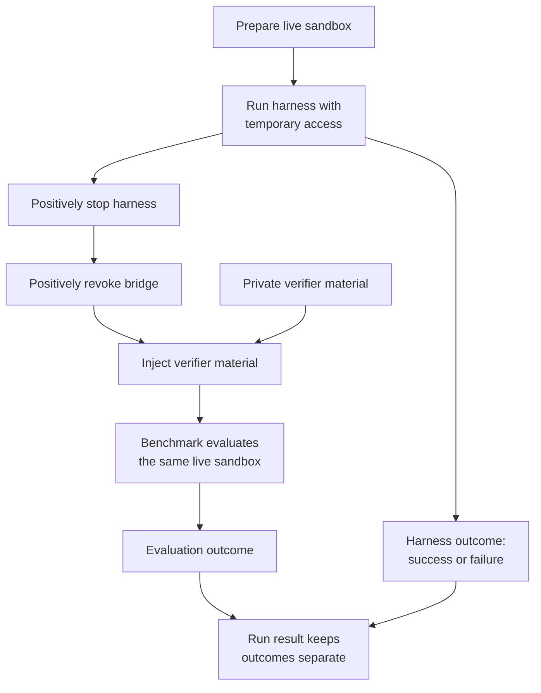

# Benchmark

`Benchmark` owns task meaning. It loads task definitions, prepares benchmark
inputs, sanitizes the live sandbox before agent access, and independently
evaluates the same sandbox after the harness is stopped and bridge access is
revoked.

## Boundary and lifecycle

Verifier tests and solutions remain private to the benchmark. They are not
placed in the sandbox until positive harness-stop and bridge-revocation gates
have both succeeded. Benchmark evaluation does not depend on whether the agent
harness reported success, and its result is recorded separately.

The current implementations are Terminal-Bench 2, Deep Research Bench, and the
public SWE-bench Pro split, all from exact pinned sources. Terminal-Bench 2's
task environment images and workdirs are derived from the selected task data;
setup verifies the pinned checkout and selected task inputs before a run.

Deep Research Bench has no sandbox-resident private verifier tree. Its private
material is a reference report and RACE-dimension rubric compared by an
LLM judge entirely host-side; that material is never uploaded into the
sandbox. `PrepareSandbox` instead confirms the agent's designated report-output
path starts absent, and `Evaluate` downloads the agent's report from that path
after both isolation gates before invoking the judge. The agent's research
work itself still runs entirely inside the sandbox, exactly like Terminal-Bench
2 — only grading moves host-side.

An optional FACT pass layers citation-trustworthiness checking on top of RACE:
it extracts claim/citation pairs from the same downloaded report, fetches each
cited URL host-side through the Jina AI Reader API, and validates the claim
against the fetched content with its own judge model. FACT is strictly
additive — configuring it (or not) never changes the RACE-derived score,
reward, or status.

SWE-bench Pro uses two independent pins: the public dataset and the official
open-source evaluator. Each dataset row supplies the base revision, task image
tag, problem statement, requirements, new-interface description, selected test
files, and required `FAIL_TO_PASS`/`PASS_TO_PASS` tests. Before the bridge is
started, the benchmark captures the selected verifier files and the image's
initial ignored build artifacts into private host snapshots, restores the base
worktree, removes local remotes, refs, reflogs, and unreachable future objects,
and proves the gold revision is not locally reachable. The task image still
has network access for the agent workflow, so this local-history sanitization
does not prevent an agent from deliberately retrieving public upstream data.

After both isolation gates, evaluation first captures the candidate patch,
restores the base worktree and initial ignored-artifact snapshot, applies the
candidate, then injects the private verifier snapshot and pinned task-specific
script and parser. A task resolves only when every required `FAIL_TO_PASS` and
`PASS_TO_PASS` test is reported `PASSED`. See the
[SWE-bench Pro guide](../benchmarks/swe-bench-pro.md) for setup, artifacts, and
scope limitations.

SWE-bench Pro runs agent and test commands as numeric UID/GID `65532:65532`
with `no-new-privileges`. Docker startup positively confirms that option from
container inspection before returning the live sandbox. Benchmark-owned
sanitation and parsing use explicit root commands. Evaluation restores private
sanitized Git metadata
before bounded candidate capture, clears residual agent processes before
private staging and after testing, rejects symlink-traversing verifier paths,
makes injected tests root-owned and read-only, and streams bounded verifier
logs directly to private host artifacts. The parser uses an empty environment
and isolated Python mode, and all private container staging is scrubbed on
return.

## Customization & Contribution Guide

Implement a new benchmark behind the existing `Benchmark` boundary: define its
task loading, pre-agent sandbox preparation, private verifier ownership, and live
sandbox evaluation in a concrete package. Expose an explicit constructor and
command switch, add tests that prove verifier secrecy and evaluation after both
isolation gates, and document setup and supported profiles. Do not introduce
registration, discovery, factories, reflection, DI, or generic plugins.
