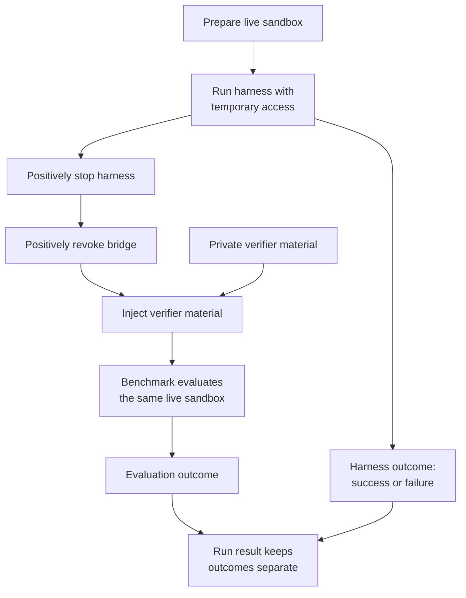

# Benchmark

`Benchmark` owns task meaning. It loads task definitions, prepares benchmark
inputs, sanitizes the live sandbox before agent access, and independently
evaluates the same sandbox after the harness is stopped and bridge access is
revoked.

## Boundary and lifecycle

Verifier tests and solutions remain private to the benchmark. They are not
placed in the sandbox until positive harness-stop and bridge-revocation gates
have both succeeded. Benchmark evaluation does not depend on whether the agent
harness reported success, and its result is recorded separately.

The current implementation is Terminal-Bench 2 from an exact pinned checkout.
Task environment images and workdirs are derived from the selected task data.
Setup verifies the pinned checkout and selected task inputs before a run.

## Customization & Contribution Guide

Implement a new benchmark behind the existing `Benchmark` boundary: define its
task loading, pre-agent sandbox preparation, private verifier ownership, and live
sandbox evaluation in a concrete package. Expose an explicit constructor and
command switch, add tests that prove verifier secrecy and evaluation after both
isolation gates, and document setup and supported profiles. Do not introduce
registration, discovery, factories, reflection, DI, or generic plugins.
