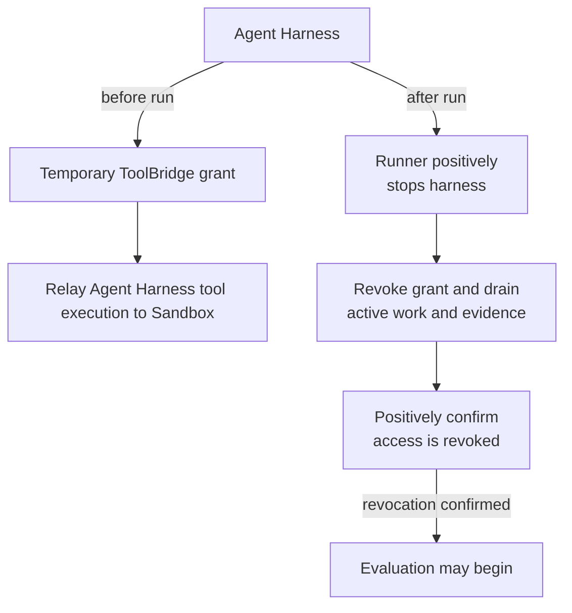

# ToolBridge

`ToolBridge` is the additional component deep dive for temporary tool access.
It adapts one concrete harness to one live sandbox, grants only the capability
needed for that pairing, and positively revokes the grant before evaluation.

## Stable security contract

The bridge grants temporary access from one harness to the exact sandbox that
will later be evaluated. The harness is stopped first; bridge revocation then
closes listeners and sessions, drains active work and evidence, removes staged
credentials, and positively confirms access is absent. Any failure blocks
evaluation and verifier upload.

The current pair-specific OpenClaw SSH bridge adapts OpenClaw's pinned SSH
behavior to a narrow streaming capability of the Docker sandbox. OpenClaw never
receives the Docker socket, sandbox ownership, or verifier material. The bridge
does not create a persistent workspace alias in the evaluated environment.
Credentials, listeners, sessions, and helper processes are owned and revoked
fail-closed.

The bridge retains structured executed-command records and lossless wire-side
input as private replayable evidence. These artifacts may contain task data and
must remain private unless reviewed; model credentials and SSH private-key
bytes do not belong in the records.

## Lifecycle position

Bridge startup follows sandbox sanitization and precedes harness startup. On
normal completion, failure, or cancellation, the Runner positively stops the
harness, revokes the bridge, evaluates the still-running sandbox, and finally
stops the sandbox. A future harness may require a different pair-specific
adapter rather than a lowest-common-denominator remote-tool protocol.

## Customization & Contribution Guide

Build a new bridge around the selected harness's real upstream boundary and the
smallest capability exposed by its sandbox pairing. Keep authentication,
workspace mapping, command semantics, cancellation, revocation, privacy, and
evidence policy concrete. Add an explicit constructor and command switch plus
tests for partial start, active-session cancellation, positive revocation,
credential cleanup, argument preservation, private artifacts, and blocked
evaluation on stop failure. Update the supported reference. Do not add
registration, discovery, factories, reflection, DI, or generic plugins.
