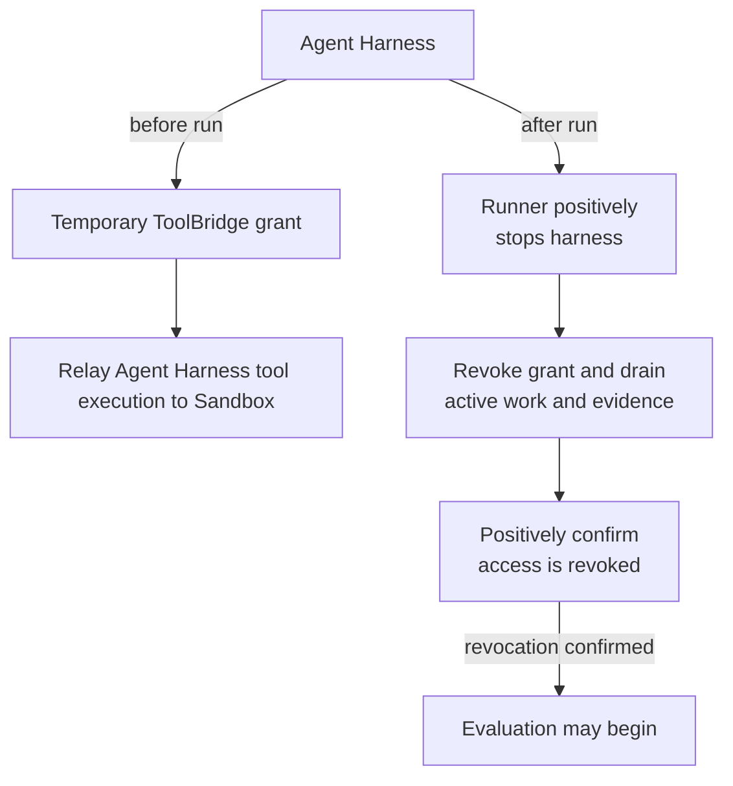

# ToolBridge

`ToolBridge` is the additional component deep dive for temporary tool access.
It adapts one concrete harness to one live sandbox, grants only the capability
needed for that pairing, and positively revokes the grant before evaluation.

## Stable security contract

The bridge grants temporary access from one harness to the exact sandbox that
will later be evaluated. The harness is stopped first; bridge revocation then
closes listeners and sessions, drains active work and evidence, removes staged
credentials, and positively confirms access is absent. Any failure blocks
evaluation and verifier upload.

The current pair-specific OpenClaw SSH bridge adapts OpenClaw's pinned SSH
behavior to a narrow streaming capability of the Docker sandbox. OpenClaw never
receives the Docker socket, sandbox ownership, or verifier material. The bridge
does not create a persistent workspace alias in the evaluated environment.
Credentials, listeners, sessions, and helper processes are owned and revoked
fail-closed.

The bridge retains structured executed-command records and lossless wire-side
input as private replayable evidence. These artifacts may contain task data and
must remain private unless reviewed; model credentials and SSH private-key
bytes do not belong in the records.

## Hermes SSH bridge

The Hermes pairing is a second, separate adapter rather than a reuse of the
OpenClaw one, because the two harnesses put different bytes on the wire. Hermes
runs OpenSSH itself, so this bridge stages no client helper and supplies no
client command; it hands over only a generated identity. Hermes forces
`StrictHostKeyChecking=accept-new` and offers no way to preload a known-hosts
file, so it pins the generated host key on first use; the bridge retains that
key as evidence rather than implying a guarantee it cannot enforce.

Recorded against Hermes v2026.5.29.2 and re-verified unchanged against
v2026.8.3, the accepted grammar is exactly four payload shapes: the two fixed
bootstrap probes `echo 'SSH connection established'` and `echo $HOME`, and
`bash -c` / `bash -l -c` with one canonically `shlex.quote`-encoded script.
A harness may open more than one SSH session per run — v2026.8.3 opens two —
so the grammar is applied per connection and carries no run-level state. Scripts carry embedded newlines and
nested quoting, so the canonical single-token encoding OpenClaw uses does not
apply. Anything else is refused. Hermes multiplexes every command onto a single
ControlMaster connection and sends an `env` request on each channel before the
exec; the bridge refuses that request and keeps the channel open, because
closing it would drop every command.

The decoded `bash` token is resolved to the absolute `/bin/bash` before it
reaches the sandbox, which requires an absolute command path and performs no
PATH lookup of its own. The bridge is also authoritative for the working
directory: every command runs in the sandbox's own workdir regardless of what
Hermes believes its `cwd` to be.

Hermes's remaining payloads belong to its `~/.hermes` file sync — `mkdir -p`,
`tar xf -`, `tar cf -`, `rm -f` — and ARIES denies them by policy. The sync set
is built from `iter_sync_files`, which includes credential files, and the remote
is the exact container the verifier later inspects, so allowing it would both
place credentials in the evaluated sandbox and pollute it with Hermes scaffold.
Denial is safe and was verified against the real harness: Hermes catches the
failure, logs one warning, rolls its sync state back, and continues running
commands normally; because nothing was pushed, its teardown sync-back then
suppresses itself. Refusals are recorded with a distinct `denied` status so
evidence separates policy from a protocol violation.

## Lifecycle position

Bridge startup follows sandbox sanitization and precedes harness startup. On
normal completion, failure, or cancellation, the Runner positively stops the
harness, revokes the bridge, evaluates the still-running sandbox, and finally
stops the sandbox. A future harness may require a different pair-specific
adapter rather than a lowest-common-denominator remote-tool protocol.

## Customization & Contribution Guide

Build a new bridge around the selected harness's real upstream boundary and the
smallest capability exposed by its sandbox pairing. Keep authentication,
workspace mapping, command semantics, cancellation, revocation, privacy, and
evidence policy concrete. Add an explicit constructor and command switch plus
tests for partial start, active-session cancellation, positive revocation,
credential cleanup, argument preservation, private artifacts, and blocked
evaluation on stop failure. Update the supported reference. Do not add
registration, discovery, factories, reflection, DI, or generic plugins.
