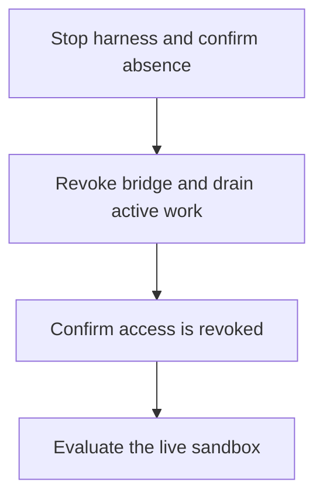

# ToolBridge

`ToolBridge` owns the task sandbox and grants temporary harness access to the
exact sandbox that the benchmark will later evaluate. It adapts harness tool
protocols to sandbox capabilities and decides whether the sandbox stays running
between tool calls. The
[design principles](../design.md) require compatible command semantics,
cancellation, errors, ownership, privacy, and confirmed revocation.

## Operations and ownership

The interface is defined in [pkg/runner](../../pkg/runner/interfaces.go).

| Operation | Contract |
| --- | --- |
| `Open(context.Context, core.SandboxRequest) (Sandbox, error)` | Create the task sandbox through the composed `ToolSandbox` and return the capability the benchmark prepares and evaluates. Every attempt is followed by `Close`. |
| `Start(context.Context) (core.ToolEndpoint, error)` | Establish a temporary access grant for the opened sandbox and return connection details and private evidence locations. Own listeners, credentials, sessions, and helpers created for the grant. |
| `Stop(context.Context) error` | Revoke the grant, cancel and drain active work and pending checkpoints, finalize evidence, and remove private credentials. A nil error is positive revocation confirmation and leaves the sandbox available for evaluation; any error prevents evaluation. |
| `Close(context.Context) error` | Remove the sandbox through the composed `ToolSandbox`; a nil error confirms absence. Repeated calls are safe. |

A bridge may consume a narrow capability of its paired sandbox beyond the minimal
`Sandbox` interface. It must validate that capability before exposing access.
The endpoint conveys access details, not authority to select or own a task network.
It must never expose verifier material or give the harness the deployment socket.

## Sandbox lifecycle modes

The shared [lifecycle bridge](../../pkg/bridge/lifecycle/lifecycle.go) composes
a `ToolSandbox` with a protocol-specific access adapter. `bridge.sandbox_lifecycle`
selects one of two modes:

| Mode | Behavior |
| --- | --- |
| `persistent` (default) | The sandbox runs from `Open` to `Close`. The bridge passes the sandbox's own capability through unchanged. |
| `checkpoint` | While access is granted, the sandbox is checkpointed whenever no operation is active and restored before the next one. Preparation before the grant and evaluation after revocation run against a live sandbox without further checkpoints. |

In checkpoint mode the grant itself checkpoints the prepared sandbox, so a
checkpoint failure fails `Start` before the harness gets access. After each tool
call the bridge schedules a checkpoint, which runs once the call has returned,
unless another operation begins first. Tool-call latency therefore includes
restore time but not checkpoint time. Overlapping calls share one restore and
one checkpoint. A failed restore fails only the operation that needed it, and
the command does not run. A failed checkpoint never lets the sandbox resume from
an older checkpoint. It is recorded and returned by `Stop`, which blocks
evaluation because the configured suspension did not hold. Each checkpoint and
restore, with its duration, is recorded in the private `checkpoint/events.jsonl`
listed in the endpoint's log paths.

Checkpoint mode requires a sandbox that implements the optional
`runner.Checkpointer` capability together with the streaming, bounded-download,
and identity capabilities the SSH adapters use. It rejects tasks before
allocation when the harness reaches a sandbox service directly, because that
service would be down between calls, and when the task requests GPUs.

## Lifecycle, cancellation, and failure

Sandbox opening precedes preparation. Access granting follows preparation and precedes harness startup. On
completion, failure, or cancellation, [Runner](../../pkg/runner/runner.go) first
stops the harness, then revokes the bridge, then evaluates the sandbox, then
closes the bridge to remove it. Every attempted bridge start is followed by
`Stop`, and every open by `Close`, even if they fail after allocating resources. Stop must be idempotent and preserve evidence
of failures; a timeout or closed listener alone does not prove that active tool
commands are gone.

```mermaid
flowchart TB
    H[Stop harness and confirm absence]
    R[Revoke bridge and drain active work]
    P[Confirm access is revoked]
    E[Evaluate the live sandbox]
    H --> R --> P --> E
```

Runner supplies a fresh bounded cleanup context after task cancellation. A bridge
must cancel its commands and await their termination within that cleanup attempt.
Unconfirmed execution termination or evidence finalization failures must remain
visible, so evaluation cannot race ongoing harness work.

## Evidence and substitution

Structured command records and lossless wire input may contain sensitive task
data and remain private. Model credentials and SSH private-key bytes do not
belong in those records. Raw input retention is configurable in current bridges;
recording limitations must remain distinguishable from successful execution.

A replacement bridge must preserve authentication, workspace mapping, argument
boundaries, stream behavior, exit status, cancellation, revocation, and sandbox
ownership for its specific pairing. A new protocol adapter normally implements
the lifecycle bridge's `Access` interface and reuses its sandbox ownership. Explicit constructors and role-specific wiring select the
implementation; no registration or generic plugin layer is needed.

Current pair-specific [SSH adapters](../implementation/ssh-bridges.md) support
OpenClaw and Hermes. Their wire grammars, host-key limitations, denied file sync,
and sandbox capabilities are implementation details. A common future protocol
does not remove the need to adapt harnesses that do not natively speak it.
