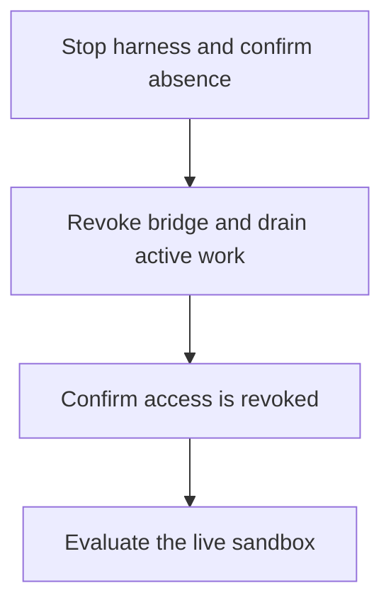

# ToolBridge

`ToolBridge` grants temporary harness access to the exact live sandbox that the
benchmark will later evaluate. It adapts harness tool protocols to sandbox
capabilities without transferring sandbox ownership. The
[design principles](../design.md) require compatible command semantics,
cancellation, errors, ownership, privacy, and confirmed revocation.

## Operations and ownership

The interface is defined in [pkg/runner](../../pkg/runner/interfaces.go).

| Operation | Contract |
| --- | --- |
| `Start(context.Context, Sandbox) (core.ToolEndpoint, error)` | Establish a temporary access grant for the supplied sandbox and return connection details and private evidence locations. Own listeners, credentials, sessions, and helpers created for the grant. |
| `Stop(context.Context) error` | Revoke the grant, cancel and drain active work, finalize evidence, and remove private credentials. A nil error is positive revocation confirmation; any error prevents evaluation. |

A bridge may consume a narrow capability of its paired sandbox beyond the minimal
`Sandbox` interface. It must validate that capability before exposing access.
The endpoint conveys access details, not authority to select or own a task network.
It must never expose verifier material or give the harness the deployment socket.

## Lifecycle, cancellation, and failure

Bridge startup follows sandbox preparation and precedes harness startup. On
completion, failure, or cancellation, [Runner](../../pkg/runner/runner.go) first
stops the harness, then revokes the bridge, then evaluates the still-running
sandbox. Every attempted bridge start is followed by `Stop`, even if startup
fails after allocating resources. Stop must be idempotent and preserve evidence
of failures; a timeout or closed listener alone does not prove that active tool
commands are gone.

```mermaid
flowchart TB
    H[Stop harness and confirm absence]
    R[Revoke bridge and drain active work]
    P[Confirm access is revoked]
    E[Evaluate the live sandbox]
    H --> R --> P --> E
```

Runner supplies a fresh bounded cleanup context after task cancellation. A bridge
must cancel its commands and await their termination within that cleanup attempt.
Unconfirmed execution termination or evidence finalization failures must remain
visible, so evaluation cannot race ongoing harness work.

## Evidence and substitution

Structured command records and lossless wire input may contain sensitive task
data and remain private. Model credentials and SSH private-key bytes do not
belong in those records. Raw input retention is configurable in current bridges;
recording limitations must remain distinguishable from successful execution.

A replacement bridge must preserve authentication, workspace mapping, argument
boundaries, stream behavior, exit status, cancellation, and revocation for its
specific pairing. Explicit constructors and role-specific wiring select the
implementation; no registration or generic plugin layer is needed.

Current pair-specific [SSH adapters](../implementation/ssh-bridges.md) support
OpenClaw and Hermes. Their wire grammars, host-key limitations, denied file sync,
and sandbox capabilities are implementation details. A common future protocol
does not remove the need to adapt harnesses that do not natively speak it.
