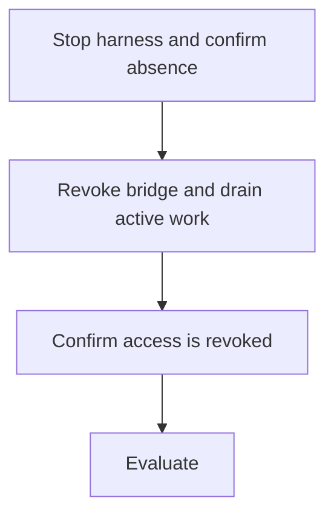

# ToolBridge

`ToolBridge` grants temporary harness access to the exact live sandbox that the
benchmark will later evaluate. It adapts harness tool protocols to sandbox
capabilities without transferring sandbox ownership. The
[design principles](../design.md) require compatible command semantics,
cancellation, errors, ownership, privacy, and confirmed revocation.

## Operations and ownership

The interface is defined in [pkg/runner](../../pkg/runner/interfaces.go).

| Operation | Contract |
| --- | --- |
| `Start(context.Context, Sandbox) (core.ToolEndpoint, error)` | Establish a temporary access grant for the supplied sandbox and return connection details and private evidence locations. Own listeners, credentials, sessions, and helpers created for the grant. |
| `Stop(context.Context) error` | Revoke the grant, cancel and drain active work, finalize evidence, and remove private credentials. A nil error is positive revocation confirmation; any error prevents evaluation. |

A bridge may consume a narrow capability of its paired sandbox beyond the minimal
`Sandbox` interface. It must validate that capability before exposing access.
Runner owns a controller; the controller owns a separate native bridge runtime
for each occurrence. The child borrows a fixed execution target and never owns
the sandbox or task attachment. Assignment control uses authenticated versioned
gRPC; harness tool traffic retains native SSH and goes directly to the child.
The supported composition pairs Docker bridge containers with Docker sandboxes.
Bridge runtime placement and sandbox execution are separate dependencies:
[wiring](../../internal/app/wiring/bridge/launch.go) supplies an explicit
[launch specification](../../pkg/bridge/launch.go), including command, private
staging and evidence paths, service ports, backend access and runtime metadata.
The manager adds occurrence identity, ownership labels and the sandbox's task
attachment, then uses deployment operations without choosing a provider or
inserting provider defaults. Resource measurement support comes from the supplied
composition metadata; an unavailable measurement is recorded as `unsupported`.

The child's sandbox backend must match the assigned target, independently of the
bridge runtime backend. Shared target validation checks descriptor identity,
ownership and command constraints. The selected provider verifies actual runtime
identity and ownership; child wiring rejects unsupported execution backends.
The endpoint conveys access details, not authority to select or own a task network.
It must never expose verifier material or give the harness the deployment socket.

The child's [NativeServer contract](../../pkg/bridge/bridge.go) accepts only a
borrowed streaming executor. A shared SSH engine owns transport and execution
mechanics; harness dialects own command grammar, workspace translation and refusal
policy. The thin `aries-ssh-client` forwards commands without interpreting them.
SSH credentials live outside the borrowed target package. Root bridge lifecycle
code does not import native dialects; wiring supplies their implementations.

This boundary permits another protocol server without duplicating the managed
lifecycle. It does not make the current SSH credential bootstrap or control
endpoint schema E2B-compatible; that requires a separate protocol design.

## Lifecycle, cancellation, and failure

Bridge startup follows sandbox preparation and precedes harness startup. On
completion, failure, or cancellation, [Runner](../../pkg/runner/runner.go) first
stops the harness, then revokes the bridge, then evaluates the still-running
sandbox. Every attempted bridge start is followed by `Stop`, even if startup
fails after allocating resources. Stop must be idempotent and preserve evidence
of failures; a timeout or closed listener alone does not prove that active tool
commands are gone. A confirmed native revocation precedes artifact collection
and positive removal of the owned runtime. Crashes without a drain/finalization
acknowledgment block evaluation.

The bridge container and the task sandbox have separate process namespaces.
Removing the bridge does not terminate commands it started inside the sandbox.
Before granting access, the Docker provider records the sandbox's existing
processes. After SSH sessions drain, it terminates processes created since that
baseline, including detached descendants, while preserving benchmark services.
This [sandbox process cleanup](../../pkg/deployment/docker/sandbox_processes.go)
must finish before evaluation; the sandbox container itself remains alive.

```mermaid
flowchart TB
    H[Stop harness and confirm absence]
    R[Revoke bridge and drain active work]
    P[Confirm access is revoked]
    E[Evaluate]
    H --> R --> P --> E
```

Runner supplies a fresh bounded cleanup context after task cancellation. A bridge
must cancel its commands and await their termination within that cleanup attempt.
Unconfirmed execution termination or evidence finalization failures must remain
visible, so evaluation cannot race ongoing harness work.

## Evidence and substitution

Structured command records and lossless wire input may contain sensitive task
data and remain private. Model credentials and SSH private-key bytes do not
belong in those records. Raw input retention is configurable in current bridges;
recording limitations must remain distinguishable from successful execution.

A replacement bridge must preserve authentication, workspace mapping, argument
boundaries, stream behavior, exit status, cancellation, and revocation for its
specific pairing. Explicit constructors and role-specific wiring select the
implementation; no registration or generic plugin layer is needed.

Runtime substitution also requires private archive transfer, control and harness
addressing, and confirmed removal. A non-Docker runtime fixture exercises these
contracts without adding another supported deployment method. The current borrowed
execution contract requires process baseline capture and confirmed process drain;
an alternative sandbox provider must satisfy that contract or explicitly redesign
it with equivalent isolation. The launch configuration still carries Docker's
sandbox socket option, and shared placement/request types retain the limitations
documented in [deployment](deployment.md#substitution-and-current-limits).

Current pair-specific [SSH adapters](../implementation/ssh-bridges.md) support
OpenClaw and Hermes. Their wire grammars, host-key limitations, denied file sync,
and sandbox capabilities are implementation details. A common future protocol
does not remove the need to adapt harnesses that do not natively speak it.
