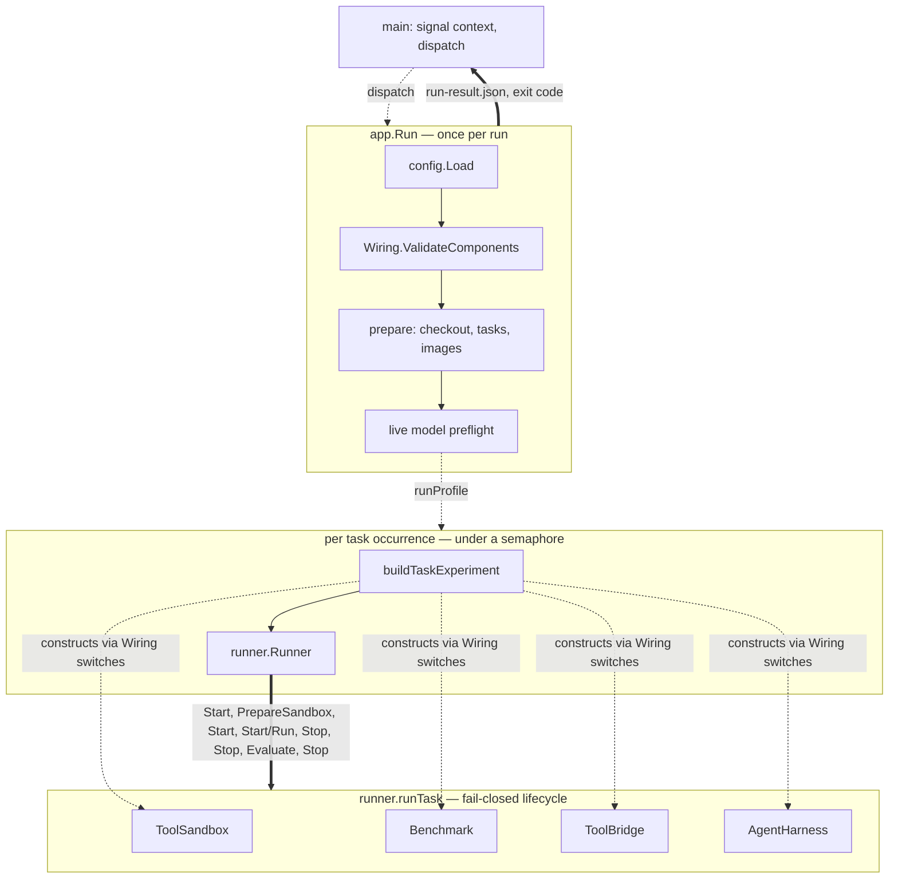

# Code structure and execution flow

## Overview

ARIES is one Go binary with one entry point and no flag parsing. `aries PROFILE.json` runs a
benchmark profile; everything else is an error. The process is a straight line: load and validate
the profile, prepare checkouts and images, preflight the model, then admit *task occurrences* under
a concurrency semaphore. Each occurrence builds a fresh set of the four substitutable roles —
`Benchmark`, `AgentHarness`, `ToolSandbox`, `ToolBridge` — and hands them to a `runner.Runner`
that drives one fixed, fail-closed lifecycle per task. When every occurrence has returned, one
`run-result.json` is written and copied to standard output, and the exit code is 0 only if nothing
failed.

Backend replacement is deliberately plain. The four roles are Go interfaces in one file; the only
consumer is the Runner; selection is four `switch` statements over string fields from the profile,
assembled into a struct of function pointers. There is no registry, factory, reflection, plugin, or
dependency-injection layer. What the interfaces do *not* say — a private capability interface every
bridge asserts on the sandbox, a shared network alias, a pairing rule between harness and bridge —
is where a new implementation actually has to be careful.



Dashed arrows are control and construction; the thick arrow is the ordered sequence of role calls.

Read the sections in this order for the questions they answer:

- **What is the entry point?** [Section 1](#1-entry-point) — `main`, `dispatch`, exit codes,
  signal handling.
- **What is executed, and when?** [Section 3](#3-the-run-sequence) is the once-per-run line;
  [Section 4](#4-occurrences-and-per-occurrence-construction) is what is built per occurrence;
  [Section 5](#5-the-per-task-lifecycle) is the per-task lifecycle the Runner enforces.
- **How is backend replacement implemented?** [Section 2](#2-the-wiring-seam) is the struct of
  constructors; [Section 6](#6-the-four-roles-and-their-contracts) is the interfaces and the data
  types that cross them; [Section 7](#7-selection-the-switches-and-the-pairing-rule) is the
  selection mechanism; [Section 8](#8-one-exemplar-per-role) shows how one implementation of each
  role satisfies its contract; [Section 9](#9-couplings-not-expressed-in-the-interfaces) lists what
  the interfaces leave implicit; [Section 11](#11-checklist-adding-a-new-implementation) is the
  practical checklist.
- **What can a profile express?** [Section 10](#10-configuration-and-profile-loading).
- **What happens on cancellation?** [Section 12](#12-cancellation-and-cleanup).

Out of scope, by choice: the `aries setup` path, the managed SGLang model runtime, the recorder
(`pkg/monitor`), the `aries-ssh` binary, and the internals of each role implementation. Each is
named where the run path calls into it, and [Section 13](#13-where-the-rest-is-documented) points
at the documents that cover them.

## 1. Entry point

`cmd/aries/main.go` is the whole command layer. It builds a JSON logger on standard error, derives
a root context cancelled by `SIGINT` or `SIGTERM`, and dispatches on the argument count
(`main.go:16-24`):

```go
func main() {
	logger := newLogger()
	ctx, stop := signal.NotifyContext(context.Background(), os.Interrupt, syscall.SIGTERM)
	defer stop()
	if err := dispatch(ctx, os.Args[1:], os.Stdout, app.Dependencies{Logger: logger, Wiring: commandWiring()}, app.Run, app.Setup); err != nil {
		logger.WithError(err).Error("aries failed")
		os.Exit(1)
	}
}
```

`dispatch` accepts exactly two shapes and nothing else (`main.go:28-37`): one argument is a
profile path and goes to `app.Run`; `setup` plus one argument goes to `app.Setup`; anything else
is the usage error. There is no `flag` package and no option. A one-argument invocation is treated
as a profile path regardless of its content (`main.go:30`).

The only exit codes are 0 (dispatch returned `nil`) and 1 (any error, after one `aries failed` log
line, `main.go:21-22`). The signal handler stays registered until `dispatch` returns, so a second
signal during cleanup is also caught rather than killing the process — an inference from the
`signal.NotifyContext` semantics, not from an explicit comment.

`app.Dependencies` (`internal/app/run.go:41-47`) carries five fields; `main` sets only `Logger`
and `Wiring`. The other three default inside `internal/app`: `ExecutablePath` to
`os.Executable()` (`repository.go:14-20`), `PreflightClient` to a DeepSeek-tuned HTTP client
(`preflight.go:111-113`), `PreflightSleep` to a context-aware sleep (`preflight.go:114-116`).

**Sources:** `cmd/aries/main.go`, `internal/app/run.go`, `internal/app/repository.go`,
`internal/app/preflight.go`.

## 2. The Wiring seam

`internal/app` never imports a benchmark, harness, sandbox, or bridge package. It receives a
struct of nine function values and calls them (`internal/app/run.go:29-39`):

```go
type Wiring struct {
	PrepareBackend       func(config.Config, string) (PreparedBackend, error)
	ValidateComponents   func(config.Config) error
	SetupBenchmark       func(context.Context, config.Config) error
	LoadPreparationTasks func(context.Context, config.Config, []string, func(string) ([]byte, bool)) ([]core.Task, error)
	PullImages           func(context.Context, []string) error
	NewBenchmark         func(config.Config, string, string, string, func(string) ([]byte, bool)) (runner.Benchmark, error)
	NewHarness           func(config.Config, string, func(string) ([]byte, bool), *logrus.Logger) (HarnessInstance, error)
	NewSandbox           func(config.Config, string, string, string, []int, *logrus.Logger) (SandboxInstance, error)
	NewBridge            func(config.Config, string, *logrus.Logger) (runner.ToolBridge, error)
}
```

`cmd/aries/wiring.go:39-51` fills every field with a named function from the same file. That
assembly is the entire seam between the command layer and the concrete packages:

| Field | Filled by | Produces | Consumed at |
| --- | --- | --- | --- |
| `ValidateComponents` | `validateComponents` (`wiring.go:53`) | error on an unknown type or a crossed harness↔bridge pair | `run.go:85` |
| `PrepareBackend` | `prepareBackend` (`:86`) | `PreparedBackend{Model, Runtime, EffectiveGPUIndices}` | `run.go:96` |
| `SetupBenchmark` | `setupBenchmark` (`:343`) | pins and checks out the benchmark repositories | `run.go:245` |
| `LoadPreparationTasks` | `loadPreparationTasks` (`:356`) | the profile's tasks, read only for their images | `run.go:248` |
| `PullImages` | `dockersandbox.PullImages` (`:45`) | pulls harness and task images | `run.go:260` |
| `NewBenchmark` | `newBenchmark` (`:120`) | one `runner.Benchmark` per occurrence | `run.go:297` |
| `NewHarness` | `newHarness` (`:222`) | `HarnessInstance{Harness, Close}` | `run.go:301` |
| `NewSandbox` | `newSandbox` (`:272`) | `SandboxInstance{Sandbox, Resources, Close}` | `run.go:305` |
| `NewBridge` | `newBridge` (`:318`) | one `runner.ToolBridge` | `run.go:309` |

`internal/app` nil-checks each field before use and returns a plain error if one is missing
(`run.go:93-95`, `:242-244`, `:263-266`, `:294-296`). The `switch` bodies inside these functions
are [Section 7](#7-selection-the-switches-and-the-pairing-rule).

Two side notes from the surface of those functions. `newBenchmark` and `loadPreparationTasks`
write a `warning:` line straight to standard error for the Deep Research Bench fact-check skip,
bypassing Logrus and therefore `aries.log` (`wiring.go:167-169`, `:389-391`). And `newBridge`
locates `aries-ssh` next to the running executable for the OpenClaw case (`wiring.go:321-325`).

**Sources:** `internal/app/run.go`, `cmd/aries/wiring.go`.

## 3. The run sequence

`app.Run` (`internal/app/run.go:76-239`) is one linear function. Everything before `runProfile`
happens once per run; everything inside `buildTaskExperiment` happens once per occurrence
([Section 4](#4-occurrences-and-per-occurrence-construction)).

1. **Profile load** — `config.Load(profilePath)` (`run.go:81`). What it accepts is
   [Section 10](#10-configuration-and-profile-loading).
2. **Component validation** — `Wiring.ValidateComponents` (`run.go:85`, `:263-268`). Unknown
   type strings and a crossed pair fail here, before anything is prepared.
3. **Run identity** — `runID` is `<UTC timestamp>-<profile name>` (`artifacts.go:20-22`);
   `outputRoot` is `<output_dir>/<runID>` made absolute (`run.go:282-288`).
4. **Backend preparation** — `Wiring.PrepareBackend` (`run.go:96`). This is the single call into
   the managed model runtime (`wiring.go:95`, `:107`), out of scope here.
5. **API-key lookup** — `resolveAPIKeyLookup` (`run.go:100`, `api_key.go:149-166`). The lookup
   reads the environment unless *all* of: the model is official DeepSeek (`preflight.go:298-300`),
   the executable is `<dir>/bin/aries` (`repository.go:13-32`), and `<dir>/DEEPSEEK_API.key`
   exists. The file is then opened with `O_NOFOLLOW` and must be a regular file, owner-only mode
   with owner-read, owned by the current user, at most `16 KiB`, exactly one line
   (`api_key.go:26-115`), and is served only for the name `DEEPSEEK_API_KEY` (`:117-127`). A
   key-file error writes `live-validation.json` with category `credential_invalid` and returns
   before `aries.log` exists (`run.go:101-110`). Key bytes are zeroed on exit (`:111`,
   `api_key.go:129-139`).
6. **Preparation** — `ensurePrepared` (`run.go:114`, `:241-261`): `SetupBenchmark`, then
   `LoadPreparationTasks`, then `Versions.HarnessImage(harness.type)`, then `PullImages` over the
   harness image plus every task image. This runs on every `Run`; `aries setup` calls the same
   function, so it is a prewarm rather than a prerequisite. It runs *before* the run directory
   exists, so a preparation failure leaves no `runs/<runID>/`.
7. **Run directory and log** — the root is created `0700` and must not pre-exist
   (`artifacts.go:46-51`); `aries.log` is opened `O_EXCL`, `0600`, and the logger output becomes
   standard error plus the file (`artifacts.go:32-44`). A deferred detach logs the finish line and
   joins the close error into the return (`run.go:128-135`).
8. **Managed runtime** — only when `PreparedBackend.Runtime` is non-nil (`run.go:152-182`). Out of
   scope; noted for the hook.
9. **Preflight** — a `goroutine` runs `validateLiveModel` (`run.go:184-193`, `preflight.go:80-134`).
   For DeepSeek it is one `GET /models` with bearer auth, 10 s per request, at most two attempts
   with a 2 s sleep, retrying only transport errors and HTTP 500/503 (`preflight.go:18-26`,
   `:203-268`). `live-validation.json` is written unconditionally (`run.go:205`); on failure `Run`
   returns before any task starts (`:209-211`).
10. **Execution** — `runCtx` is derived (`run.go:216`) and `runProfile` runs in a `goroutine`
    (`:219-230`), admitting occurrences as described in
    [Section 4](#4-occurrences-and-per-occurrence-construction).
11. **Result persistence** — `executeAndRecord` (`artifacts.go:53-75`) marshals the
    `core.RunResult`, writes it to `run-result.json` via a temp file, `fsync`, and hard-link so an
    existing file is never overwritten (`artifacts.go:77-125`), then copies the same bytes to
    standard output — the only standard-output write on the run path. This happens even when the
    run error is non-nil.
12. **Exit** — the returned error is the join of the run error, persistence error, and
    standard-output error (`artifacts.go:74`), plus deferred runtime-stop and log-detach errors.
    Any failed occurrence, cancellation, or persistence failure yields exit 1 while the result file
    is still on disk.

There are no `init` functions in `cmd/aries` or `internal/app`. The `goroutines` are: preflight,
execution, one per occurrence, and a runtime-exit watcher for managed runtimes only.

**Sources:** `internal/app/run.go`, `internal/app/artifacts.go`, `internal/app/api_key.go`,
`internal/app/preflight.go`, `internal/app/repository.go`, `internal/app/runtime.go`,
`cmd/aries/wiring.go`.

## 4. Occurrences and per-occurrence construction

An *occurrence* is one execution of one profile task (`internal/app/execution.go:32-43`):

```go
type taskOccurrence struct {
	logicalID   string
	executionID string
}
```

`logicalID` is the task ID as written in `benchmark.tasks`; `executionID` is `<logicalID>-<NNN>`
where `NNN` is one run-wide counter incremented at admission (`execution.go:71`, `:87`). So the
first admitted occurrence of any task is `-001`, the next admitted occurrence of whichever task is
`-002`, and so on. Concurrency is a buffered channel of size `execution.concurrency` used as a
semaphore (`:68`); `admit` blocks on cancellation, the loop deadline, or a free slot (`:76-86`).
With `execution.loop_duration` unset the task list is walked once in order (`:103-108`); with a
positive duration it repeats until the timer fires (`:59-67`, `:109-118`). Results are
concatenated in admission order and errors are wrapped as `task occurrence <executionID>: …`
(`:119-136`).

Per occurrence, `buildTaskExperiment` (`run.go:290-329`) constructs, in this order and all against
the same `outputRoot`:

1. `Wiring.NewBenchmark(cfg, outputRoot, logicalID, occurrenceID, apiKeyLookup)` (`:297`)
2. `Wiring.NewHarness(cfg, outputRoot, apiKeyLookup, logger)` (`:301`)
3. `Wiring.NewSandbox(cfg, outputRoot, runID, occurrenceID, gpuIndices, logger)` (`:305`) — the
   sandbox and a `monitor.ResourceSource`
4. `Wiring.NewBridge(cfg, outputRoot, logger)` (`:309`)
5. `runner.New(benchmark, harness, sandbox, bridge, runner.Options{...})` (`:313-320`), where the
   options carry the profile's `overrides_file` values as `RuntimeOverrides` — this is where
   overrides leave the config layer and enter the Runner
6. `monitor.New(...)` (`:324`) — the single call into the recorder, out of scope

Error paths close what was already built — harness, then sandbox and its resource source
(`:307`, `:311`, `:322`, `:326`). Nothing closes the bridge, and nothing needs to: neither bridge
type has a `Close` method, because bridges hold no Docker transport — they are in-process
listeners (see [containers](containers.md)).

`experiment.Run` (`execution.go:24-30`) delegates to `runObserved`: start the recorder, call
`runner.Run`, stop the recorder under a 15 s context that survives cancellation, attach each task's
observer report, close the occurrence's clients (`execution.go:150-203`).

**Sources:** `internal/app/execution.go`, `internal/app/run.go`, `pkg/bridge/hermesssh/bridge.go`
and `pkg/bridge/openclawssh/bridge.go` (method listing only, to confirm no `Close`).

## 5. The per-task lifecycle

`runner.Runner` is the only consumer of the four roles. `New` (`pkg/runner/runner.go:55-90`)
rejects any nil role and an empty run ID; `Run` (`:94-120`) calls `Benchmark.Tasks` once and
iterates sequentially, checking `ctx.Err()` before each task. `runTask` (`:122-300`) is the
sequence every implementation must be written against:

1. **Overrides applied** — `effectiveRuntime` (`:124`, `:327-343`) clones `task.Environment` with
   the agent-sandbox resource overrides and computes the harness CPU, memory, and timeout. The
   original task is kept for evaluation (`:123`, `:287`).
2. **`ToolSandbox.Start`** (`:198-202`). Failure → `finish()`.
3. **`Benchmark.PrepareSandbox`** (`:212`) — sanitization, before any bridge exists.
4. **`ToolBridge.Start`** (`:217`). `bridgeActive` is set **before** the error is checked
   (`:221`), with the reason inline:

   ```go
   // Start may fail after allocating task-local resources or after its internal
   // rollback fails. Stop is idempotent, so every Start attempt must be followed
   // by a positive revocation confirmation before sandbox cleanup.
   ```
5. **`AgentHarness.Start`** then **`Run`** (`:228-258`). `harnessActive` is likewise set
   unconditionally (`:241`). A `Start` error records the harness status and continues to the
   gates; `Run` is called exactly once and only after a successful `Start`.
6. **Isolation gates** (`:260-274`) — a fresh `WithTimeout(WithoutCancel(ctx), cleanupTimeout)`
   context; `AgentHarness.Stop` then `ToolBridge.Stop`; each nil error confirms one gate.
7. **Blocked branch** (`:276-284`) — if either gate failed, both `Isolation.Status` and
   `Evaluation.Status` are `blocked_isolation`, and `Evaluate` is never called.
8. **`Benchmark.Evaluate`** (`:287`) on the still-running sandbox, with the original task.
9. **`finish()`** (`:151-195`) — under one lazily created cleanup context that survives
   cancellation (`:145-150`): `Stop` the harness, the bridge, and the sandbox for whichever flags
   remain active. That is reverse order, and it is a *second* `Stop` on any role whose gate
   already failed.

What this guarantees each role, read off the code rather than the interfaces:

- `ToolSandbox.Stop` runs under a bounded cleanup context, once per task, and must accept a sandbox
  from a partially failed pipeline.
- `Benchmark.PrepareSandbox` always precedes `ToolBridge.Start`; `Benchmark.Evaluate` runs only
  after both `Stop` calls returned nil.
- `AgentHarness.Stop` and `ToolBridge.Stop` may be called after a failed `Start`, may be called
  twice, and receive a context that is not the run context. An idempotent `Stop` is assumed by the Runner's
  comments (`:219-220`, `:238-240`) and enforced only by the existing state machines
  ([Section 9](#9-couplings-not-expressed-in-the-interfaces), item 10).

Why the gates exist, and why the sandbox outlives the agent, is covered in
[containers](containers.md) and is not repeated here.

**Sources:** `pkg/runner/runner.go`.

## 6. The four roles and their contracts

`pkg/runner/interfaces.go:10-56` defines everything a replacement must implement:

```go
type Benchmark interface {
	Tasks(context.Context) ([]core.Task, error)
	PrepareSandbox(context.Context, core.Task, Sandbox) error
	Evaluate(context.Context, core.Task, Sandbox) (core.Evaluation, error)
}

type AgentHarness interface {
	Start(context.Context, core.HarnessRequest) error
	Run(context.Context, string) (core.HarnessResult, error)
	Stop(context.Context) error
}

type ToolSandbox interface {
	Start(context.Context, core.SandboxRequest) (Sandbox, error)
	Stop(context.Context, Sandbox) error
}

// Sandbox is the live capability returned by ToolSandbox, not a fifth
// substitutable component role.
type Sandbox interface {
	Exec(context.Context, core.Command) (core.CommandResult, error)
	Upload(context.Context, string, string) error
	Download(context.Context, string, string) error
}

// ToolBridge grants and then positively revokes harness access to a sandbox.
// A nil Stop error is the positive revocation confirmation.
type ToolBridge interface {
	Start(context.Context, Sandbox) (core.ToolEndpoint, error)
	Stop(context.Context) error
}
```

Two optional sandbox capabilities sit beside them: `LimitedDownloader` (`DownloadLimit`, a
download rejected before more than a bound is written to the host, `:41-43`) and `StreamExecutor`
(`ExecStream`, output kept off the agent-writable filesystem, `:47-49`). The only guarantee stated
as a doc comment is the one on `ToolBridge`; the ordering and idempotent-`Stop` rules live in the Runner
([Section 5](#5-the-per-task-lifecycle)).

The types that cross these boundaries are in `pkg/core/types.go`:

| Type | Lines | Role |
| --- | --- | --- |
| `Task` | 6-11 | `ID`, `Instruction` (the string given to `Run`), `Timeout`, `Environment` |
| `Environment` | 14-24 | image, workdir, resources, `AllowNetwork`, env, and `ExecUser` (`json:"-"`) — the benchmark's sandbox spec |
| `SandboxRequest` | 28-32 | run and task identity separately from the environment |
| `Command` | 35-44 | `Path`, `Args`, `Dir`, `Env`, `Stdin`, `Timeout`, `User`, `OutputLimitBytes` — the exact-`argv` contract |
| `CommandResult` | 47-52 | exit code, output, duration |
| `ModelConfig` | 83-88 | provider, base URL, model, and the *name* of the key's environment variable — never a value |
| `ToolEndpoint` | 94-106 | protocol, address, username, network, and paired `*File` (in-container) / `*SourceFile` (host) paths; "credential bytes are never carried in this value" (`:90-93`) |
| `HarnessRequest` | 109-118 | identity, endpoint, model, timeout, resources, output dir |
| `HarnessResult`, `IsolationResult`, `Evaluation`, `TaskResult` | 133-185 | the per-task outcomes, each recorded independently |

Status constants (`:120-130`) include `blocked_isolation`, which is what a failed gate produces.

**Sources:** `pkg/runner/interfaces.go`, `pkg/core/types.go`.

## 7. Selection: the switches and the pairing rule

`validateComponents` (`cmd/aries/wiring.go:53-84`) is four `switch` statements with empty accepted
cases and a `default` error each:

| Selector | Accepted values | Error |
| --- | --- | --- |
| `benchmark.type` | `terminalbench2`, `deepresearchbench`, `swebenchpro` | `unsupported benchmark type %q` |
| `harness.type` | `openclaw`, `hermes` | `unsupported harness type %q` |
| `sandbox.type` | `docker` | `unsupported sandbox type %q` |
| `bridge.type` | `openclaw-ssh`, `hermes-ssh` | `unsupported bridge type %q` |

Then the pairing rule (`wiring.go:78-82`):

```go
	// Each bridge speaks one harness's SSH grammar, so the pair is checked
	// here rather than left to fail at the first tool call.
	if (cfg.Harness.Type == "hermes") != (cfg.Bridge.Type == "hermes-ssh") {
		return fmt.Errorf("harness type %q requires its paired bridge, not %q", cfg.Harness.Type, cfg.Bridge.Type)
	}
```

It is a two-way boolean equality. A third harness/bridge pair cannot be expressed without
rewriting the line ([Section 11](#11-checklist-adding-a-new-implementation)).

The constructors repeat the same `switch` shape. `newBenchmark` (`:120-174`) builds each benchmark
with its root, the pinned revision from `versions.json`, and `TaskIDs: []string{logicalID}` plus
`ExecutionTaskIDs: []string{occurrenceID}` when they differ. `newHarness` (`:222-270`) passes the
pinned image, output root, key lookup, logger, and the harness feature flags. `newSandbox`
(`:272-295`) builds the Docker manager and a resource source for the recorder. `newBridge`
(`:318-341`) passes the output root, logger, and raw-log flag; only the OpenClaw case also passes
a client path.

The configuration layer does **not** enumerate these values — it requires them to be non-blank
and nothing more ([Section 10](#10-configuration-and-profile-loading)). Wiring is the sole owner
of the accepted set.

**Sources:** `cmd/aries/wiring.go`.

## 8. One exemplar per role

Each implementation asserts its interface at compile time and satisfies the contract as follows.
Internals are documented elsewhere ([Section 13](#13-where-the-rest-is-documented)).

**`terminalbench.Benchmark`** — `var _ runner.Benchmark = (*Benchmark)(nil)`
(`pkg/benchmark/terminalbench/terminalbench.go:103`). `Tasks` re-verifies the checkout revision,
loads each task, and caches private verifier details in a mutex-guarded map (`:157-184`).
`PrepareSandbox` removes `/tests` and `/logs/verifier` and then proves their absence with a
second `Exec` (`:186-214`). `Evaluate` re-verifies the revision, resets the same paths, uploads the
verifier files, runs the verifier, and downloads the results (`evaluate.go:20-113`). It uses only
the base `Sandbox` methods.

**`hermes.Manager`** — assertion at `pkg/harness/hermes/harness.go:168`. `Start` refuses if
already active (`:242-245`), renders its configuration from `request.Model`, builds the container
environment from `request.Endpoint`, joins the container to `request.Endpoint.Network` (`:327`),
and stages the identity read from `request.Endpoint.IdentitySourceFile` (`:814-823`). `Run`
accepts exactly one instruction (`:411-425`). `Stop` (`:462-501`) returns a cached result when
nothing is active and stops under a context that survives cancellation — the idempotent behavior the
Runner relies on. `Close` (`:171-182`) releases the Docker transport and is wired as
`HarnessInstance.Close`.

**`dockersandbox.Manager` and `Sandbox`** — assertions at `pkg/sandbox/docker/docker.go:49-54`
for `ToolSandbox`, `Sandbox`, `LimitedDownloader`, and `StreamExecutor`. `Start` creates a
per-task network and container and verifies them live, rolling back on failure (`:171-228`).
`Stop` asserts the concrete type and same-owner before removing anything (`:231-243`). `Exec` is
built on `ExecStream` (`:375-391`).

**`hermesssh.Manager`** — assertion at `pkg/bridge/hermesssh/bridge.go:530`. `Start` type-asserts
the sandbox to a private capability interface (`:561-564`), listens on the task network's gateway,
and returns a `ToolEndpoint` with `Protocol: "ssh"`, `Username: "aries"`, the network name, and
the identity paths (`:651-655`). A failure after allocation revokes and finalizes; if that cleanup
itself fails, the session stays recorded as active so the Runner's mandatory `Stop` can retry
(`:577-592`) — the other half of why the Runner sets `bridgeActive` before checking the error.

**Sources:** `pkg/benchmark/terminalbench/terminalbench.go`,
`pkg/benchmark/terminalbench/evaluate.go`, `pkg/harness/hermes/harness.go`,
`pkg/harness/hermes/config.go`, `pkg/sandbox/docker/docker.go`, `pkg/bridge/hermesssh/bridge.go`.

## 9. Couplings not expressed in the interfaces

These are the parts of the seam a replacement will hit at runtime rather than at compile time.

1. **Every bridge asserts a private `bridgeSandbox` interface** on the `runner.Sandbox` it
   receives — `ContainerID`, `ContainerName`, `NetworkName`, `NetworkGateway`, `RunID`, `TaskID`,
   `Workdir`, `ExecStream` (`pkg/bridge/hermesssh/bridge.go:73-83`, identical in
   `pkg/bridge/openclawssh/bridge.go:74-84`). A sandbox that implements only `runner.Sandbox`
   compiles and then fails at `bridge.Start` with "requires the local Docker sandbox capability"
   (`hermesssh/bridge.go:562-564`).
2. **`dockersandbox.Manager.Stop` asserts `*Sandbox` and same owner** (`docker.go:235-241`).
3. **`swebenchpro` requires `LimitedDownloader` and `StreamExecutor`**
   (`pkg/benchmark/swebenchpro/evaluate.go:86-92`, `sandbox.go:50-52`, `:411-414`).
4. **The in-container identity path is two constants that happen to agree.** The bridge advertises
   `/run/aries/ssh/id_ed25519` in `ToolEndpoint.IdentityFile` (`hermesssh/bridge.go:37`, `:653`);
   the Hermes harness never reads that field and uses its own `identityContainerFS`
   (`hermes/config.go:22`, `:145`; `harness.go:742`, `:823`). Agreement by construction, not by
   contract.
5. **Endpoint grammar is pair-specific.** Hermes requires `Protocol == "ssh"`,
   `Username == "aries"`, a network, an identity source, and *rejects* any client command
   (`hermes/config.go:225-239`). OpenClaw requires an IP address and all six path fields
   (`openclaw/config.go:296-310`). The bridge's `lockedUsername = "aries"` is the other half
   (`hermesssh/bridge.go:38`).
6. **The harness joins the network named in `ToolEndpoint.Network`** (`hermes/harness.go:327`)
   and re-validates it (`:794`); the value is the sandbox's Docker network name
   (`hermesssh/bridge.go:647-652`).
7. **The `task-sandbox` network alias** is defined once (`docker.go:38`) and hard-coded as
   `http://task-sandbox:8888` in both harnesses (`hermes/config.go:38`, `openclaw/config.go:33`)
   for the Deep Research Bench search service.
8. **The artifact path convention** `<outputDir>/<TaskID>/{sandbox,bridge,harness,evaluation}` is
   derived independently by each role from its constructor's output root (`docker.go:190`,
   `hermesssh/bridge.go:573`, `hermes/harness.go:331`, `terminalbench/evaluate.go:46`).
   `HarnessRequest.OutputDir` is not read by the Hermes harness.
9. **Benchmark-to-image path contracts**: Terminal-Bench's `/tests` and `/logs/verifier`
   (`terminalbench.go:28-29`); SWE-bench Pro's `ExecUser` of `65532:65532`
   (`swebenchpro.go:26-28`), passed through `Environment.ExecUser` and `Command.User`.
10. **Idempotent `Stop` is a convention.** The Runner sets `bridgeActive` and `harnessActive`
    before checking the `Start` error (`runner.go:221`, `:241`); only the two existing state
    machines honor a second `Stop` (`hermes/harness.go:462-501`, `hermesssh/bridge.go:893-932`).
    No type enforces it.

**Sources:** `pkg/bridge/hermesssh/bridge.go`, `pkg/bridge/openclawssh/bridge.go`,
`pkg/sandbox/docker/docker.go`, `pkg/benchmark/swebenchpro/evaluate.go`,
`pkg/benchmark/swebenchpro/sandbox.go`, `pkg/benchmark/swebenchpro/swebenchpro.go`,
`pkg/harness/hermes/config.go`, `pkg/harness/hermes/harness.go`,
`pkg/harness/openclaw/config.go`, `pkg/benchmark/terminalbench/terminalbench.go`,
`pkg/benchmark/terminalbench/evaluate.go`, `pkg/runner/runner.go`.

## 10. Configuration and profile loading

`pkg/config` is one file. `Load` (`pkg/config/config.go:282-325`) opens the profile, decodes it,
validates it, and resolves three paths relative to the profile's directory: `versions_file`
(mandatory), `overrides_file` (optional; `""` skips it), and `runtime.config.file`.

Decoding is strict for every file the package reads (`decodeStrictJSON`, `:417-431`):

```go
	decoder := json.NewDecoder(r)
	decoder.DisallowUnknownFields()
	if err := decoder.Decode(destination); err != nil {
		return err
	}
	var trailing any
	if err := decoder.Decode(&trailing); !errors.Is(err, io.EOF) {
		if err == nil {
			return fmt.Errorf("%s contains multiple JSON values", name)
		}
		return fmt.Errorf("read trailing JSON: %w", err)
	}
```

Unknown keys, a second JSON value, and a literal `api_key` field are all rejected
(`config_test.go:236-251`, `:527`, `:542`).

**No merge or inheritance layer.** `overrides_file` decodes into a separate `RuntimeOverrides`
struct stored on `Config.Overrides` (`json:"-"`, `:37`) and is never copied into profile fields.
`harness_resources` and `agent_sandbox_resources` are separate fields validated independently
(`:66-67`, `:345-349`). The values reach the Runner only through `runner.Options.RuntimeOverrides`
([Section 4](#4-occurrences-and-per-occurrence-construction)), where `effectiveRuntime` applies
them ([Section 5](#5-the-per-task-lifecycle)). `overrides_file` is *not* in the required list
(`:27`, `:448-460`); the "every profile declares it" rule in the repository's own guidance is a
convention of the checked-in profiles, not a code invariant.

The defaults are few: `execution.concurrency = 1`, `output_dir = "runs"`,
`harness.mode = "agent"`, `harness.subagents.enabled = true` for the two known harness types
(`:377`, `:382-384`, `:470-472`, `:621-635`).

Validation is exhaustive on shape and on the enumerations config owns — `runtime.backend`
(`deepseek`, `sglang`), `runtime.mode` (`external`, `managed`), `harness.mode` (`agent`,
`realtime`) — but **the four role selectors are only required to be non-blank** (`:450-454`).
`benchmark.type` and `harness.type` are pattern-matched by name to gate optional blocks
(`environment`/`judge`/`fact` for Deep Research Bench; `web_search`/`subagents`/`realtime` for the
two harnesses) with an explicit comment delegating unknown-type rejection to wiring (`:525-527`);
`sandbox.type` and `bridge.type` are never inspected by value. The harness↔bridge pairing has no
code in this package.

`versions.json` (`Versions`, `:247-279`) pins a repository URL and 40-hex revision for each
benchmark and a tag-only, non-`latest` image for each harness; every pin is validated on every
load regardless of which benchmark the profile selects (`:790-819`). `HarnessImage` (`:824-838`)
is the one closed `switch` over harness names in the package; it is called from `ensurePrepared`
after wiring has already validated the type ([Section 3](#3-the-run-sequence), step 6).

Credentials never enter config. Every credential field is the *name* of an environment variable,
validated as such (`validEnvName`, `:868-876`); the `DEEPSEEK_API.key` file fallback lives in
`internal/app` ([Section 3](#3-the-run-sequence), step 5).

A minimal profile (`profiles/hermes-tb2-fix-git-deepseek.json`):

```json
{
  "name": "hermes-tb2-fix-git-deepseek",
  "versions_file": "../configs/versions.json",
  "overrides_file": "",
  "execution": { "concurrency": 1 },
  "benchmark": { "type": "terminalbench2", "root": ".cache/terminal-bench-2", "tasks": ["fix-git"] },
  "harness": { "type": "hermes" },
  "sandbox": { "type": "docker" },
  "bridge": { "type": "hermes-ssh" },
  "runtime": { "backend": "deepseek", "mode": "external" },
  "model": { "base_url": "https://api.deepseek.com", "api_key_env": "DEEPSEEK_API_KEY", "id": "deepseek-v4-flash" },
  "output_dir": "runs"
}
```

`TestCheckedInProfilesLoad` hard-codes the number of checked-in profiles (`config_test.go:487-509`);
adding or removing one requires updating that test. The operator-facing view of profiles and
overrides is in [quick-start](../quick-start.md) and [supported](../supported.md).

**Sources:** `pkg/config/config.go`, `pkg/config/config_test.go`, `pkg/containerimage/image.go`,
`configs/versions.json`, `configs/runtime-overrides.json`, `profiles/*.json`.

## 11. Checklist: adding a new implementation

Derived from [Sections 6](#6-the-four-roles-and-their-contracts),
[7](#7-selection-the-switches-and-the-pairing-rule), and
[9](#9-couplings-not-expressed-in-the-interfaces).

**A new `Benchmark`**
1. Implement `Tasks`, `PrepareSandbox`, `Evaluate`; add the compile-time assertion.
2. Assert at runtime any optional sandbox capability `Evaluate` needs, as `swebenchpro` does.
3. Add a `case` in `validateComponents` (`wiring.go:54`), `newBenchmark` (`:124`),
   `setupBenchmark` (`:344`), and `loadPreparationTasks` (`:360`).
4. Config accepts the new `benchmark.type` unchanged unless it needs a pin in `versions.json` or
   one of the gated blocks (`config.go:598-599`).

**A new `AgentHarness`**
1. Implement `Start`, `Run`, `Stop`; make `Stop` idempotent and safe after a failed `Start`.
2. Agree with the paired bridge on `ToolEndpoint` — protocol, username, which source paths are
   populated, and the in-container identity path (item 4 in Section 9).
3. Add a `case` in `validateComponents` (`:61`) and `newHarness` (`:223`), returning
   `app.HarnessInstance{Harness, Close}`.
4. Rewrite the pairing line (`wiring.go:80`) — it cannot express a third pair.
5. Config: add a `Versions` field and a `HarnessImage` case if the image comes from
   `versions.json` (`config.go:248-254`, `:824-838`); extend the harness-type guards only if the
   new harness needs `web_search`, `subagents`, or `realtime`.

**A new `ToolSandbox`**
1. Implement `Start`/`Stop` on the manager and `Exec`/`Upload`/`Download` on the returned value.
2. In practice also implement `bridgeSandbox` (item 1 in Section 9) or every existing bridge
   fails at `Start`; implement `LimitedDownloader` and `StreamExecutor` for SWE-bench Pro; expose
   a `task-sandbox` alias for Deep Research Bench.
3. `Stop` must accept what `Start` returned and reject foreign values.
4. Add a `case` in `validateComponents` (`:67`) and `newSandbox` (`:273`), returning
   `app.SandboxInstance{Sandbox, Resources, Close}` — a `monitor.ResourceSource` is required by
   the struct shape.
5. Config needs no change.

**A new `ToolBridge`**
1. Implement `Start(ctx, Sandbox) (ToolEndpoint, error)` and `Stop`; nil from `Stop` is the
   revocation confirmation; expect `Stop` after every `Start` attempt and again in cleanup.
2. Populate `ToolEndpoint` to satisfy the paired harness's `validateEndpoint`.
3. Add a `case` in `validateComponents` (`:72`) and `newBridge` (`:319`); update the pairing line.
4. Config needs no change. Preserving the current bridge's guarantees under a different transport
   is inventoried in [hermes-bridge-inventory](hermes-bridge-inventory.md).

**Sources:** `cmd/aries/wiring.go`, `pkg/config/config.go`, `pkg/runner/interfaces.go`, plus the
files listed under Section 9.

## 12. Cancellation and cleanup

`SIGINT` or `SIGTERM` cancels the root context (`main.go:18`), which is the parent of `runCtx`
(`run.go:216`), of each occurrence `goroutine` (`execution.go:99`), and of `runner.Run`
(`execution.go:25`). `runCtx` is also cancelled from inside if a managed runtime exits
(`runtime.go:121-123`, `run.go:235`).

After cancellation, no new occurrence is admitted (`execution.go:77-78`, `:83-86`) and `Run`
breaks before the next task (`runner.go:94-120`). Work already inside `runTask` continues to the
isolation gates and cleanup, because those run under contexts that do not inherit the
cancellation: the gates and `finish()` use `WithTimeout(WithoutCancel(ctx), cleanupTimeout)`
(`runner.go:145-150`, `:261`); the recorder stop uses `WithoutCancel` plus 15 s
(`execution.go:163`); the run result is written with no context (`artifacts.go:59-67`); the
managed runtime stops under `context.Background` plus its stop timeout (`runtime.go:100`); key
bytes are wiped (`run.go:111`); the log is detached (`:134`). A cancelled run always exits 1
because `ctx.Err()` is joined into the result (`execution.go:132-136`).

**Sources:** `cmd/aries/main.go`, `internal/app/run.go`, `internal/app/execution.go`,
`internal/app/artifacts.go`, `internal/app/runtime.go`, `pkg/runner/runner.go`.

## 13. Where the rest is documented

- The role contracts as design intent: [design](../design.md), [benchmark](benchmark.md),
  [harness](harness.md), [sandbox](sandbox.md), [bridge](bridge.md), [runtime](runtime.md).
- The container shape one task produces and why the sandbox outlives the agent:
  [containers](containers.md).
- The Hermes harness end to end: [hermes-integration](hermes-integration.md).
- Every guarantee the Hermes bridge carries, as a migration checklist:
  [hermes-bridge-inventory](hermes-bridge-inventory.md).
- Which benchmarks, harnesses, and models are supported: [supported](../supported.md).
