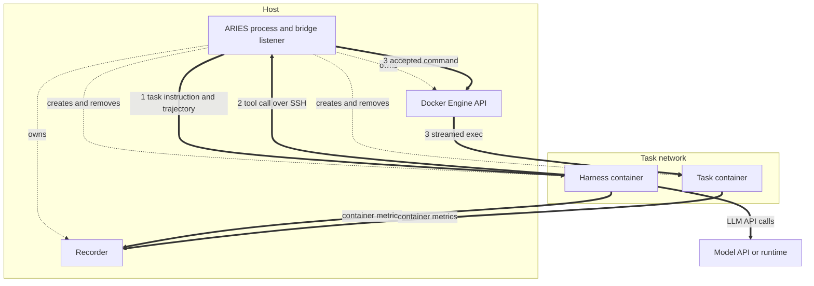

# Container topology

The role guides describe *ownership*: which component may start, observe, or
evaluate what. This page describes the *runtime shape* that ownership takes on
a Linux host — which processes run in which container, which connections exist
between them, and when each connection is created and removed.

Nothing here adds a component role. The Runner still composes exactly the four
roles described in the [architecture](../design.md).

## Participants

One admitted task occurrence produces the following participants.

| Participant | Identity | Owner |
| --- | --- | --- |
| ARIES | one host process | the operator |
| Task network | `aries-net-<id>` | `ToolSandbox` |
| Task container | `aries-task-<id>` | `ToolSandbox` |
| Harness container | `aries-openclaw-<id>` or `aries-hermes-<id>` | `AgentHarness` |

The ARIES process holds the Runner, the bridge's SSH server, the recorder, and
the Docker Engine client. That SSH server runs inside the ARIES process
itself: a TCP listener bound to the task network's gateway address, not a
container and not a daemon installed in either container. Task images
therefore need no SSH server of their own.

Both containers carry `aries.managed`, `aries.kind`, `aries.component`,
`aries.run`, and `aries.task`; the harness container adds `aries.attempt`. The
task network carries the same set except `aries.component`, which only
containers receive. That label is exactly `sandbox` or `harness`, and the
recorder uses it to classify the containers it samples.

Identity labels are checked when the sandbox validates its freshly started
container and network, and again whenever the network gateway is resolved.
Cleanup does not match on labels: it removes the container and network recorded
at start, then requires a follow-up inspection to report each one absent.

The task network is created per task and is `Internal` unless the benchmark
task allows network access. The task container joins it under the alias
`task-sandbox`, holds the task image, and is held open by `/bin/sleep infinity`
under Docker's `init` process, so it exposes no port and serves nothing. The
harness container joins the same network by name.

A managed SGLang runtime, when configured, is a host child process in its own
process group for the whole profile run, rather than a per-task container. See
the [model runtime guide](runtime.md).

## Connections

Dashed arrows are lifecycle control paths; ARIES owns every managed resource
and no container manages another. Solid arrows are data paths, numbered where
they carry a tool call. The absence of an arrow between the two containers is
deliberate: they share a network but exchange nothing across it.

The recorder samples both containers, not only the task container. It lists
containers by managed and run labels and classifies each by its component
label, so harness cost and sandbox cost are observed through the same path.

**1. Control plane — ARIES to the harness container.** How ARIES delivers the
task instruction and collects the trajectory. The transport differs by harness
and is described in the next section.

**2. Tool calls — the harness container to the host bridge.** The harness
connects outward to an ephemeral listener on the task network's `IPv4` gateway
address. Host and client keys are `Ed25519` and are generated per session.
The bridge accepts only `exec` requests, decodes them against the harness's own
SSH grammar, and rejects everything else.

**3. Execution — the host to the task container.** The bridge translates an
accepted request into a `core.Command` and calls the sandbox's streaming
executor, which reaches the task container through the Docker Engine API.

The consequence worth stating plainly: a tool call leaves the harness
container, arrives at the host, and re-enters the task container through the
Engine API. The harness never receives the Docker socket and never holds a
handle on the task container.

Because both containers share the task network, IP reachability between them
exists. It is unused — the task container publishes no port and runs only the
idle command — so the guarantee comes from the sandbox serving nothing, not
from network segmentation.

## Harness control planes

**OpenClaw** runs a gateway inside its container listening on `18789/tcp`,
published to `127.0.0.1` on an ephemeral host port. ARIES drives the agent over
that gateway; the connect payload carries a per-session token generated as 32
random bytes.

The bridge writes the SSH client helper, an identity, and a known-hosts file to
private host paths and advertises those paths in the tool endpoint. The harness
reads them and copies the files into its own container before start — they are
not bind mounts — and the bridge removes the host copies when it revokes. The
helper accepts exactly one argument order and compares its SSH configuration
against a pinned directive list byte for byte before connecting.

**Hermes** publishes no port. Its container is held at an idle shell command
ending in `exec sleep infinity`, and ARIES drives one Hermes run through a
Docker exec into that container, recovering the exit status from a sentinel
trailer on the exec stream. Hermes runs OpenSSH itself, so no client helper is
staged and the tool endpoint carries only the identity. Hermes forces
`StrictHostKeyChecking=accept-new` and offers no way to preload a known-hosts
file, so the bridge keeps its copy as private run evidence instead of staging
one.

Each bridge implements exactly one harness's SSH grammar, and a crossed pair is
rejected before the run starts. See
[supported implementations](../supported.md).

## Lifecycle

Connections appear and disappear in the order the Runner enforces.

| Phase | Task network and container | Connection 1 | Connections 2 and 3 |
| --- | --- | --- | --- |
| Sandbox start and benchmark sanitization | live | absent | absent |
| Bridge start | live | absent | listener open |
| Harness start and run | live | live | live |
| Harness stop | live | closed | listener open |
| Bridge revocation | live | closed | closed |
| Independent evaluation | live | closed | closed |
| Sandbox stop | absent | closed | closed |

Three properties follow from this ordering:

- Evaluation runs against the still-live task container, after every agent path
  into it has been closed. The benchmark uploads its verifier files inside
  `Evaluate`, and the Runner calls `Evaluate` only when harness stop and bridge
  revocation have both returned success. If either fails, evaluation is
  recorded as blocked and `Evaluate` is never called.
- The harness container is removed during harness stop, before evaluation. The
  task container outlives both it and the bridge, and is the last participant
  removed. Removal is confirmed rather than assumed: the sandbox removes its
  container and network and then requires an inspection to report each absent,
  and a resource that still exists is a cleanup failure.
- Revocation is positive. Bridge stop closes live sessions, waits for them, and
  seals its evidence writer; if that evidence cannot be flushed, stop returns
  the error, which the Runner treats as an unconfirmed gate.

Cleanup runs in reverse ownership order — harness, then bridge, then sandbox —
under a context that survives cancellation of the run, so a cancelled run still
drains its resources.

## Customization & Contribution Guide

A new harness or sandbox may change the transports above, but must preserve the
shape: the task environment stays under sandbox ownership, the harness receives
no lifecycle authority over it, tool access arrives through a bridge that can
be positively revoked, and evaluation happens after revocation against the
still-live environment. Keep managed resources labeled with run and task
identity so the recorder can attribute them. Do not add registration,
discovery, factories, reflection, DI, or generic plugins.

Related guides: [agent harness](harness.md), [tool sandbox](sandbox.md),
[tool bridge](bridge.md), [model runtime](runtime.md).
