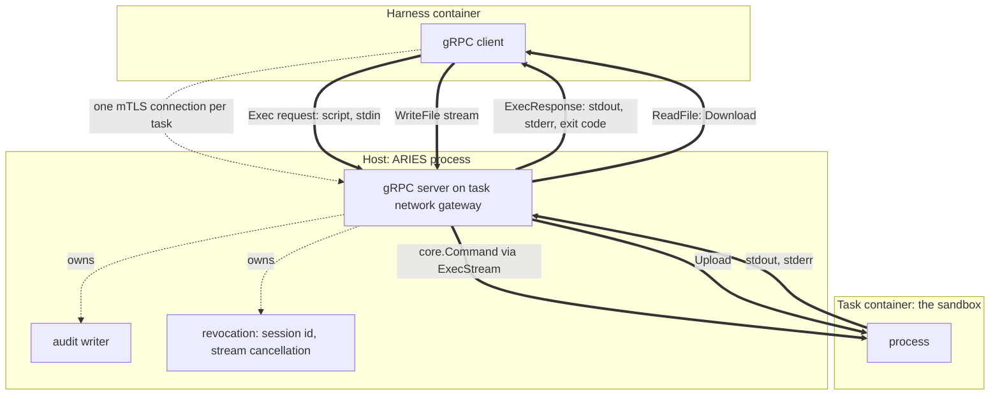

# gRPC tool bridge

**Status: proposal.** Nothing described here is implemented. It replaces the transport of
`ToolBridge`, not the role. The contract in `pkg/runner/interfaces.go` is unchanged.

## Overview

One `ToolBridge` implementation serving gRPC instead of SSH, running **in the ARIES process** on
the task network gateway — the same place the SSH listener binds today. The sandbox gains nothing:
no daemon, no sidecar, no port. Commands still reach the task container through the Docker Engine
API.

The shape is **one RPC per operation** (Option A). A connection is established once per task and
reused; each call is one HTTP/2 stream, which is the direct analogue of today's single-use SSH
channel. The server holds no execution state and carries no working directory of its own, so
revocation stays as provable as it is now.



Dashed arrows are control and lifecycle; thick arrows are data.

- [Section 1](#1-scope) — what changes and what deliberately does not.
- [Section 2](#2-service-definition) — the methods and messages.
- [Section 3](#3-connection-authentication-and-session-identity) — one connection, mTLS, and
  what the session id is for.
- [Section 4](#4-state-what-the-server-holds) — why the working directory is a field.
- [Section 5](#5-revocation) — how `Stop` keeps its guarantee.
- [Section 6](#6-evidence) — preserving the audit contract.
- [Section 7](#7-what-is-preserved-and-what-is-dropped) — the migration checklist.
- [Section 8](#8-open-questions) — what this proposal does not settle.
- [Section 9](#9-reaching-a-real-harness-without-moving-the-pin) — how a real client is reached.

## 1. Scope

**In scope.** A new bridge implementation under `pkg/bridge/`, selected by a new `bridge.type`
value, constructed by a new `case` in `newBridge` (`cmd/aries/wiring.go:318-341`). It implements
`runner.ToolBridge` and returns a `core.ToolEndpoint` describing a gRPC endpoint instead of an SSH
one.

The four methods below are the design; they are not one deliverable. The first implementation
carries **`Exec` alone**, which already exercises everything structural — the connection, the
credential material, the audit writer, `ExecStream`, and revocation. `ReadFile`, `WriteFile`, and
`Stat` add file-transfer plumbing that proves nothing further about the transport, and they make
the file-transfer policy question live before there is anything to test it against.

**Out of scope, deliberately.**

- *The harness side.* Some client has to speak this. Which harness, and how it is taught to, is a
  separate decision. The first iteration is paired with Hermes only — `bridge.type` `hermes-grpc`,
  admitted for `harness.type == "hermes"` — but **the service itself is harness-neutral by
  requirement**, because OpenClaw is expected to follow. See
  [section 8](#8-open-questions), items 1 and 2.
- *The sandbox.* `runner.Sandbox` and `pkg/sandbox/docker` are untouched. Every method below lands
  on `ExecStream`, `Upload`, `Download`, or `DownloadLimit`, all of which already exist.
- *Session-scoped server state.* Considered and rejected for this iteration; see
  [section 4](#4-state-what-the-server-holds).
- *Anything running inside the task container.* See
  [containers](containers.md) for why the sandbox stays empty.

**Sources:** `pkg/runner/interfaces.go`, `cmd/aries/wiring.go`, `pkg/sandbox/docker/docker.go`.

## 2. Service definition

Four methods. The command-profile research found that 27% of Terminal-Bench tasks contain a
pipeline or substitution no typed method can replace, and that file writes appear in 74% — so the
surface needs a shell form and first-class file transfer. It found no structured commands crossing
the wire at all, which is why `Exec` carries a script rather than an argument vector; see
[why nothing else is here](#why-nothing-else-is-here).

```proto
service Sandbox {
  rpc Exec(ExecRequest) returns (ExecResponse);
  rpc ReadFile(ReadFileRequest) returns (stream FileChunk);
  rpc WriteFile(stream WriteFileRequest) returns (WriteFileResponse);
  rpc Stat(StatRequest) returns (StatResponse);
}
```

### Exec

Unary in both directions. `stdin` is a bounded field on the request; `stdout` and `stderr` are
bounded fields on the response. This is the deliberate first-iteration choice — see
[why neither side streams](#why-neither-side-streams).

```proto
message ExecRequest {
  string script = 1;   // run under /bin/bash -c, exactly as the wire carries today
  bytes stdin = 2;     // bounded; large input goes through WriteFile
}
```

Two fields, because two fields are what actually crosses the wire.

#### Why nothing else is here

The Hermes bridge populates **three of `core.Command`'s eight fields** — `Path`, `Args`, and
`Dir` — and `Dir` is a constant it forces itself (`pkg/bridge/hermesssh/workspace.go:46-51`).
Every other field a general-purpose sandbox API would carry is unreachable in this one:

| Omitted | Why |
| --- | --- |
| `working_dir` | The bridge forces `Dir` to `sandbox.Workdir()` on every call, and the client establishes its own position on top of that. Under the transport-swap decision the client owns the directory, so the field would never be read. |
| `env` | The bridge never sets `Command.Env`, and no client environment reaching the sandbox is a preserved property ([section 7](#7-what-is-preserved-and-what-is-dropped)). Defining a field the server intends to refuse is worse than omitting it. |
| `timeout_ms` | The bridge sets no `Command.Timeout`; the per-command bound is applied client-side. |
| `output_limit_bytes` | Never set, so `ExecStream` applies its 16 MiB default. |
| `argv` | Nothing emits structured commands. Every payload arriving today is a shell string, so an `argv` arm would be defined and never populated. |

The omissions are cheap to reverse. Adding fields is wire-compatible, and promoting `script` into
a `oneof` at field 1 later stays wire-compatible on the wire — only the generated Go API changes,
which matters little while there is one client.

**What would bring each back.** `working_dir` and `env` become necessary if a client ever arrives
without a command wrapper of its own — the typed-backend end state, where the client no longer
builds its own `cd`. `argv` becomes necessary when a client emits structured commands, at which
point the `oneof` earns its stated purpose of making a structured call and a shell escape hatch
distinguishable in the audit. `timeout_ms` and `output_limit_bytes` become necessary only if the
bridge starts imposing per-call bounds, which it does not today.

The general trap this avoids: `envd` carries `cwd` and `envs` because it is a general-purpose
sandbox API serving many clients. This bridge has one client, which supplies all of that inside
the script it already builds. Copying the reference surface would import requirements that do not
exist here.

```proto
message ExecResponse {
  int32 exit_code = 1;
  Reason reason = 2;      // completed, cancelled, timed out, limit exceeded, sandbox error
  bytes stdout = 3;
  bytes stderr = 4;
  bool truncated = 5;     // output reached the cap
}
```

`stdout` and `stderr` stay separate fields rather than being interleaved, which is stricter than
SSH's extended-data channel. `exit_code` replaces the `exit-status` request. `reason` carries what
the current design has to flatten into exit code 255 — cancelled, timed out, output limit
exceeded, sandbox error — so a caller can distinguish a command that failed from a bridge that
did.

A non-zero `exit_code` is **not** an RPC error. The RPC status stays `OK` and the exit code goes in
the response; error statuses are reserved for bridge-level failures such as an invalid request, a
revoked session, or an unreachable sandbox. Conflating the two would make "the command failed"
indistinguishable from "the bridge failed", which is exactly the distinction the audit keeps today.

#### The working directory, and what ARIES does not do

The bridge continues to force `Dir` to `sandbox.Workdir()` on every call
(`pkg/bridge/hermesssh/workspace.go:46-51`). The request carries no directory and the response
reports none.

**ARIES adds no mechanism for tracking the directory across calls.** A shell command can `cd`, and
a process's directory dies with it, so reporting where a command finished would mean ARIES
appending a `pwd` to the script and stripping the result back out — the same technique the existing
transport already carries, reintroduced one layer down.

That is not ARIES's problem to solve here. Clients that need a persistent directory already
maintain one themselves, entirely above this boundary: they re-establish it at the top of each
command and recover the result from the command's own output. That machinery is generated by the
harness and passes through ARIES as opaque text — the bridge neither builds it nor reads it. It
rides inside the `script` field exactly as it rides inside the SSH payload today, so directory
tracking behaves identically before and after this migration.

The consequence, stated plainly: **this proposal is a transport swap, not a simplification of what
crosses it.** The wrapper a client wraps around its commands is unaffected. Removing it is a
client-side change with its own justification, and coupling it to the transport migration would
mean doing two risky things at once.

If a future client arrives that carries no wrapper of its own, it will need the directory reported
back. At that point a response field is the right answer, and the exit-status trailer that
`wrappedCommand` already emits (`pkg/sandbox/docker/docker.go:44`, stripped by `exitTrailerWriter`
at `:568-612`) is the mechanism to extend. Not before.

#### Why neither side streams

The SSH transport is fully duplex and the current implementation uses it that way: `ExecStream`
copies `stdin` in one goroutine while a second demultiplexes output
(`pkg/sandbox/docker/docker.go:455-477`), and the bridge hands it the channel for all three
streams (`pkg/bridge/hermesssh/bridge.go:809-812`). So reading and writing genuinely overlap.

**Nothing exercises that overlap, and nothing consumes output incrementally.** The evidence, from
checking every `ExecStream` call site:

- The bridge passes the channel as `stdin` unconditionally, whether or not the client sends a
  byte. That is the absence of a decision, not a decision that `stdin` is needed.
- The bridge's own test fixture drains `stdin` to completion before running anything
  (`pkg/bridge/hermesssh/bridge_test.go:41`), so even the fake is not concurrent.
- The single integration case sends fourteen bytes; no recorded wire payload uses `stdin` at all.
- Nothing watches output arrive. A tool result reaches the model as one complete string in its next
  prompt; there is no progress display, no stall detection, and no incremental parser. ARIES only
  counts bytes, and the count is equally available at the end.

**The size and duration arguments do not apply to this bridge.** Two figures that look like they
justify streaming belong elsewhere:

- The 256 MiB output cap is SWE-bench Pro's verifier, which calls `ExecStream` directly on the
  sandbox and never traverses the bridge. Bridge traffic sets no `OutputLimitBytes`
  (`pkg/bridge/hermesssh/workspace.go:46-51`) and so takes the 16 MiB default
  (`pkg/sandbox/docker/docker.go:36`, `:399-403`).
- The 600-12,000 second budgets in Terminal-Bench's `task.toml` are **whole-task** budgets covering
  many commands, not single-command durations. The per-command bound over this bridge is
  `TERMINAL_TIMEOUT`, which defaults to 180 seconds and is never set from a profile
  (`pkg/harness/hermes/harness.go:39`, `pkg/harness/hermes/config.go:146`; not passed by
  `cmd/aries/wiring.go:257-262`). A twenty-minute command over one bridge call cannot occur.

So the observed traffic is short commands with small outputs, consumed whole. Unary fits it, and
this is a first iteration where simplicity is the point.

**What this gives up, stated plainly.** Partial output is lost when a command is cancelled or the
task budget expires mid-command — the response was never sent, so nothing arrives. That is a real
diagnostic loss, bounded to at most 180 seconds of output. Genuinely interactive commands are also
foreclosed; nothing in the observed corpus needs one.

Both are recoverable later by adding a streaming variant beside this method, without changing it.

**Sources for this subsection:** `pkg/sandbox/docker/docker.go`,
`pkg/bridge/hermesssh/bridge.go`, `pkg/bridge/hermesssh/workspace.go`,
`pkg/bridge/hermesssh/bridge_test.go`, `pkg/harness/hermes/harness.go`,
`pkg/harness/hermes/config.go`, `cmd/aries/wiring.go`,
`.cache/terminal-bench-2/*/task.toml`.

### `ReadFile`, `WriteFile`, `Stat`

These map onto capabilities the sandbox already has and that **no bridge currently reaches**:
`Download`/`DownloadLimit` for reads, `Upload` for writes. `bridgeSandbox` embeds `runner.Sandbox`
(`pkg/bridge/hermesssh/bridge.go:73-83`), so those methods are available to the bridge today and
simply never called.

`ReadFile` server-streams chunks with a mandatory byte cap, landing on `DownloadLimit` so an
oversized read is refused rather than truncated. `WriteFile` client-streams content, landing on
`Upload`. `Stat` is unary and answers the predicate questions that today become `test` and `wc`
invocations.

**A policy note that is not incidental.** The current bridge denies file-transfer payloads
outright, because a harness attempted to push its own configuration — including credential files —
into the container the verifier later inspects. `WriteFile` must not reopen that: it exists for
*agent intent*, and there is deliberately no separate "sync my runtime" path. A typed API makes
that distinction expressible for the first time, where the shell string could not.

**Sources:** `pkg/bridge/hermesssh/bridge.go`, `pkg/bridge/hermesssh/grammar.go`,
`pkg/sandbox/docker/docker.go`, `docs/research/sandbox-command-profile.md`,
`docs/research/e2b-tool-bridge.md`.

## 3. Connection, authentication, and session identity

**One connection per task, established once.** The server binds `tcp4` on the task network's
gateway at port 0, exactly as `Start` does today (`pkg/bridge/hermesssh/bridge.go:606`). The
client dials it from the harness container, which shares that network.

**Authentication is mTLS with per-task material.** `Start` generates a certificate authority and a
client keypair for this task only, mirroring the current per-session `Ed25519` generation
(`:1036-1058`); the client certificate and key are written to private host paths and advertised
through `core.ToolEndpoint` for the harness to stage, as the SSH identity is today. The server
accepts exactly one client certificate. This preserves the property that credentials exist only
for the life of one task and are removed at revocation.

**Session identity is a metadata header**, `aries-session-id`, checked on every call. It is not
redundant with the connection: it makes revocation checkable *per call* rather than relying on the
connection having been closed. After `Stop` marks the id revoked, any call carrying it is refused
with `FAILED_PRECONDITION` even if a connection survives. That is defence in depth for the one
guarantee the bridge exists to provide.

Keepalive is HTTP/2 PING, handled by the transport, replacing the `keepalive@openssh.com` global
request the current server has to implement itself.

**Sources:** `pkg/bridge/hermesssh/bridge.go`, `pkg/core/types.go`.

## 4. State: what the server holds

**Per session:** the listener, the set of in-flight calls, the audit writer, the credential paths,
and the revoked flag. That is the same list the current `bridgeSession` holds
(`pkg/bridge/hermesssh/bridge.go:85-105`), plus the flag.

**Per call:** the script and its `stdin`, discarded when the call returns. Nothing else is
carried — see [why nothing else is here](#why-nothing-else-is-here).

**Not held: the working directory.** `Dir` stays forced to `sandbox.Workdir()` on every call,
exactly as today (`pkg/bridge/hermesssh/workspace.go:46-51`). A client that wants a persistent
directory tracks it entirely on its own side, as clients already do — see
[the working directory](#the-working-directory-and-what-aries-does-not-do). ARIES neither accepts
it, remembers it, nor reports it back.

This is the deliberate choice of Option A over a session-scoped design. The reason is revocation.
Today `Stop` returning `nil` is easy to honour because nothing the bridge holds can act after it
returns, and between commands there is no agent presence in the sandbox at all. Server-held
execution state — especially a persistent process — turns "nothing remains" into "this specific
thing was terminated and its termination was confirmed," which is a larger obligation on the one
guarantee that gates evaluation. Metadata-only state keeps the current proof structure intact
while still removing the marker channel from the wire.

No client-supplied environment reaches the sandbox today, and the request carries no field that
could change that. If one is ever added, it should be an explicit allowlist rather than a
passthrough.

**Sources:** `pkg/bridge/hermesssh/bridge.go`, `pkg/bridge/hermesssh/workspace.go`,
`pkg/runner/runner.go`, `docs/design/ssh-connection-lifecycle.md`.

## 5. Revocation

`Stop` keeps its meaning exactly: a `nil` return is the positive revocation confirmation
(`pkg/runner/interfaces.go:51-53`), and the Runner blocks evaluation without it
(`pkg/runner/runner.go:260-284`).

The sequence mirrors `revoke` and `finalize` today:

1. Mark the session id revoked, so any surviving call is refused.
2. Cancel the serve context, which cancels every in-flight call's context.
3. Stop the gRPC server, refusing new connections and closing established ones.
4. Wait for every handler to return.
5. Seal the audit; if it cannot be flushed, `Stop` returns the error.
6. Remove the client credential material.

An in-flight `Exec` is aborted, not awaited. The cancelled context reaches `ExecStream`, which
terminates the container process group and confirms its absence — machinery that already exists
and is unchanged (`pkg/sandbox/docker/docker.go:668-706`). An error returned after cancellation
that cannot be proven to be pure cancellation must still be preserved and must still fail `Stop`
(`pkg/bridge/hermesssh/bridge.go:813-822`); that logic ports directly.

One improvement over the current implementation: the ordering gap where the listener is closed
before the connection set is locked (`:1002-1005`) does not need to be reproduced. Marking the
session revoked first makes a late-arriving connection harmless by construction rather than by
timing.

**Sources:** `pkg/runner/interfaces.go`, `pkg/runner/runner.go`,
`pkg/bridge/hermesssh/bridge.go`, `pkg/sandbox/docker/docker.go`.

## 6. Evidence

`tool-calls.jsonl` keeps its shape and its role: one record per call, monotonic sequence, shared
timestamp, and **an audit failure latches and blocks revocation**. Every field that exists today
has an equivalent, and two gain precision:

| Today | Under gRPC |
| --- | --- |
| `command` — the shell string | the script, unchanged in substance |
| `operation_class` — `agent`, `bootstrap`, `sync` | the method name |
| `exit_code` clamped to 0-255 | `exit_code` plus a structured termination reason |
| `stdin_bytes`, `stdout_bytes`, `stderr_bytes` | unchanged |
| raw wire log | the request messages, which are already structured |

Two rules carry over unchanged. Command **output never enters the audit** — byte counts only.
And retained `stdin` stays bounded, with the overflow latching an audit error rather than
truncating silently.

Four request classes currently produce no audit record at all — rejected channel types, channels
with extra data, channel accept errors, and refused global requests
(see [SSH connection lifecycle](ssh-connection-lifecycle.md#4-the-request-funnel)). Those gaps
should not be reproduced: a refused call is a recordable event.

#### Per-command logging is reduced, deliberately

The SSH bridges write two artifacts per task: the structured `tool-calls.jsonl` and a byte-level
`ssh_raw.log`, the latter opt-out through `bridge.retain_raw_log`. **This bridge writes only the
structured log**, and there is no equivalent option.

The raw artifact exists because on SSH the wire command and the executed command are different
objects: canonical quoting, and on the OpenClaw path a virtual-namespace translation, mean the
structured record cannot reproduce what actually arrived. Here the request message carries the
script verbatim and the bridge forwards it unchanged, so the structured record is already a
faithful copy of both.

One thing is genuinely lost. Binary `stdin` that is not valid text is omitted from the structured
record with a note, and the SSH bridges keep those bytes in the raw log; this bridge retains them
nowhere. The note says so rather than pointing at a file that does not exist. If binary `stdin`
fidelity turns out to matter, the answer is a raw artifact reintroduced on its own merits, not
carried over by default.

Refusals are recorded here, including a rejected session identity and a call against a revoked
session — closing the gap named in the paragraph above rather than inheriting it.

**Sources:** `pkg/bridge/hermesssh/bridge.go`, `docs/design/hermes-bridge-inventory.md`,
`docs/design/ssh-connection-lifecycle.md`.

## 7. What is preserved, and what is dropped

**Preserved — these are the guarantees, not the transport.**

- Positive revocation, and the fail-closed treatment of ambiguity.
- Audit completeness gating revocation.
- Workdir authority: the bridge forces the sandbox workdir on every call and the request offers
  no way to override it.
- Exact argument boundaries via `core.Command`.
- Absolute command paths with no `PATH` lookup.
- No client environment reaching the sandbox.
- Bounded `stdin` retention; no command output in the audit.
- Per-task ephemeral credentials, removed at revocation.
- Per-call output bounds. Note that `Exec` now buffers up to that bound rather than
  streaming through; see [why neither side streams](#why-neither-side-streams).
- Refusals recorded distinctly from failures.

**Dropped — transport artifacts with no successor.**

- Canonical shell quoting and its round-trip verification.
- The one-exec-per-channel rule, which becomes inherent.
- Host keys and known-hosts pinning, replaced by mTLS.
- The handshake deadline, and the fact that clearing it leaves no idle timeout.
- The `keepalive` global-request handler.
- Grammar-based payload validation of the *envelope*, replaced by typed messages. The script
  itself stays an opaque string, so nothing validates its contents on either transport.

**Sources:** `docs/design/hermes-bridge-inventory.md`,
`docs/design/ssh-connection-lifecycle.md`.

## 8. Open questions

1. **Per-harness generality.** The first client is Hermes-paired, but OpenClaw is expected to
   follow, so **no interface decision here may be Hermes-specific**. Concretely: the service
   defines no harness-shaped message, no grammar keyed to one client's payload style, and no
   assumption about the wrapper a client puts around its commands — `script` is opaque text either
   way. Anything that turns out to need per-harness behaviour belongs in the client, not in the
   service. The one place ARIES currently encodes such a difference is the OpenClaw path's prefix
   stripping and `HOME` remapping (`pkg/bridge/openclawssh/workspace.go`); a gRPC client for
   OpenClaw would carry that itself, and the service would not learn about it.
2. **The pairing rule — open, with an interim decision.** `cmd/aries/wiring.go:78-82` is a two-way
   boolean equality and cannot express a third harness/bridge pair. Rewriting it into a table or an
   explicit per-harness mapping is the correct fix and is **not** part of this iteration. For the
   first iteration, admit the new bridge only for `harness.type == "hermes"`, extending the same
   boolean shape:

   ```go
   if (cfg.Harness.Type == "hermes") != (cfg.Bridge.Type == "hermes-ssh" || cfg.Bridge.Type == "hermes-grpc") {
   ```

   That keeps the crossed-pair rejection intact and defers the restructuring until a second
   harness actually needs it. Record the debt rather than paying it early.
3. **Per-call user identity.** `core.Command.User` is `json:"-"` and no bridge sets it, so the
   agent inherits the container default. Whether `Start` should carry a UID, and under what
   policy, is unresolved.
4. **Timeout placement.** The first cut carries no per-call timeout, matching today: the bridge
   sets none and the client bounds its own commands. If a server-side bound is ever wanted, the
   interaction with the run-level cleanup budget needs stating before adding the field.
5. **Backgrounded processes.** Deep Research Bench launches a server that must outlive the call.
   A unary or streaming `Exec` does not model this; today it works only because the shell
   backgrounds it and the sandbox does not reap it.
6. **The dependency and code-generation question — unresolved, and the largest thing this adds.**
   The repository has **no gRPC dependency today**: `go.mod` lists eleven direct requirements and
   `google.golang.org/protobuf` appears only as `// indirect`. There are no `.proto` files, no
   `protoc` or `buf` configuration, and no generation target in the `Makefile`. So this proposal
   introduces a new direct dependency, a new build step, and a decision about whether generated
   code is checked in or produced at build time.

   That collides with a standing rule: *"Add dependencies only when the stdlib or an existing
   dependency genuinely cannot do the job."* The rule is satisfiable — no stdlib package speaks
   gRPC — but the case should be made explicitly rather than assumed, and the alternative is real:
   the two independent reimplementations found during the E2B research
   ([e2b-tool-bridge](../research/e2b-tool-bridge.md)) both hand-write the Connect envelope with no
   protobuf runtime at all. Decide before writing code, not during.

7. **Deferred: distinguishing structured calls from shell escapes.** A `oneof` over `argv` and
   `script` would let the audit separate the two, which the research argues for. It is omitted from
   the first cut because nothing emits structured commands, so the arm would never be populated.
   Adding it later is wire-compatible.

## 9. Reaching a real harness without moving the pin

Everything in section 8 is deferrable; items 3 to 5 each resolve to "match today's behaviour". The
one genuine question is how a client speaks this protocol at all, and there are two routes.

**The route that does not require a pin move.** ARIES already owns the harness container's
entrypoint wrapper (`pkg/harness/hermes/config.go:159-181`), which exports credentials and then
`exec`s the agent. Prepending a directory to `PATH` there, and staging a shim into it, makes the
harness invoke ARIES's binary wherever it would have invoked its transport client. The shim
translates the invocation into a gRPC call.

There is direct precedent: ARIES stages `/opt/aries/bin/aries-ssh` mode `0555` for the OpenClaw
path and OpenClaw is *configured* to call it (`pkg/harness/openclaw/config.go:314`). The
difference for Hermes is that ARIES deliberately refuses to supply a client command
(`pkg/harness/hermes/config.go:232-238`), so the shim is reached by shadowing `PATH` rather than by
configuration — implicit where the other is explicit.

What this buys: an end-to-end run against the **same pinned image the SSH bridge uses**, with no
image patch and no dependency on a pluggable-backend seam. Staging a file is what ARIES already
does; it is not a patch layer.

What it does **not** buy: the client's command wrapper survives unchanged, the payload is still an
opaque script, and a translation step is added between the harness's invocation shape and the RPC.
That is consistent with this proposal being a transport swap
([the working directory](#the-working-directory-and-what-aries-does-not-do)) rather than a
simplification of what crosses the wire — but it should not be mistaken for progress toward typed
operations.

The cost to weigh is coupling: the shim must understand the harness's invocation shape, and will
break if that shape changes. That coupling belongs in the client, which is where
[section 8](#8-open-questions) item 1 says per-harness behaviour goes, so it does not compromise
the service. It does mean the shim needs its own pinned-payload tests, exactly as the current
grammar has.

**The route that does require a pin move.** A first-class backend registered through the harness's
own pluggable-backend seam. That seam is absent from the pinned image
(`configs/versions.json:19-21`) and present only in later releases, so this path requires moving
the pin — which changes agent behaviour mid-milestone and invalidates the wire payloads recorded in
`pkg/bridge/hermesssh/grammar_test.go:15-16`. It is the cleaner end state and the wrong thing to
attempt first.

**Neither route blocks building the bridge.** The server, service definition, audit path, and
revocation are all testable against a purpose-built Go client — which is what this package's tests
would use regardless, exactly as `bridge_test.go` drives the SSH bridge with a raw
`x/crypto/ssh` client rather than a real harness. Suggested order:

1. Build the bridge and its test client. No pin change, no harness change, nothing user-visible.
2. Add the staged shim and prove an end-to-end run on the current pin.
3. Move the pin and adopt the native backend later, as its own change, re-recording payloads and
   re-running `TestUpstreamHermesDrivesTheBridgeWithoutPatches`.

Only step 3 carries comparability risk, and it is no longer on the critical path.

## Related documents

- What the current bridge guarantees, as a checklist: [hermes-bridge-inventory](hermes-bridge-inventory.md).
- The lifecycle this replaces: [ssh-connection-lifecycle](ssh-connection-lifecycle.md).
- What actually runs in the sandbox: [sandbox-command-profile](../research/sandbox-command-profile.md).
- E2B and `envd` as reference: [e2b-tool-bridge](../research/e2b-tool-bridge.md).
- Container topology: [containers](containers.md).
