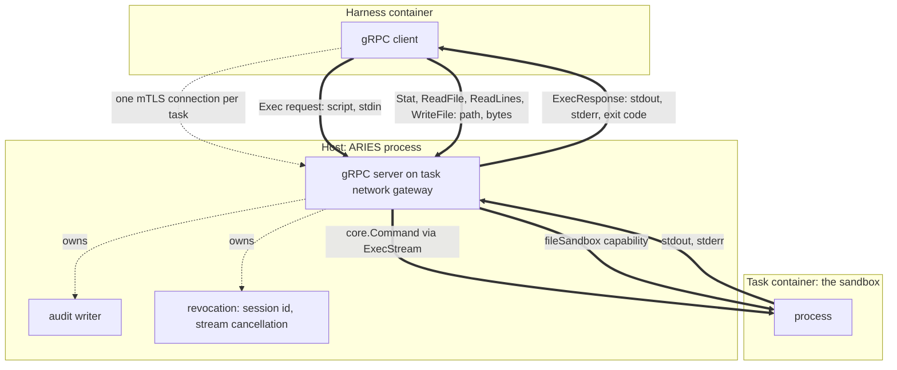

# gRPC tool bridge

**Status: `Exec` and the file procedures are implemented and wired, and the Docker sandbox serves
the file procedures.** They are specified in
[the sandbox RPC interface](sandbox-rpc.md). It
replaces the transport of `ToolBridge`, not the role. The contract in `pkg/runner/interfaces.go` is
unchanged.

## Overview

One `ToolBridge` implementation serving gRPC instead of SSH, running **in the ARIES process** on
the task network gateway — the same place the SSH listener binds today. The sandbox gains nothing:
no daemon, no sidecar, no port. Commands still reach the task container through the Docker Engine
API.

The shape is **one RPC per operation** (Option A). A connection is established once per task and
reused; each call is one HTTP/2 stream, which is the direct analogue of today's single-use SSH
channel. The server holds no execution state and carries no working directory of its own, so
revocation stays as provable as it is now.



Dashed arrows are control and lifecycle; thick arrows are data.

- [Section 1](#1-scope) — what changes and what deliberately does not.
- [Section 2](#2-service-definition) — the methods and messages.
- [Section 3](#3-connection-authentication-and-session-identity) — one connection, mTLS, and
  what the session id is for.
- [Section 4](#4-state-what-the-server-holds) — why the working directory is a field.
- [Section 5](#5-revocation) — how `Stop` keeps its guarantee.
- [Section 6](#6-evidence) — preserving the audit contract.
- [Section 7](#7-what-is-preserved-and-what-is-dropped) — the migration checklist.
- [Section 8](#8-open-questions) — what this proposal does not settle.
- [Section 9](#9-how-hermes-reaches-the-bridge) — the ARIES plugin, the file-operations seam,
  and the working directory.

## 1. Scope

**In scope.** A new bridge implementation under `pkg/bridge/`, selected by a new `bridge.type`
value, constructed by a new `case` in `newBridge` (`cmd/aries/wiring.go:318-341`). It implements
`runner.ToolBridge` and returns a `core.ToolEndpoint` describing a gRPC endpoint instead of an SSH
one.

`Exec` came first and exercises everything structural: the connection, the credential material, the
audit writer, `ExecStream`, and revocation. The file procedures followed, specified in
[the sandbox RPC interface](sandbox-rpc.md).

**Out of scope, deliberately.**

- *The harness side.* Some client has to speak this. Which harness, and how it is taught to, is a
  separate decision. The first iteration is paired with Hermes only — `bridge.type` `hermes-grpc`,
  admitted for `harness.type == "hermes"` — but **the service itself is harness-neutral by
  requirement**, because OpenClaw is expected to follow. See
  [section 8](#8-open-questions), item 1.
- *The sandbox.* `runner.Sandbox` and `pkg/sandbox/docker` are untouched. `Exec` lands on
  `ExecStream`; the file procedures land on a narrow capability the bridge asserts, which no
  sandbox implements yet.
- *Session-scoped server state.* Considered and rejected for this iteration; see
  [section 4](#4-state-what-the-server-holds).
- *Anything running inside the task container.* The sandbox serves nothing and gains no daemon;
  every call still reaches it through the Docker Engine API from outside.

**Sources:** `pkg/runner/interfaces.go`, `cmd/aries/wiring.go`, `pkg/sandbox/docker/docker.go`.

## 2. Service definition

Five methods; the four file procedures are specified in
[the sandbox RPC interface](sandbox-rpc.md). The command-profile research found that 27% of Terminal-Bench tasks contain a
pipeline or substitution no typed method can replace, and that file writes appear in 74% — so the
surface needs a shell form and first-class file transfer. It found no structured commands crossing
the wire at all, which is why `Exec` carries a script rather than an argument vector; see
[why nothing else is here](#why-nothing-else-is-here).

```proto
service Sandbox {
  rpc Exec(ExecRequest) returns (ExecResponse);
  rpc Stat(StatRequest) returns (StatResponse);
  rpc ReadFile(ReadFileRequest) returns (ReadFileResponse);
  rpc ReadLines(ReadLinesRequest) returns (ReadLinesResponse);
  rpc WriteFile(WriteFileRequest) returns (WriteFileResponse);
}
```

### Exec

Unary in both directions. `stdin` is a bounded field on the request; `stdout` and `stderr` are
bounded fields on the response. This is the deliberate first-iteration choice — see
[why neither side streams](#why-neither-side-streams).

```proto
message ExecRequest {
  string script = 1;   // run under /bin/bash -c, exactly as the wire carries today
  bytes stdin = 2;     // bounded; file content goes through WriteFile
}
```

Two fields, because two fields are what actually crosses the wire.

#### Why nothing else is here

The Hermes bridge populates **three of `core.Command`'s eight fields** — `Path`, `Args`, and
`Dir` — and `Dir` is a constant it forces itself (`pkg/bridge/hermesssh/workspace.go:46-51`).
Every other field a general-purpose sandbox API would carry is unreachable in this one:

| Omitted | Why |
| --- | --- |
| `working_dir` | The bridge forces `Dir` to `sandbox.Workdir()` on every call, and the client establishes its own position on top of that. Under the transport-swap decision the client owns the directory, so the field would never be read. |
| `env` | The bridge never sets `Command.Env`, and no client environment reaching the sandbox is a preserved property ([section 7](#7-what-is-preserved-and-what-is-dropped)). Defining a field the server intends to refuse is worse than omitting it. |
| `timeout_ms` | The bridge sets no `Command.Timeout`; the per-command bound is applied client-side. |
| `output_limit_bytes` | Never set, so `ExecStream` applies its 16 MiB default. |
| `argv` | Nothing emits structured commands. Every payload arriving today is a shell string, so an `argv` arm would be defined and never populated. |

The omissions are cheap to reverse. Adding fields is wire-compatible, and promoting `script` into
a `oneof` at field 1 later stays wire-compatible on the wire — only the generated Go API changes,
which matters little while there is one client.

**What would bring each back.** `working_dir` and `env` become necessary if a client ever arrives
without a command wrapper of its own — the typed-backend end state, where the client no longer
builds its own `cd`. `argv` becomes necessary when a client emits structured commands, at which
point the `oneof` earns its stated purpose of making a structured call and a shell escape hatch
distinguishable in the audit. `timeout_ms` and `output_limit_bytes` become necessary only if the
bridge starts imposing per-call bounds, which it does not today.

The general trap this avoids: `envd` carries `cwd` and `envs` because it is a general-purpose
sandbox API serving many clients. This bridge has one client, which supplies all of that inside
the script it already builds. Copying the reference surface would import requirements that do not
exist here.

```proto
message ExecResponse {
  int32 exit_code = 1;
  Reason reason = 2;      // completed, cancelled, timed out, limit exceeded, sandbox error
  bytes stdout = 3;
  bytes stderr = 4;
  bool truncated = 5;     // output reached the cap
}
```

`stdout` and `stderr` stay separate fields rather than being interleaved, which is stricter than
SSH's extended-data channel. `exit_code` replaces the `exit-status` request. `reason` carries what
the current design has to flatten into exit code 255 — cancelled, timed out, output limit
exceeded, sandbox error — so a caller can distinguish a command that failed from a bridge that
did.

A non-zero `exit_code` is **not** an RPC error. The RPC status stays `OK` and the exit code goes in
the response; error statuses are reserved for bridge-level failures such as an invalid request, a
revoked session, or an unreachable sandbox. Conflating the two would make "the command failed"
indistinguishable from "the bridge failed", which is exactly the distinction the audit keeps today.

#### The working directory, and what ARIES does not do

The bridge continues to force `Dir` to `sandbox.Workdir()` on every call
(`pkg/bridge/hermesssh/workspace.go:46-51`). The request carries no directory and the response
reports none.

**ARIES adds no mechanism for tracking the directory across calls.** A shell command can `cd`, and
a process's directory dies with it, so reporting where a command finished would mean ARIES
appending a `pwd` to the script and stripping the result back out — the same technique the existing
transport already carries, reintroduced one layer down.

That is not ARIES's problem to solve here. Clients that need a persistent directory already
maintain one themselves, entirely above this boundary: they re-establish it at the top of each
command and recover the result from the command's own output. That machinery is generated by the
harness and passes through ARIES as opaque text — the bridge neither builds it nor reads it. It
rides inside the `script` field exactly as it rides inside the SSH payload today, so directory
tracking behaves identically before and after this migration.

The consequence, stated plainly: **this proposal is a transport swap, not a simplification of what
crosses it.** The wrapper a client wraps around its commands is unaffected. Removing it is a
client-side change with its own justification, and coupling it to the transport migration would
mean doing two risky things at once.

If a future client arrives that carries no wrapper of its own, it will need the directory reported
back. At that point a response field is the right answer, and the exit-status trailer that
`wrappedCommand` already emits (`pkg/sandbox/docker/docker.go:44`, stripped by `exitTrailerWriter`
at `:568-612`) is the mechanism to extend. Not before.

#### Why neither side streams

The SSH transport is fully duplex and the current implementation uses it that way: `ExecStream`
copies `stdin` in one goroutine while a second demultiplexes output
(`pkg/sandbox/docker/docker.go:455-477`), and the bridge hands it the channel for all three
streams (`pkg/bridge/hermesssh/bridge.go:809-812`). So reading and writing genuinely overlap.

**Nothing exercises that overlap, and nothing consumes output incrementally.** The evidence, from
checking every `ExecStream` call site:

- The bridge passes the channel as `stdin` unconditionally, whether or not the client sends a
  byte. That is the absence of a decision, not a decision that `stdin` is needed.
- The bridge's own test fixture drains `stdin` to completion before running anything
  (`pkg/bridge/hermesssh/bridge_test.go:41`), so even the fake is not concurrent.
- The single integration case sends fourteen bytes; no recorded wire payload uses `stdin` at all.
- Nothing watches output arrive. A tool result reaches the model as one complete string in its next
  prompt; there is no progress display, no stall detection, and no incremental parser. ARIES only
  counts bytes, and the count is equally available at the end.

**The size and duration arguments do not apply to this bridge.** Two figures that look like they
justify streaming belong elsewhere:

- The 256 MiB output cap is SWE-bench Pro's verifier, which calls `ExecStream` directly on the
  sandbox and never traverses the bridge. Bridge traffic sets no `OutputLimitBytes`
  (`pkg/bridge/hermesssh/workspace.go:46-51`) and so takes the 16 MiB default
  (`pkg/sandbox/docker/docker.go:36`, `:399-403`).
- The 600-12,000 second budgets in Terminal-Bench's `task.toml` are **whole-task** budgets covering
  many commands, not single-command durations. The per-command bound over this bridge is
  `TERMINAL_TIMEOUT`, which defaults to 180 seconds and is never set from a profile
  (`pkg/harness/hermes/harness.go:39`, `pkg/harness/hermes/config.go:146`; not passed by
  `cmd/aries/wiring.go:257-262`). A twenty-minute command over one bridge call cannot occur.

So the observed traffic is short commands with small outputs, consumed whole. Unary fits it, and
this is a first iteration where simplicity is the point.

**What this gives up, stated plainly.** Partial output is lost when a command is cancelled or the
task budget expires mid-command — the response was never sent, so nothing arrives. That is a real
diagnostic loss, bounded to at most 180 seconds of output. Genuinely interactive commands are also
foreclosed; nothing in the observed corpus needs one.

Both are recoverable later by adding a streaming variant beside this method, without changing it.

**Sources for this subsection:** `pkg/sandbox/docker/docker.go`,
`pkg/bridge/hermesssh/bridge.go`, `pkg/bridge/hermesssh/workspace.go`,
`pkg/bridge/hermesssh/bridge_test.go`, `pkg/harness/hermes/harness.go`,
`pkg/harness/hermes/config.go`, `cmd/aries/wiring.go`,
`.cache/terminal-bench-2/*/task.toml`.

### The file procedures

`Stat`, `ReadFile`, `ReadLines` and `WriteFile` are specified in
[the sandbox RPC interface](sandbox-rpc.md). They reach the sandbox through a capability the bridge
asserts, not through `Upload` and `Download`, which take host paths and serve the runner.

**A policy note that is not incidental.** The SSH bridge denies file-transfer payloads outright,
because a harness attempted to push its own configuration — including credential files — into the
container the verifier later inspects. `WriteFile` does not reopen that: it exists for *agent
intent*, and the plugin route has no "sync my runtime" path at all.

**Sources:** `pkg/bridge/hermesssh/bridge.go`, `pkg/bridge/hermesssh/grammar.go`,
`pkg/sandbox/docker/docker.go`, `docs/research/sandbox-command-profile.md`,
`docs/research/e2b-tool-bridge.md`.

## 3. Connection, authentication, and session identity

**One connection per task, established once.** The server binds `tcp4` on the task network's
gateway at port 0, exactly as `Start` does today (`pkg/bridge/hermesssh/bridge.go:606`). The
client dials it from the harness container, which shares that network.

**Authentication is mTLS with per-task material, and there is no certificate authority.** `Start`
generates two self-signed `Ed25519` certificates for this task only, one per side, mirroring the
current per-session generation (`:1036-1058`). Each side accepts exactly one peer certificate,
compared by raw bytes in `VerifyPeerCertificate` — the same shape as the SSH bridge comparing one
marshalled public key rather than validating a chain. A chain would be more machinery for a channel
with exactly two parties.

Two files are written to private host paths and advertised through `core.ToolEndpoint` for the
harness to stage. They carry the meanings their SSH-shaped field names already have:

| Endpoint field | Content | Role |
| --- | --- | --- |
| `IdentitySourceFile` | client certificate and key, one PEM, `0600` | the client's own credential, as an SSH identity is |
| `KnownHostsSourceFile` | the bridge's certificate, `0600` | the single server identity the client accepts |

**These certificates never expire, deliberately.** They are issued with `99991231235959Z`, the
GeneralizedTime [RFC 5280 section 4.1.2.5](https://datatracker.ietf.org/doc/html/rfc5280#section-4.1.2.5)
reserves for a certificate with no well-defined expiration date — so the lifetime is stated in
X.509's own vocabulary rather than as a duration somebody chose.

Nothing here would consult a shorter one. Pinning replaces chain validation on both sides, so
neither end runs the standard checks that read `NotAfter`, and the pin compares raw bytes with no
notion of time; an expired certificate is accepted by this configuration, which was verified rather
than assumed. Any finite lifetime would therefore be decorative today, and would become a live
failure for long tasks the moment anyone enabled standard verification.

What bounds these credentials is `Stop`: it removes the client identity and tears the server down.
That is positive revocation, and it is the guarantee the bridge exists to provide — a clock is not.

Leaving the dates unset is not equivalent: Go encodes the zero time as `0001-01-01`, which reads as
expired since year one.

**The server's private key is never written anywhere.** It exists only inside the `tls.Certificate`
the listener holds, so nothing can stage or persist it; only the certificate, which is public
material, reaches the container.

Credentials exist only for the life of one task. Revocation removes the identity file; the bridge
certificate is retained as evidence of what the harness was told to trust, exactly as the SSH
bridge retains its `known_hosts` line.

**There is no per-call identity token.** Identity is settled once, at the TLS handshake, where
exactly one client certificate is accepted by raw bytes — the same shape as the SSH bridge, which
compares its pinned public key once in `PublicKeyCallback` and checks nothing per call. A per-call
token would add nothing: the revocation check below delivers per-call refusal on its own, and a
token could only fail on a bug in ARIES's own client.

**Revocation is still checked on every call**, before anything else the handler does. After `Stop`
marks the session revoked, a call that reaches a surviving connection is refused with
`UNAVAILABLE`, on every procedure, so the client can tell it from a failed precondition. That check
has no SSH counterpart — `hermesssh` has no revoked flag at all
and relies on the transport being torn down — and it is the part worth keeping.

**The client authenticates the bridge, which the SSH path cannot.** Hermes forces
`StrictHostKeyChecking=accept-new` and offers no way to preload a known-hosts file, so on SSH the
harness trusts whatever answers first and ARIES's `known_hosts` line is evidence rather than
something it can hand over. Here the harness is told in advance which certificate is acceptable, so
substituting another — a second bridge's valid certificate, say — is refused.

**The client refuses to be proxied.** grpc-go honours `HTTPS_PROXY` by default, which would carry
every script, its `stdin` and all output off the task network. The staged client opts out
explicitly rather than depending on the harness image's `NO_PROXY`.

**Keepalive is off, and nothing replaced the SSH handler.** HTTP/2 PING exists and the transport
would manage it, but grpc-go disables it by default — `defaultClientKeepaliveTime` is `infinity`, so
the client sends no pings, and the server's own interval is two hours. The SSH bridge's
`keepalive@openssh.com` handler was therefore dropped rather than replaced
([section 7](#7-what-is-preserved-and-what-is-dropped)). Nothing needs it today: a call is one
request and one reply over a connection the harness opens and ARIES tears down, with no idle period
either end must survive. Turning it on is `grpc.WithKeepaliveParams` if that stops being true.

**Sources:** `pkg/bridge/hermesgrpc/credentials.go`, `pkg/bridge/hermesgrpc/client.go`,
`pkg/bridge/hermesssh/bridge.go`, `pkg/core/types.go`.

## 4. State: what the server holds

**Per session:** the listener, the set of in-flight calls, the audit writer, the credential paths,
and the revoked flag. That is the same list the current `bridgeSession` holds
(`pkg/bridge/hermesssh/bridge.go:85-105`), plus the flag.

**Per call:** the script and its `stdin`, discarded when the call returns. Nothing else is
carried — see [why nothing else is here](#why-nothing-else-is-here).

**Not held: the working directory.** `Dir` stays forced to `sandbox.Workdir()` on every call,
exactly as today (`pkg/bridge/hermesssh/workspace.go:46-51`). A client that wants a persistent
directory tracks it entirely on its own side, as clients already do — see
[the working directory](#the-working-directory-and-what-aries-does-not-do). ARIES neither accepts
it, remembers it, nor reports it back.

This is the deliberate choice of Option A over a session-scoped design. The reason is revocation.
Today `Stop` returning `nil` is easy to honour because nothing the bridge holds can act after it
returns, and between commands there is no agent presence in the sandbox at all. Server-held
execution state — especially a persistent process — turns "nothing remains" into "this specific
thing was terminated and its termination was confirmed," which is a larger obligation on the one
guarantee that gates evaluation. Metadata-only state keeps the current proof structure intact
while still removing the marker channel from the wire.

No client-supplied environment reaches the sandbox today, and the request carries no field that
could change that. If one is ever added, it should be an explicit allowlist rather than a
passthrough.

**Sources:** `pkg/bridge/hermesssh/bridge.go`, `pkg/bridge/hermesssh/workspace.go`,
`pkg/runner/runner.go`, `docs/design/ssh-connection-lifecycle.md`.

## 5. Revocation

`Stop` keeps its meaning exactly: a `nil` return is the positive revocation confirmation
(`pkg/runner/interfaces.go:51-53`), and the Runner blocks evaluation without it
(`pkg/runner/runner.go:260-284`).

The sequence mirrors `revoke` and `finalize` today:

1. Mark the session id revoked, so any surviving call is refused.
2. Cancel the serve context, which cancels every in-flight call's context.
3. Stop the gRPC server, refusing new connections and closing established ones.
4. Wait for every handler to return.
5. Seal the audit; if it cannot be flushed, `Stop` returns the error.
6. Remove the client identity file. The bridge certificate stays as evidence.

An in-flight `Exec` is aborted, not awaited. The cancelled context reaches `ExecStream`, which
terminates the container process group and confirms its absence — machinery that already exists
and is unchanged (`pkg/sandbox/docker/docker.go:668-706`). An error returned after cancellation
that cannot be proven to be pure cancellation must still be preserved and must still fail `Stop`
(`pkg/bridge/hermesssh/bridge.go:813-822`); that logic ports directly.

One improvement over the current implementation: the ordering gap where the listener is closed
before the connection set is locked (`:1002-1005`) does not need to be reproduced. Marking the
session revoked first makes a late-arriving connection harmless by construction rather than by
timing.

**Sources:** `pkg/runner/interfaces.go`, `pkg/runner/runner.go`,
`pkg/bridge/hermesssh/bridge.go`, `pkg/sandbox/docker/docker.go`.

## 6. Evidence

`tool-calls.jsonl` keeps its shape and its role: one record per call, monotonic sequence, shared
timestamp, and **an audit failure latches and blocks revocation**. Every field that exists today
has an equivalent, and two gain precision:

| Today | Under gRPC |
| --- | --- |
| `command` — the shell string | the script, unchanged in substance |
| `operation_class` — `agent`, `bootstrap`, `sync` | the method name |
| `exit_code` clamped to 0-255 | `exit_code` plus a structured termination reason |
| `stdin_bytes`, `stdout_bytes`, `stderr_bytes` | unchanged |
| raw wire log | absorbed into the structured record; see below |

Two rules carry over unchanged. Command **output never enters the audit** — byte counts only.
And retained `stdin` stays bounded, with the overflow latching an audit error rather than
truncating silently.

Four request classes currently produce no audit record at all — rejected channel types, channels
with extra data, channel accept errors, and refused global requests
(the SSH request funnel, `pkg/bridge/hermesssh/bridge.go:720-760`). Those gaps should not be
reproduced: a refused call is a recordable event.

#### One artifact, without losing what the second one held

The SSH bridges write two artifacts per task: the structured `tool-calls.jsonl` and a byte-level
`ssh_raw.log`, the latter opt-in through `bridge.retain_raw_log`. **This bridge writes only the
structured log.** For it `retain_raw_log` means the most verbose evidence level: file content,
base64, in a `content_raw` field of each file record. Off by default; content never reaches
`aries.log` or results.

The bridge decodes Hermes's grammar itself (section 2), so it receives the same verbatim payload SSH
does. Three things the raw log uniquely held are therefore accounted for here:

- **The verbatim wire command.** Accepted calls need nothing. The canonical round-trip check in
  `decodeShellToken` rejects any payload whose script token is not canonically quoted, so for a call
  that runs, the recorded `command` *is* the payload that arrived. Refused calls are different:
  a payload that failed to decode has no canonical encoding, and `hermesssh` records only
  `command_hash` for those, keeping the bytes in the raw log alone. Here refusal records carry
  `command` too.
- **Binary `stdin`.** JSON cannot hold arbitrary bytes — a property of the file format, not of SSH —
  so `stdin_raw` carries them base64-encoded when they are not structured-safe, and the omission
  note names that field instead of saying the bytes were not retained.
- **The SSH request framing.** This has no successor and is the one accepted loss. A protobuf
  request is not a comparable artifact.

Refusals are recorded, including a call against a revoked session — closing the gap named in the
paragraph above rather than inheriting it.

#### Per-call sizes are logged, and the output bound is 16 MiB

`Exec` buffers a whole reply, which the SSH bridge never did: it wrote straight to the channel and
accumulated nothing. Both designs end with the full output assembled — the agent's tool-call
interface is request/response, so nothing consumes it incrementally either way — but they
accumulate it in different processes, and that is what the bound is about.

Under SSH the bytes pile up in the harness container, which Docker already caps through
`harness_resources`, and whose death the lifecycle handles as a harness failure. Under gRPC they
additionally materialise inside ARIES, which is shared across tasks and unconstrained. If that
process dies, `Stop` never runs: revocation is unconfirmed and the audit unsealed for **every**
concurrent task, not only the one that produced the output. The bound therefore protects the
fail-closed lifecycle, not throughput.

**Two limits, and the order between them is the point.** `stdout` and `stderr` each truncate at
16 MiB, reporting `truncated` in both the response and the record while the byte counts stay
truthful — they report what the sandbox produced, not what was kept, so a truncated call still says
what it would have needed. The transport cap sits at 64 MiB as a backstop that must never bind
first: if it did, a command would run to completion and then have its reply rejected, which is
exactly the failure grpc-go's 4 MiB receive default would have caused. A test pins that ordering.

**The numbers are deliberately generous.** A Terminal-Bench run peaked at 5.6 KB of `stdout` across
twenty calls, so 16 MiB is roughly three orders of magnitude of headroom. A high limit costs nothing
until it fires — `parser.recvMsg` compares against a length already on the wire, with no
preallocation — while a low one is not free, because truncation stops the agent seeing output it
asked for and can change a task's outcome.

**Compression is available and deliberately off.** grpc-go ships gzip but compresses nothing by
default, and a server with no compressor configured only gzips a reply when the client gzipped the
request — backwards here, where the request is a script and the reply is the large half. Forcing it
is one blank import plus `grpc.SetSendCompressor` in the handler. It is not enabled because the
bytes never leave the host: harness container to task gateway over a local Docker bridge, where
link bandwidth is not the scarce resource and memory is. The trigger to revisit is a bridge whose
two ends stop sharing a host. Note also that `MaxRecvMsgSize` applies to the *decompressed* size,
so compression does not interact with that cap the way it might appear to.

**Sources:** `pkg/bridge/hermesssh/bridge.go`, `docs/design/hermes-bridge-inventory.md`,
`docs/design/ssh-connection-lifecycle.md`.

## 7. What is preserved, and what is dropped

**Preserved — these are the guarantees, not the transport.**

- Positive revocation, and the fail-closed treatment of ambiguity.
- Audit completeness gating revocation.
- Workdir authority: the bridge forces the sandbox workdir on every call and the request offers
  no way to override it.
- Exact argument boundaries via `core.Command`.
- Absolute command paths with no `PATH` lookup.
- No client environment reaching the sandbox.
- Bounded `stdin` retention; no command output in the audit.
- Per-task ephemeral credentials, removed at revocation.
- Refusals recorded distinctly from failures.
- Grammar-based validation of the payload, including the refusal of a raw `~/.hermes` file-sync
  payload. The check stays on the server, where a caller holding the staged credentials cannot
  route around it. On the plugin route Hermes never attempts the sync
  ([section 9](#9-how-hermes-reaches-the-bridge)).
- Canonical shell quoting and its round-trip verification, which `grammar.go` carries over whole.

**Dropped — transport artifacts with no successor.**

- The one-exec-per-channel rule, which becomes inherent.
- Host keys and known-hosts pinning, replaced by mTLS.
- The handshake deadline, and the fact that clearing it leaves no idle timeout.
- The `keepalive` global-request handler.
- The byte-level `ssh_raw.log`. What it uniquely held is absorbed into the structured record;
  see [section 6](#6-evidence).
- Streaming output. `Exec` buffers a whole reply where SSH wrote straight to the channel, which is
  why a truncation bound is needed at all; see [section 6](#6-evidence).

**Sources:** `docs/design/hermes-bridge-inventory.md`,
`docs/design/ssh-connection-lifecycle.md`.

## 8. Open questions

1. **Per-harness generality.** The first client is Hermes-paired, but OpenClaw is expected to
   follow, so **no interface decision here may be Hermes-specific**. Concretely: the service
   defines no harness-shaped message, no grammar keyed to one client's payload style, and no
   assumption about the wrapper a client puts around its commands — `script` is opaque text either
   way. Anything that turns out to need per-harness behaviour belongs in the client, not in the
   service. The one place ARIES currently encodes such a difference is the OpenClaw path's prefix
   stripping and `HOME` remapping (`pkg/bridge/openclawssh/workspace.go`); a gRPC client for
   OpenClaw would carry that itself, and the service would not learn about it.
2. **Per-call user identity.** `core.Command.User` is `json:"-"` and no bridge sets it, so the
   agent inherits the container default. Whether `Start` should carry a UID, and under what
   policy, is unresolved.
3. **Timeout placement.** The first cut carries no per-call timeout, matching today: the bridge
   sets none and the client bounds its own commands. If a server-side bound is ever wanted, the
   interaction with the run-level cleanup budget needs stating before adding the field.
4. **Backgrounded processes.** Deep Research Bench launches a server that must outlive the call.
   A unary or streaming `Exec` does not model this; today it works only because the shell
   backgrounds it and the sandbox does not reap it.
5. **Deferred: distinguishing structured calls from shell escapes.** A `oneof` over `argv` and
   `script` would let the audit separate the two, which the research argues for. It is omitted from
   the first cut because nothing emits structured commands, so the arm would never be populated.
   Adding it later is wire-compatible.

Two questions this section used to carry are settled: the harness/bridge pairing now admits
`hermes-grpc` alongside `hermes-ssh` in `cmd/aries/wiring.go`, and the gRPC dependency and
code-generation step are in `go.mod` and `make proto`, with generated code committed.

## 9. How Hermes reaches the bridge

Hermes reaches the bridge through an ARIES terminal-backend plugin, the pluggable-backend seam
Hermes gained in `v2026.8.27`. The harness stages the plugin under `HERMES_HOME/plugins/aries`,
enables it with `plugins.enabled: [aries]` in the rendered `config.yaml`, and selects it with
`TERMINAL_ENV=aries`. The plugin's environment subclasses Hermes's `BaseEnvironment`, so Hermes's
own working-directory and environment envelope wraps every command, and runs each one as

```sh
/run/aries/bin/aries-grpc exec [--login] -- SCRIPT
```

one process per command. The client wraps `SCRIPT` as the `bash -c` payload the grammar accepts
and makes one `Exec` call. It is run by path, so nothing shadows `ssh` on `PATH` and there is no
OpenSSH argv to reconstruct. That wrapping is temporary: it keeps the grammar gate and audit
classification unchanged, and gives way to a native command request when the SSH pairing is
retired. Hermes enforces command timeouts by killing the client, and the closed connection
cancels the call on the bridge. The plugin constructs no `FileSyncManager`, so Hermes never
attempts its `~/.hermes` sync on this route.

**File operations need one seam in Hermes itself.** Hermes lowers every file tool into shell
commands through `ShellFileOperations`, and `_get_file_ops` constructs that class
unconditionally, so no plugin can supply typed file operations. ARIES adds
`BaseEnvironment.get_file_operations()`, returning `None` by default, and makes `_get_file_ops`
ask the environment first; the plugin's environment returns its own `FileOperations` subclass.
Until that two-line change is upstream, `pkg/harness/hermes/seam.py` applies it inside the
container: the agent wrapper runs it as root before Hermes starts, it checks every anchor before
writing, and a missing anchor stops the container, so a moved pin cannot silently leave file
tools on the shell. The gRPC route therefore runs the pinned image with that patch applied; the
SSH route runs it unmodified.

**The working directory.** Both Hermes bridges advertise the sandbox workdir in
`core.ToolEndpoint.Workdir`, and the harness sets `TERMINAL_CWD` from it. Hermes runs a session's
first command in `TERMINAL_CWD` behind `cd || exit 126` and records a new directory only after a command
completes, so a path the sandbox lacks fails every command. An earlier placeholder path did exactly
that on both routes.

## Background material

The research behind this proposal is deliberately not tracked in the repository. It was written to
reach these decisions rather than to be maintained alongside the code, and it would go stale as the
bridge changes. The `**Sources:**` lines in each section name the code that section rests on, which
is the part that stays true.

For anyone who has the working copy, the unversioned notes are `docs/design/containers.md`,
`hermes-bridge-inventory.md`, `hermes-integration.md`, `ssh-connection-lifecycle.md`,
`code-structure.md`, and `docs/research/{e2b-tool-bridge,sandbox-command-profile}.md`.
