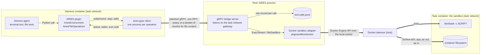
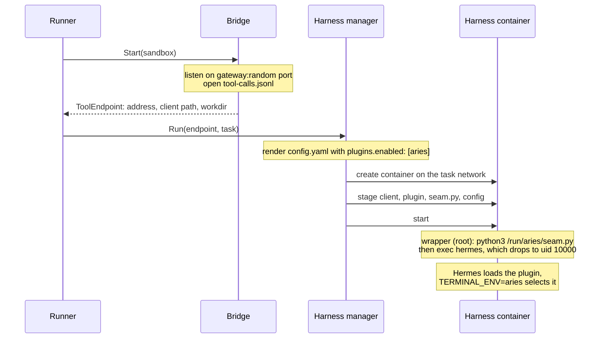
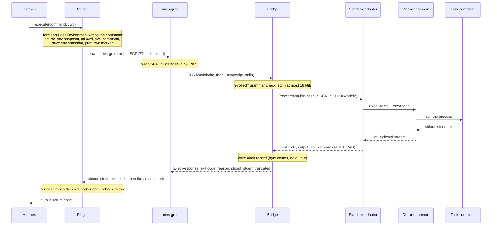
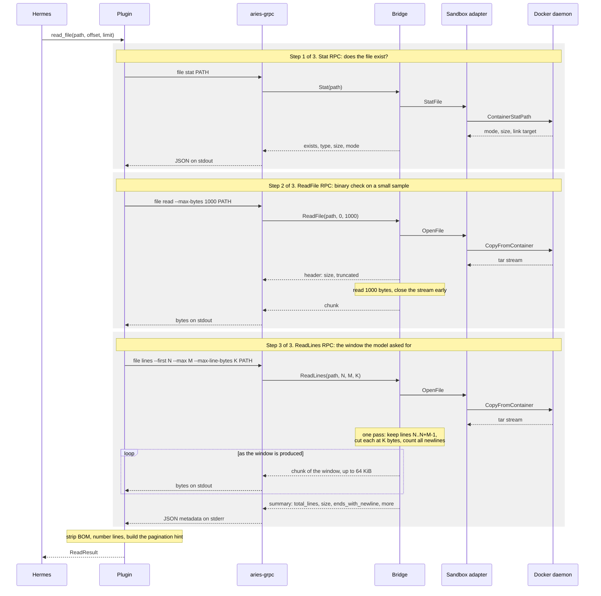
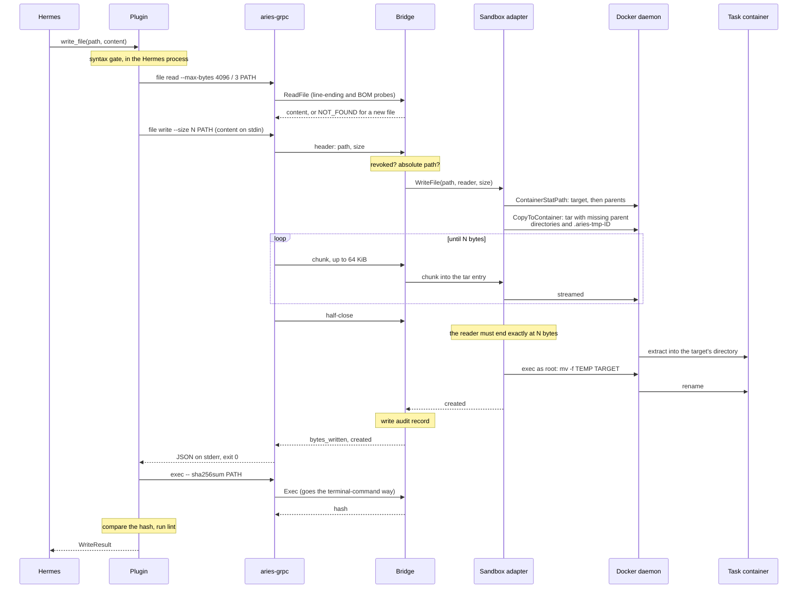
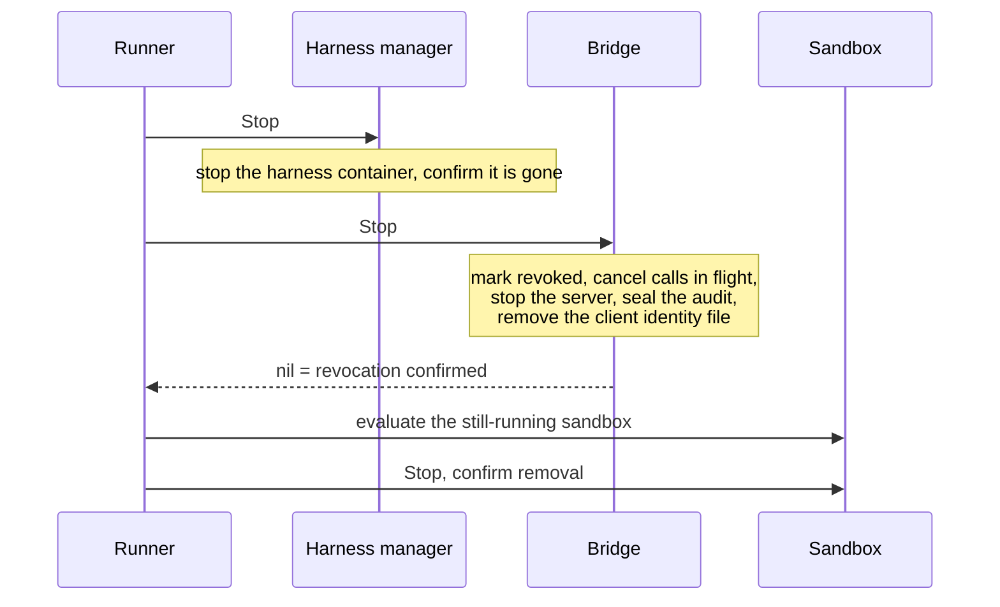

# The Hermes gRPC route: how a tool call reaches the sandbox

This document describes what runs where, and what happens on the wire, when Hermes uses a tool on
a `hermes-grpc` profile. It describes current behaviour only. The decisions behind it are in
[the gRPC bridge design](grpc-bridge.md), and the procedure contract is in
[the sandbox RPC interface](sandbox-rpc.md).

## Components

Three places are involved: the harness container, the ARIES process on the host, and the task
container. The Docker daemon runs on the host, not inside the sandbox. The sandbox is an ordinary
container that serves nothing; every call reaches it from outside, through the Docker Engine API.

| Component | Runs in | Code | What it does |
| --- | --- | --- | --- |
| Hermes agent | harness container | pinned upstream image | Talks to the model, decides tool calls, formats tool results |
| ARIES plugin | harness container, inside the Hermes process | `pkg/harness/hermes/plugin/__init__.py` | Hermes terminal backend `aries`. Turns each command or file operation into one run of the client |
| `aries-grpc` client | harness container, one short-lived process per operation | `cmd/aries-grpc`, `pkg/bridge/hermesgrpc/client.go` | Dials the bridge, makes exactly one RPC, prints the result, exits |
| Bridge server | ARIES process on the host | `pkg/bridge/hermesgrpc` | Checks revocation, validates the request, calls the sandbox, writes the audit record |
| Sandbox adapter | ARIES process on the host | `pkg/sandbox/docker` | Turns a command or a file operation into Docker Engine API calls |
| Docker daemon | host | | Runs execs in the task container and moves files through the archive API |
| Task container | task network | benchmark task image | Runs the agent's commands and holds the files. Runs no ARIES code |

## Setup, once per task

What the harness stages into the container:

| Path | Content |
| --- | --- |
| `/run/aries/bin/aries-grpc` | the client binary |
| `/run/aries/hermes/plugins/aries/` | the plugin (`plugin.yaml`, `__init__.py`) |
| `/run/aries/seam.py` | the seam script |
| `/run/aries/hermes/config.yaml` | Hermes configuration, with the plugin enabled |

Environment the harness sets:

| Variable | Value | Read by |
| --- | --- | --- |
| `TERMINAL_ENV` | `aries` | Hermes, to select the backend |
| `TERMINAL_CWD` | the sandbox workdir, from the endpoint | Hermes, as the first working directory |
| `TERMINAL_TIMEOUT` | per-command timeout, 180 seconds by default | Hermes |
| `ARIES_GRPC_TARGET` | the bridge address, `gateway:port` | the client |

**The seam.** Stock Hermes always builds its shell-based file operations. `seam.py` patches two
places in the image's Hermes before it starts: it adds `BaseEnvironment.get_file_operations()`,
and it makes `_get_file_ops` ask the environment first. The plugin's environment then returns
`AriesFileOperations`. If an anchor is missing, the script fails and the container stops.

## A terminal command

- **The script is Hermes's envelope, not the bare command.** The environment snapshot and the cwd
  marker live inside the script and inside files in the sandbox's `/tmp`. The bridge does not
  read them.
- **The working directory.** The bridge always starts the process in the sandbox workdir. The
  envelope's own `cd` moves to the directory Hermes tracks.
- **Timeouts.** Hermes enforces the timeout by killing the client process. The closed connection
  cancels the call on the bridge, and the sandbox adapter terminates the process group in the
  container.
- **A failed command is not a failed call.** A non-zero exit code comes back in an `OK` response.
  The client exits with the command's exit code. Exit code 255 means the call itself failed.

## Reading a file

One `read_file(path, offset, limit)` tool call is **three separate bridge calls**, run one after
another. Each is its own client process and its own RPC. Only the third one returns the text the
model sees.

| Step | RPC | Why | Returns |
| --- | --- | --- | --- |
| 1 | `Stat` | Does the file exist, and is it a regular file? | type, size |
| 2 | `ReadFile`, first 1000 bytes | Is the file binary? | a byte sample |
| 3 | `ReadLines`, the requested window | The content itself | the lines, plus line counts |

The diagram shows the three steps as three boxes. Steps 2 and 3 use the same sandbox path
(`OpenFile`) and differ only in what the bridge keeps from the stream.

- **`ReadFile` and `ReadLines` are different procedures.** `ReadFile` returns a byte range and
  serves probes and whole-file reads. `ReadLines` returns a range of lines and serves the
  paginated `read_file` tool.
- **Content streams end to end, with no size bound.** Docker's tar stream feeds the bridge, and
  the bridge sends 64 KiB chunks that the client writes straight to stdout. Only the plugin holds
  the whole content, because Hermes's `ReadResult` is one string. Metadata rides in the stream: a
  header first for `ReadFile`, a summary last for `ReadLines`.
- **No process runs in the task container for a read.** The archive API needs no binaries in the
  task image.
- **A symlink is followed.** The daemon reports the resolved target, and the adapter reads that.
- **The plugin formats, the bridge selects.** The bridge returns raw bytes of the window. Line
  numbers, truncation markers and hints are Hermes's own code.
- **A step can end the call early.** A missing file stops after step 1. A binary file stops after
  step 2, unless Hermes's UTF-16 rescue applies, which runs on the shell.

## Writing a file

- **The write is atomic.** The bytes land under a temporary name in the target's directory, and
  one rename makes them visible. A reader sees the old file or the new one. A failed or cancelled
  write, or a stream that does not carry exactly the declared size, removes the temporary file and
  leaves the original intact. The rename waits for the client's half-close.
- **Nothing holds the whole file except the plugin.** The client streams stdin and the bridge
  passes chunks into the tar entry, so a write has no size bound.
- **Modes and owners.** An existing file keeps its mode. A new file gets `0644`. Missing parent
  directories are created `0755`. New files and directories are owned by the sandbox's exec
  user.
- **Still on the shell.** The hash check and lint after a write go through `Exec`. So do search,
  delete, move, and patch reads.
- **The archive API acts as root.** File calls can reach paths the agent's own shell cannot,
  when the sandbox runs commands as an unprivileged user. See
  [the known limits](sandbox-rpc.md#docker-implementation).

## What the bridge records

Every call writes one line to `bridge/tool-calls.jsonl` in the task's run directory, including
calls the bridge refuses.

| Call | `operation_class` | Recorded |
| --- | --- | --- |
| `Exec` | `agent`, `bootstrap`, or `sync` (refused) | the script, stdin, byte counts, exit code, duration |
| `Stat` | `file_stat` | path, status, duration |
| `ReadFile` | `file_read` | path, bytes returned, `sha256`, status, duration |
| `ReadLines` | `file_lines` | path, bytes returned, `sha256`, status, duration |
| `WriteFile` | `file_write` | path, bytes written, `sha256`, status, duration |

Command output is never recorded. File content is recorded only when the profile sets
`bridge.retain_raw_log`.

## How a failure travels back

| Where it fails | What the client gets | What Hermes sees |
| --- | --- | --- |
| The command exits non-zero | `OK`, exit code in the response | the command's output and exit code |
| File not found, not a regular file, a write stream that does not match its size | a gRPC status; exit code 1 to 5 | a tool error with the message |
| The session is revoked | `UNAVAILABLE`; exit code 255 | a failed tool call |
| The bridge is unreachable | a transport error; exit code 255 | a failed tool call |

The plugin raises on a failed file call. It never falls back to the shell.

## Teardown

Evaluation starts only after both the harness stop and the bridge revocation are confirmed. If
the audit is incomplete, `Stop` returns an error and the task is not evaluated.

**Sources:** `pkg/harness/hermes/plugin/__init__.py`, `pkg/harness/hermes/seam.py`,
`pkg/harness/hermes/config.go`, `pkg/harness/hermes/harness.go`,
`pkg/bridge/hermesgrpc/client.go`, `pkg/bridge/hermesgrpc/bridge.go`,
`pkg/bridge/hermesgrpc/files.go`, `pkg/bridge/hermesgrpc/audit.go`,
`pkg/sandbox/docker/docker.go`, `pkg/sandbox/docker/files.go`, `pkg/runner/runner.go`.
