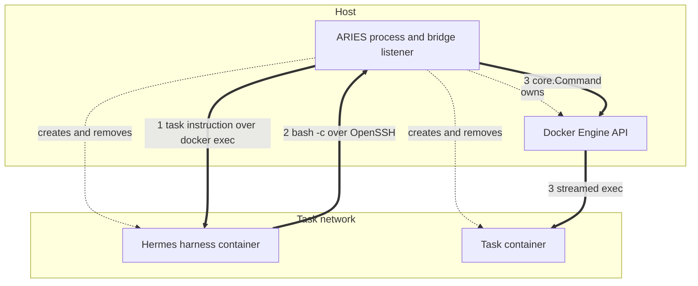

# Hermes harness integration

## Scope

This page describes how the Hermes harness works today: the container ARIES
creates for it, what is staged inside, how one task instruction is delivered,
and how a tool call travels from Hermes to the evaluated sandbox and back. It
records the mechanism as implemented against the pinned image
`docker.io/nousresearch/hermes-agent:v2026.5.29.2`
(`configs/versions.json:19-21`).

It does not describe Hermes's internal agent loop, and it proposes no changes.
The role contracts themselves live in the [agent harness](harness.md) and
[tool bridge](bridge.md) guides; the host-level container shape is in
[container topology](containers.md).

## Where Hermes sits

Hermes implements one of the four substitutable roles, `AgentHarness`
(`pkg/runner/interfaces.go:18-22`):

```go
type AgentHarness interface {
	Start(context.Context, core.HarnessRequest) error
	Run(context.Context, string) (core.HarnessResult, error)
	Stop(context.Context) error
}
```

`pkg/harness/hermes.Manager` asserts that contract at compile time
(`pkg/harness/hermes/harness.go:168`).

The Runner calls those three methods at fixed points in the task lifecycle:
`Start` at `pkg/runner/runner.go:228`, `Run` at `:247`, and `Stop` at `:262`.
Ordering around them is not incidental. The bridge starts first (`:217`) so the
endpoint exists before the harness is configured, and both isolation gates must
return success before the benchmark is allowed to see the sandbox:

```go
	if err := r.harness.Stop(isolationCtx); err != nil {
		isolationErrors = append(isolationErrors, fmt.Errorf("confirm harness stopped: %w", err))
	} else {
		harnessActive = false
		result.Isolation.HarnessStopped = true
	}
```

If either gate fails, evaluation is recorded as blocked and `Evaluate` is never
called (`runner.go:276-284`); only on success does the Runner reach
`r.benchmark.Evaluate` at `:287`. Both gates run under a context built with
`context.WithoutCancel` (`:261`), so a cancelled run still proves revocation.

`Start` is followed by a stop attempt even when it fails, because Stop is
idempotent and a partial start may still hold task-local resources
(`runner.go:238-241`).

Selection happens through explicit switches, not a registry. `cmd/aries/wiring.go:63`
admits harness type `hermes`, `:74` admits bridge type `hermes-ssh`, and the two
are required to agree:

```go
	if (cfg.Harness.Type == "hermes") != (cfg.Bridge.Type == "hermes-ssh") {
		return fmt.Errorf("harness type %q requires its paired bridge, not %q", cfg.Harness.Type, cfg.Bridge.Type)
	}
```

Construction is at `wiring.go:256-266`, which passes the pinned image, the run
output root, the API-key lookup, and the web-search and subagent settings.

## Container lifecycle

**Image.** The image must be an exact, non-`latest` tag; `New` rejects anything
else before contacting Docker (`harness.go:185-187`). Only the image is pinned —
unlike the benchmark entries, the Hermes entry in `configs/versions.json` carries
no repository or revision.

**Idle command.** ARIES replaces the upstream entrypoint so it owns when the
agent starts (`harness.go:76-79`):

```go
var (
	idleEntrypoint = []string{"/bin/sh"}
	idleCommand    = []string{"-c", fmt.Sprintf("chown -R %d:%d %s && exec sleep infinity", runtimeUID, runtimeGID, stagedRoot)}
)
```

The `chown` is load-bearing. The staging archive already carries `10000:10000`
ownership, but the Engine's copy API resets it to root, and the start command is
the only place that runs as root after the copy and before readiness
(`harness.go:71-75`).

**Container configuration** (`harness.go:315-327`): the pinned image, the
environment described below, the idle entrypoint and command, and six labels —
`aries.managed`, `aries.kind` (`hermes-harness`), `aries.component` (`harness`),
`aries.run`, `aries.task`, and `aries.attempt`. The host configuration carries
only the task network and the resource limits:

```go
	hostConfig := &container.HostConfig{NetworkMode: container.NetworkMode(request.Endpoint.Network), Resources: resources}
```

There are **no port bindings**. Hermes publishes nothing; ARIES reaches it by
`docker exec`, and Hermes reaches ARIES by dialing outward.

**Create, copy, validate, start** (`harness.go:360-386`). The container is
created stopped, the runtime archive is copied in with `CopyUIDGID: true`, the
container is inspected before it ever runs, and only then started.

`validateContainer` (`:767-811`) re-reads the container from the daemon and
rejects a mismatched image, idle command, entrypoint, or label set; any secret
found in `Env`, `Cmd`, or `Labels`; a network mode other than the task network;
any bind or mount; and any volume other than the one the upstream image declares
for itself:

```go
	for _, mount := range containerInfo.Mounts {
		if mount.Type != "volume" || mount.Destination != imageDeclaredVolume || mount.Name == "" {
			return errors.New("Hermes container must not carry mounts beyond the image-declared volume")
		}
	}
```

`imageDeclaredVolume` is `/opt/data` (`harness.go:45-48`). ARIES does not use it —
`HERMES_HOME` is relocated to the staged private directory — but Docker creates
it regardless, so exactly that one volume is allowed and nothing else.

**Readiness.** Hermes exposes no readiness service, so the positive signal is the
CLI answering from the staged configuration (`harness.go:740-742`):

```go
	probe := `test -x ` + agentWrapperPath + ` && test -r ` + configContainerPath + ` && test -r ` + modelKeyPath +
		` && test -r ` + identityContainerFS + ` && command -v ssh >/dev/null && hermes --version >/dev/null 2>&1`
```

The comment at `:735-739` explains why `hermes --version` is included rather than
only the `test` calls: those run as root and pass regardless of ownership, while
the real agent runs through the PATH shim as an unprivileged user, so only
invoking the CLI proves the staged runtime is readable by the identity that will
use it. The probe repeats every 100 ms and aborts early if the container has
exited (`:743-764`), bounded by `startTimeout` (45 s default, `:36`).

**Stop and confirmed removal** (`harness.go:886-936`). Inspect; stop with a 5 s
grace; re-inspect and `KILL` if still running; remove with `Force` and
`RemoveVolumes`; then require the final inspection to report the container
absent:

```go
	if _, err := manager.client.ContainerInspect(ctx, active.containerID, client.ContainerInspectOptions{}); err == nil {
		errs = append(errs, errors.New("Hermes container remains after removal"))
		return errors.Join(errs...)
	}
```

Only after absence is confirmed are the in-memory secrets cleared (`:930-931`).
A container that was already gone is treated as success (`:896-900`), which is
what makes `Stop` idempotent.

## Staged runtime

`runtimeArchive` (`harness.go:813-830`) builds one tar that is copied to `/`.
Every entry is owned by `10000:10000`.

| In-container path | Content | Mode |
| --- | --- | --- |
| `/run/aries/hermes/config.yaml` | rendered Hermes configuration | `0600` |
| `/run/aries/hermes/model.key` | model API key | `0600` |
| `/run/aries/ssh/id_ed25519` | bridge session identity, read from `endpoint.IdentitySourceFile` | `0600` |
| `/run/aries/run-agent` | wrapper script | `0555` |
| `/run/aries/hermes/tavily.key` | extract API key, staged only when web extract is enabled | `0600` |

Directories are staged explicitly (`harness.go:852-857`): `run/aries`,
`run/aries/hermes`, and `run/aries/ssh` at `0700`, and `run/aries/workspace` at
`0755`.

The identity is read with `readStablePrivateFile` (`harness.go:1093-1116`), which
opens with `O_NOFOLLOW`, requires one bounded regular file at exactly mode
`0600`, and re-stats afterwards to reject a source that changed while being read.

**Why `10000`** (`harness.go:50-58`): `/opt/hermes/bin/hermes` sits earliest on
`PATH` and is a privilege-drop shim — invoked as root it re-execs the real binary
under that UID via `s6-setuidgid`. Staging as root leaves the agent unable to
read its own configuration, and the failure surfaces far from its cause as a
`PermissionError` inside Hermes's `dotenv` loader.

The `/run/aries/workspace` directory exists only inside the harness container. It
is the exec working directory for the agent run (`harness.go:438`), the readiness
probe (`:747`), and the session export (`:1046`), and it is the value written into
`TERMINAL_CWD`. Nothing is ever created, cleared, or seeded in the task sandbox.

## Configuration surface

`renderConfig` (`config.go:50-110`) emits YAML directly rather than through a
marshaller. For a DeepSeek profile with web search and subagents disabled, the
document is:

```yaml
model:
  default: "deepseek-v4-flash"
  provider: "deepseek"
  base_url: "https://api.deepseek.com"
  api_key: "${DEEPSEEK_API_KEY}"
  api_mode: "chat_completions"

agent:
  max_turns: 90

disabled_toolsets:
  - delegation

display:
  streaming: false
  compact: true

platform_toolsets:
  cli:
    - terminal
    - file
    - code_execution
```

Enabling web search appends `- web` to the toolset list and a `web:` block with
`search_backend: "searxng"`, plus `extract_backend: "tavily"` when an extract key
is staged (`config.go:96-108`). Enabling subagents drops the `disabled_toolsets`
block and may add `delegation.max_concurrent_children` (`:73-83`). Every scalar
goes through `yamlString` (`:279-307`), which escapes the quote, the backslash,
the three whitespace controls, and any remaining control character or Unicode
line separator as a numeric escape, so no rendered value can restructure the
document.

Two omissions are deliberate. Toolsets are configured in the file rather than
through the `--toolsets` flag because on the pinned version
`_validate_explicit_toolsets` can fall off its final branch and return a bare
`None`, which the caller unpacks, so the agent exits 1 before doing any work
(`config.go:87-90`). And there is **no terminal block at all** (`config.go:47-49`):

```go
// Terminal settings are deliberately absent. Hermes resolves its backend from
// environment variables only (tools/terminal_tool.py::_get_env_config), so the
// SSH target is supplied through containerEnvironment below.
```

The file is staged at `/run/aries/hermes/config.yaml` (`config.go:19`) and found
through `HERMES_HOME`.

**Container environment** (`config.go:138-151`):

| Variable | Value | Meaning |
| --- | --- | --- |
| `HERMES_HOME` | `/run/aries/hermes` | relocates Hermes state off the image-declared volume |
| `TERMINAL_ENV` | `ssh` | selects Hermes's built-in SSH environment |
| `TERMINAL_SSH_HOST` | host part of `endpoint.Address` | the bridge listener |
| `TERMINAL_SSH_PORT` | port part of `endpoint.Address` | ephemeral, chosen per session |
| `TERMINAL_SSH_USER` | `endpoint.Username`, always `aries` | |
| `TERMINAL_SSH_KEY` | `/run/aries/ssh/id_ed25519` | staged session identity |
| `TERMINAL_CWD` | `/run/aries/workspace` | see below |
| `TERMINAL_TIMEOUT` | `180` by default (`harness.go:39`) | per-command timeout |
| `SEARXNG_URL` | `http://task-sandbox:8888` | added only when web search is enabled |

`TERMINAL_CWD` is the mechanism worth reading closely (`config.go:115-120`):

```go
// TERMINAL_CWD is an ARIES-owned path that deliberately does not exist in any
// task image. The bridge is authoritative for the working directory: it runs
// every command in the sandbox's own workdir. Hermes opens its session with
// `cd <TERMINAL_CWD> 2>/dev/null || true` followed by `pwd -P`, so a path it
// cannot enter makes it adopt the workdir the bridge chose. Naming a real
// sandbox path here is impossible in any case — the harness never learns it.
```

`validateEndpoint` (`config.go:225-239`) additionally refuses any endpoint that
offers a client command or client source file, because Hermes builds its own
`ssh` argv and cannot preload a known-hosts file — accepting one would imply a
host-key guarantee the harness cannot honour.

## Model interaction

The model reaches Hermes as configuration, never as a value in Docker metadata.
`renderConfig` writes the credential as a `${NAME}` reference (`config.go:69`),
which Hermes expands from the process environment. The value itself is staged as
a private file and exported inside the container by the wrapper
(`config.go:159-181`):

```sh
#!/bin/sh
set -eu
if [ ! -f /run/aries/hermes/model.key ]; then
  echo "ARIES: Hermes model key is missing" >&2
  exit 1
fi
DEEPSEEK_API_KEY="$(cat /run/aries/hermes/model.key)"
export DEEPSEEK_API_KEY
exec hermes --ignore-rules --yolo --model "$1" --provider "$2" -z "$3"
```

Three checks bracket this. `Start` refuses to proceed if the rendered
configuration contains the key value (`harness.go:284-287`, and `:303-307` for the
extract key); `validateContainer` refuses if a secret appears in `Env`, `Cmd`, or
`Labels` (`:784-793`); and every artifact is passed through `redactSession`
before being written (`redact.go:8-30`), which replaces both the raw bytes and
their JSON-escaped form. Container logs get an additional line filter that drops
anything containing `authorization:` or `bearer ` (`harness.go:1063-1079`).

The key is held as `[]byte`, cloned from the lookup, and the source buffer is
cleared immediately (`harness.go:273-283`); session secrets are zeroed once
removal is confirmed (`:1248-1253`).

Providers are restricted to `deepseek` and `sglang` (`config.go:184-186`). For
`sglang` the base URL is normalized and must have a path of exactly `/v1`
(`config.go:213-223`).

## Running one task

`Run` accepts exactly one instruction (`harness.go:419-422`) and drives it through
a single Docker exec into the idle container (`:436-439`):

```go
	runCtx, cancel := context.WithTimeout(ctx, active.agentTimeout)
	result, runErr := manager.execAttached(runCtx, active.containerID,
		[]string{agentWrapperPath, active.model.Model, active.model.Provider, instruction}, workspaceRoot)
```

`execAttached` (`:509-598`) wraps the command in a small shell that reports the
child's status as a delimited stderr trailer (`:61-69`):

```sh
token=$1
shift
"$@"
status=$?
printf '\036ARIES_HERMES_EXIT_%s=%s\037' "$token" "$status" >&2
exit "$status"
```

The trailer is authoritative because Docker's exec inspection can race a fast
child. `execTrailer` (`:664-712`) buffers the last 256 bytes of stderr, signals
completion as soon as it sees the token-bearing record terminated by `\037`, and
`Finish` parses the status, rejecting anything outside 0–255 and treating a
missing trailer as an error. The token is fresh random hex per exec (`:510`), so
agent output cannot forge it.

Completion is whichever comes first of exec inspection, the trailer, or stream
end (`:550-571`). Inspection polls at a widening interval, from 20 ms to 1 s and also checks
whether the exec PID is still present via `ContainerTop`, so a finished-but-
unreported exec is not waited on forever (`:600-662`). If the trailer arrives
first, the reader is drained for at most 200 ms before the connection is closed,
because Docker 29 may never send EOF until the caller closes (`:573-586`).

Both streams are bounded at 16 MiB (`:40`, `limitedBuffer` at `:714-729`);
exceeding the bound fails the exec rather than truncating silently. The default
agent timeout is 20 minutes (`:37`), overridden by the task's own timeout
(`:260-263`). Cancellation returns exit code `-1` and the partial output
(`:552-557`), and is classified as `canceled` rather than `failed`
(`:952-969`, `:1081-1091`).

Artifact collection runs under `context.WithoutCancel` (`:448-450`) so a
cancelled or timed-out run still retains its evidence.

## Tool calls: Hermes to bridge to sandbox



Dashed arrows are lifecycle control paths; solid arrows are data paths. The two
containers share a network but exchange nothing across it.

**The bridge listener.** `Start` (`pkg/bridge/hermesssh/bridge.go:555-653`)
resolves the task network gateway, generates a fresh `Ed25519` host and client
key pair per session, and binds an ephemeral port on the gateway:

```go
	listener, err := net.Listen("tcp4", net.JoinHostPort(gateway, "0"))
```

This is a listener inside the ARIES process, not a container and not a daemon in
either container, so task images need no SSH server. The endpoint returned to the
harness carries only the protocol, address, locked username, network, and the
identity paths (`:649-653`) — no client command, which is what
`validateEndpoint` on the harness side requires.

**Accepted grammar.** Hermes drives OpenSSH directly, so the wire command is
whatever `tools/environments/ssh.py` appends to its argv. Only four shapes are
produced (`grammar.go:8-28`), and `decodeRemoteCommand` (`:64-99`) accepts exactly
those: `echo 'SSH connection established'`, `echo $HOME`, `bash -c <script>`, and
`bash -l -c <script>`. The script must be a single token whose encoding is
canonical under Python's `shlex.quote`, verified by re-quoting and comparing
(`:143-145`); `shlexQuote` mirrors the Python safe set `[^\w@%+=:,./-]`
(`:149-170`). Anything else is rejected.

**Denied by policy.** Hermes's `SSHEnvironment.__init__` pushes `~/.hermes` to the
remote before the agent runs, and the file set comes from `iter_sync_files`, which
includes credential files. The remote is the exact container the verifier later
inspects, so ARIES refuses those payloads rather than confining them
(`grammar.go:50-53`):

```go
var syncPayloadPrefixes = []string{"mkdir -p ", "tar xf ", "tar cf ", "rm -f ", "scp "}

var errSyncDenied = errors.New("Hermes SSH file sync is denied by ARIES policy")
```

Refusal is safe and was measured rather than assumed: Hermes catches every sync
exception and rolls back, logging one `file_sync: sync failed, rolled back state`
warning, after which `sync_back` early-returns so the teardown `tar cf -` never
fires (`.agents/BRIDGE-ALTERNATIVES.md:283-300`). Denials are recorded with a
distinct `denied` status rather than being silently dropped (`bridge.go:776-784`).

**Preparation.** Unlike the OpenClaw bridge there is no virtual namespace to
translate (`workspace.go:10-12`). `prepareRemoteCommand` (`:29-55`) makes exactly
two changes: it resolves the bare `bash` token to the absolute `/bin/bash`,
because the sandbox requires an absolute command path and performs no `PATH`
lookup (`:16-21`), and it forces `Dir` to the sandbox's own workdir. Bootstrap
probes are replayed literally through `/bin/sh` so `echo $HOME` reports the
sandbox's own home rather than a value ARIES invents (`:35-45`).

**A single tool call, end to end:**

1. Hermes builds `bash -c <shlex-quoted script>` and runs its own `ssh` client,
   authenticating with the staged `Ed25519` identity as user `aries`.
2. The bridge accepts the connection only for that username and that exact public
   key (`bridge.go:666-674`), and accepts only `session` channels.
3. OpenSSH sends an `env` request first. The bridge refuses it but keeps the
   channel open — closing it would lose every command Hermes ever issues — and
   records the refusal (`bridge.go:752-762`).
4. The `exec` request payload is decoded (`:775`), classified, and prepared
   against `session.sandbox.Workdir()` (`:785`).
5. The request is accepted (`:791`), then `execute` (`:807-847`) streams it to the
   sandbox through `ExecStream`, which reaches the task container over the Docker
   Engine API. Channel stdin, stdout, and stderr are wired straight through.
6. The exit status is clamped to 0–255 and returned as an `exit-status` request
   (`:795-796`), and one `toolCallRecord` is enqueued (`:841-851`).

Each channel handles exactly one exec and then returns (`:795`).

The consequence worth stating plainly: a tool call leaves the harness container,
arrives at the host, and re-enters the task container through the Engine API.
Hermes never receives the Docker socket and never holds a handle on the task
container.

## Isolation and revocation

`Stop` (`bridge.go:893-931`) cancels the serve context, closes live connections,
waits for in-flight sessions, and then finalizes. `finalize` (`:935-947`) seals
the audit writer first and removes the private identity:

```go
	// Only the private identity is removed; that is revocation. knownSource
	// holds nothing but the ephemeral host public key and is retained as the
	// evidence of what Hermes pinned on first use.
	cleanupErr := errors.Join(
		session.revocationError(), auditErr,
		removeIfPresent(session.identitySource),
	)
```

Revocation fails closed in two ways. If the audit writer cannot be flushed, the
error is returned and the session stays active (`:934-936`). And a sandbox error
returned after cancellation is preserved rather than discarded, so an
unconfirmed tool termination cannot be mistaken for an earlier failure
(`:813-821`); `isPureCancellation` (`:975-996`) distinguishes an ordinary
cancellation from one carrying a real error.

The harness gate is independent: `harness.Stop` removes the container and proves
absence, which closes the exec path, while `bridge.Stop` closes the SSH path.
The Runner requires both (`runner.go:260-284`).

One residue is not suppressed. Hermes writes `/tmp/hermes-snap-*.sh` and
`/tmp/hermes-cwd-*.txt` into the sandbox as part of its ordinary session-snapshot
mechanism. That is inherent to its `bash -c` protocol, stays in `/tmp` rather
than the task workspace, and is left in place
(`.agents/BRIDGE-ALTERNATIVES.md:302-305`).

## Artifacts and telemetry

Under `runs/<timestamp>-<profile>/<task-id>/harness/` (`harness.go:331`):

| File | Written at | Contents |
| --- | --- | --- |
| `config.yaml` | `harness.go:350-353` | the rendered configuration, redacted |
| `session-outcome.json` | `:974-983` | status, end reason, exit code, timings |
| `hermes_stdout.log` | `:984-994` | agent stdout, redacted |
| `hermes_stderr.log` | `:984-994` | agent stderr, redacted, trailer removed |
| `container.log` | `:995-1017` | container logs, redacted and line-filtered |
| `telemetry/sessions.jsonl` | `:1044-1061` | Hermes's own session store, exported via `hermes sessions export -` |
| `telemetry.index.json` | `:1024-1037` | relative paths of the telemetry files |

`session-outcome.json` exists because Hermes leaves `ended_at` and `end_reason`
null for `-z` runs, so the recovered exit trailer is the only positive record of
how the agent finished; it is kept beside the native export rather than merged
into it, which keeps that export byte-identical to what Hermes wrote
(`harness.go:938-942`). An empty export is not a failure — a run that never
reached the model leaves no session (`:1050-1055`).

Under `bridge/` (`bridge.go:599-601`): `tool-calls.jsonl` always;
`ssh_raw.log` only when retained; `known_hosts` retained as evidence;
`id_ed25519` removed at revocation. `ssh_raw.log` is the only artifact holding
the raw wire command, the request payload, and binary stdin that the structured
log omits (`bridge.go:47-52`), and it is opt-in through `bridge.retain_raw_log`.

All artifact directories are created mode `0700` with symlinked paths rejected
(`harness.go:1177-1193`), and files are written `O_EXCL` at `0600`
(`:1118-1146`).

The recorder samples the harness container alongside the task container, keyed on
the `aries.managed`, `aries.run`, and `aries.component` labels the container
carries.

## Differences from the OpenClaw path

| Aspect | Hermes | OpenClaw | Why |
| --- | --- | --- | --- |
| Control plane | one `docker exec` into an idle container | a gateway inside the container on `18789/tcp` | Hermes is a one-shot CLI; OpenClaw is a long-lived agent server |
| Port publishing | none | ephemeral host port bound to `127.0.0.1` | follows from the control plane |
| SSH client | Hermes runs OpenSSH itself | a staged `aries-ssh` shim with a pinned 13-directive config | Hermes builds its own argv and cannot be constrained by a helper |
| Grammar | `bash [-l] -c <shlex-quoted script>` plus two `echo` probes | `env … /bin/sh -c` with every token single-quoted | each bridge speaks one harness's real wire format; they are mutually exclusive |
| Workspace mapping | none; absolute sandbox paths used verbatim | a virtual namespace translated per call | OpenClaw generates protocol paths; Hermes does not |
| Workspace clean and seed | nothing to suppress | three controls matched byte-exactly and suppressed | OpenClaw's SSH backend clears and seeds a skills directory |
| Working directory | `TERMINAL_CWD` names a path that cannot exist, so Hermes adopts the bridge's workdir | the generated `cd` prefix is stripped and `HOME` remapped | the harness never learns the real workdir either way |
| Config format | YAML, no terminal block | JSON with `sandbox.backend: "ssh"` | Hermes reads its backend only from environment variables |
| known_hosts | retained as evidence, never staged | staged into the container and pinned | Hermes forces `StrictHostKeyChecking=accept-new` and offers no way to preload one |
| File sync | denied by policy, recorded as `denied` | not applicable | Hermes pushes `~/.hermes`, including credential files, to the remote |

## Requirements imposed on task images

- **`/bin/bash` must exist.** Every agent tool call is `bash -c`, and the bare
  token is resolved to the absolute `/bin/bash` because the sandbox performs no
  `PATH` lookup (`workspace.go:16-21`). A `busybox`-only image cannot run an
  agent command at all (`integration_test.go:29-33`).
- **`/bin/sh` must exist**, for the two bootstrap probes (`workspace.go:14`).
- **The workdir must be shell-neutral.** `validWorkdir` (`workspace.go:66-85`,
  mirrored at `config.go:253-272`) accepts `/` or an absolute path whose
  components contain only `[A-Za-z0-9._-]`. A workdir with a space or a `$`
  fails every command closed.
- **No SSH server is required**, and none should be added; the bridge listener
  lives in the ARIES process.

## Test coverage map

| Invariant | Test | Location |
| --- | --- | --- |
| Staged files, modes, idle container | `TestStartStagesPrivateRuntimeAndPinsIdleContainer` | `harness_test.go:325` |
| No secret in Docker metadata or artifacts | `TestStartKeepsCredentialOutOfDockerMetadataAndArtifacts` | `harness_test.go:372` |
| Extract key staged only when configured | `TestStartStagesExtractKeyWhenConfigured` | `harness_test.go:413` |
| One instruction only | `TestRunAcceptsExactlyOneInstruction` | `harness_test.go:531` |
| Non-zero exit still retains artifacts | `TestRunReportsNonZeroExitAndStillRetainsArtifacts` | `harness_test.go:565` |
| Cancellation classified as canceled | `TestRunCancellationIsReportedAsCanceled` | `harness_test.go:586` |
| Empty session export is not a failure | `TestEmptySessionExportIsNotAFailure` | `harness_test.go:606` |
| Stop is idempotent and confirms absence | `TestStopIsIdempotentAndConfirmsAbsence` | `harness_test.go:628` |
| Remaining container is a failure | `TestStopFailsWhenContainerRemains` | `harness_test.go:652` |
| Only the image-declared volume allowed | `TestValidateContainerAllowsOnlyTheImageDeclaredVolume` | `harness_test.go:760` |
| Credential referenced by name, never by value | `TestRenderConfigReferencesCredentialByName` | `config_test.go:23` |
| YAML injection attempts quoted | `TestRenderConfigQuotesInjectionAttempts` | `config_test.go:73` |
| Native SSH backend selected by env only | `TestContainerEnvironmentSelectsNativeSSHBackend` | `config_test.go:130` |
| Wrapper exports the key and avoids `--toolsets` | `TestAgentWrapperExportsKeyAndAvoidsToolsetsFlag` | `config_test.go:336` |
| Captured payloads accepted | `TestDecodeAcceptsCapturedHermesPayloads` | `grammar_test.go:19` |
| Captured file-sync payloads denied | `TestDecodeDeniesCapturedFileSyncPayloads` | `grammar_test.go:61` |
| Everything else rejected | `TestDecodeRejectsEverythingElse` | `grammar_test.go:78` |
| Canonical quoting required | `TestDecodeRequiresCanonicalQuoting` | `grammar_test.go:101` |
| `shlex.quote` parity | `TestShlexQuoteMatchesPython` | `grammar_test.go:110` |
| Commands mapped to the sandbox workdir | `TestPrepareMapsAgentCommandsToTheSandboxWorkdir` | `workspace_test.go:8` |
| Unsafe workdir rejected | `TestPrepareRejectsUnsafeWorkdir` | `workspace_test.go:47` |
| Evidence retained per call | `TestBridgeProxiesHermesCommandsAndRetainsEvidence` | `bridge_test.go:169` |
| Denial recorded as policy | `TestBridgeDeniesFileSyncAndRecordsItAsPolicy` | `bridge_test.go:298` |
| Identity revoked, known_hosts retained | `TestStopRevokesIdentityAndRetainsKnownHosts` | `bridge_test.go:345` |
| In-flight command cancelled by Stop | `TestStopCancelsInFlightCommand` | `bridge_test.go:470` |
| Real container starts and stops positively | `TestHarnessStartsRealHermesContainerAndStopsPositively` | `harness/hermes/integration_test.go:52` |
| Unmodified upstream drives the bridge | `TestUpstreamHermesDrivesTheBridgeWithoutPatches` | `bridge/hermesssh/integration_test.go:158` |
| No `.hermes` reaches the sandbox | same test | `bridge/hermesssh/integration_test.go:273-275` |

The last two are the load-bearing ones: they run the pinned image unmodified,
read from `configs/versions.json` rather than restated, so that moving the pin
reports whether the new upstream still drives the bridge instead of
re-confirming that a stale image once did (`integration_test.go:35-40`).

## Fragile couplings

- **The grammar is pinned to one upstream version.** The accepted payload shapes
  were recorded from Hermes `v2026.5.29.2` driving a logging SSH server
  (`grammar_test.go:10`). A change to how `tools/environments/ssh.py` builds its
  argv would be rejected as malformed, not adapted to.
- **`shlexQuote` must stay in lockstep with Python's `shlex.quote`.** The
  canonical round-trip check is exact, so a divergence in the safe set turns
  valid commands into rejections (`grammar.go:149-152`).
- **`TERMINAL_CWD` depends on the path not existing.** If a task image ever
  contained `/run/aries/workspace`, Hermes would enter it and run every command
  in the wrong directory. Nothing enforces the absence.
- **Only the image tag is pinned.** `configs/versions.json` carries no repository
  or revision for Hermes, unlike the benchmark entries, so upstream source cannot
  be diffed at build time when the pin moves.
- **`ExecStream` is an optional sandbox capability.** The bridge requires a
  sandbox satisfying `bridgeSandbox` (`bridge.go:73-83`) and fails at `Start` with
  a type assertion if given anything else — there is no compile-time link between
  the bridge and the Docker sandbox that supplies it.
- **The `/opt/data` volume allowance is version-coupled.** If the upstream image
  declared a second volume, `validateContainer` would reject every start
  (`harness.go:802-806`).
