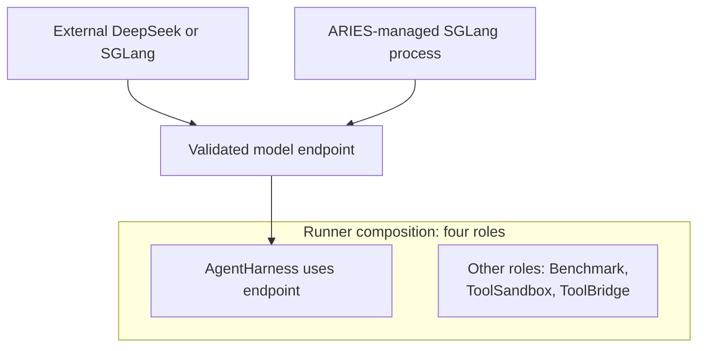

# Model runtime platform service

This is the platform-service guide for model endpoints used by an
`AgentHarness`. A model runtime surrounds task execution; it is not one of the
four component roles and is not a fifth Runner role.

## External and managed service modes

Profiles select `runtime.backend` and `runtime.mode`, while model configuration
identifies the endpoint, served model, and name of the credential environment
variable. ARIES validates the endpoint before admitting task work.

DeepSeek is supported only as an external OpenAI-compatible endpoint. ARIES
performs bounded model validation but does not own the remote service. SGLang
may also be external, or ARIES may manage one host process across a profile run.
Managed SGLang uses a native YAML file, explicit executable and timeouts, and
optional GPU indices; ARIES validates model, port, and GPU topology before side
effects and stops the owned process after admitted tasks drain.

Both direct run and the optional `aries setup PROFILE.json` command share one
idempotent lightweight preparation path for the pinned benchmark checkout,
selected task metadata, and exact Docker images. Direct run completes that
work before creating run artifacts, starting managed SGLang, checking model
health, or admitting tasks. Setup is prewarm-only: it validates backend
configuration and prepares those lightweight inputs, but never starts or stops
a runtime, contacts an external endpoint, installs SGLang, or downloads model
weights. Managed model loading and health therefore remain live, run-scoped
states rather than a persisted readiness marker.

Credentials remain runtime inputs rather than JSON values. Managed child logs
are private, and the configured model credential is removed from the managed
SGLang child environment. ARIES does not install SGLang, download models, or
configure connectivity between the host endpoint and harness containers. See
the [quick start](../quick-start.md) for exact external and managed workflows.

## Customization & Contribution Guide

A new backend or managed service must remain outside the four Runner roles.
Implement its validation and, when needed, its narrow lifecycle in a concrete
package, expose it with an explicit constructor and command switch, and test
endpoint discovery, credential isolation, startup failure, cancellation,
idempotent shutdown, and positive process absence. Update checked-in profiles,
the supported reference, and the quick start only when real configurations
exist. Do not add registration, discovery, factories, reflection, DI, or
generic plugins.
