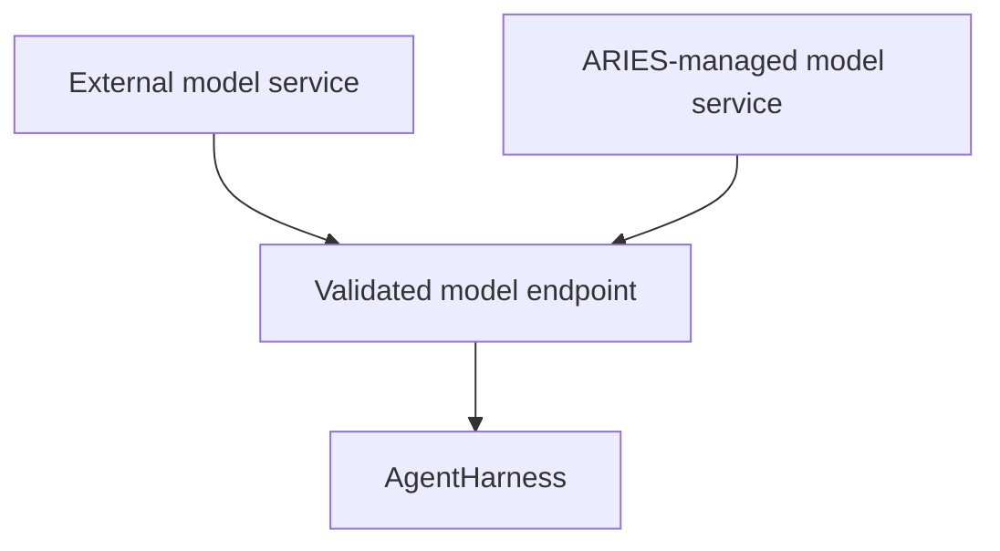

# Model runtime infrastructure

Model endpoint preparation and managed-service ownership surround task execution.
They are outside Runner's four component roles. `AgentHarness` owns inference
interaction; model runtime infrastructure owns service readiness and, for managed
services, process lifecycle.

## External and managed ownership

Profiles select `runtime.backend` and `runtime.mode`. Model configuration supplies
the endpoint, served model, and credential environment-variable name. External
mode validates an endpoint without acquiring ownership of the remote service.
Managed mode owns a local service across the profile run, including concurrent
admitted task work. Endpoint validation precedes task admission.

```mermaid
flowchart TB
    X[External model service] --> E[Validated model endpoint]
    M[ARIES-managed model service] --> E
    E --> H[AgentHarness]
```

## Managed service operations

The application consumes [ModelRuntime](../../internal/app/runtime.go), separately
from [Runner's interfaces](../../pkg/runner/interfaces.go).

| Operation | Contract |
| --- | --- |
| `Start(context.Context) error` | Start the owned model service; preserve cleanup responsibility after partial startup. |
| `Health(context.Context) error` | Check readiness. Only explicitly retryable health failures may be retried. |
| `Done() <-chan struct{}` | Signal process completion, including unexpected exit. |
| `Err() error` | Report the completed process outcome; a nil outcome does not make unexpected exit healthy. |
| `Stop(context.Context) error` | Idempotently terminate owned processes and confirm absence. |

The application watches service completion during startup and admitted work. An
unexpected exit cancels affected work; it is not silently treated as normal
completion. Admitted tasks drain before managed-runtime teardown. Cleanup uses a
fresh bounded context after cancellation. Cleanup failure remains distinct from
an ordinary process exit or inference error.

## Isolation and substitution

Credentials remain runtime inputs. Private child logs and process environments
must preserve credential boundaries. External services are never stopped by
ARIES. Replacements must preserve readiness, cancellation, process ownership,
positive absence, and endpoint validation without becoming a fifth Runner role.
They use explicit construction under `internal/app/wiring/runtime` and concrete
service packages, rather than generic registration.

The [implementation guide](../implementation/model-runtime.md) explains current
DeepSeek/OpenAI-compatible endpoint preparation, SGLang process management,
prewarm behavior, and transport limitations. The [quick start](../quick-start.md)
contains user configuration and commands. [Runtime tests](../../internal/app/runtime_test.go)
cover health retry classification, exit races, and cancellation-independent cleanup;
this documentation review does not establish fresh runtime correctness.
