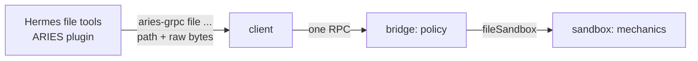

# Sandbox RPC interface

The typed interface between a harness and a task sandbox, as the Hermes gRPC bridge serves it.
It spans three components: the client staged into the harness container (`cmd/aries-grpc`), the
bridge in the ARIES process (`pkg/bridge/hermesgrpc`), and the sandbox. Bridge-specific decisions
(transport, credentials, revocation, audit) are in [the gRPC bridge design](grpc-bridge.md); this
document is the contract. The wire definition with every field documented is
`pkg/bridge/hermesgrpc/sandboxv1/sandbox.proto`.

**Status.** All five procedures are implemented in the client and the bridge. No sandbox offers
file access yet: the Docker sandbox lacks the capability below, so every file call is recorded and
answered `UNIMPLEMENTED`.

## Layers



- **The caller decides what the bytes are.** Hermes keeps its content semantics: the syntax gate,
  BOM and line-ending preservation, lint, line numbering, and the size check before a read.
- **The client forwards.** A path and raw bytes, one call per process, no knowledge of how bytes
  land.
- **The bridge owns policy.** Authorization, the absolute-path rule, bounds, status mapping, and
  one audit record per call.
- **The sandbox owns mechanics**, through a capability the bridge asserts on the sandbox it adapts:

  ```go
  type fileSandbox interface {
      StatFile(ctx context.Context, path string) (fs.FileInfo, error)
      OpenFile(ctx context.Context, path string) (io.ReadCloser, fs.FileInfo, error)
      WriteFile(ctx context.Context, path string, content io.Reader, size int64) (created bool, err error)
  }
  ```

  Errors use `fs.ErrNotExist`, `fs.ErrPermission` and `syscall.EISDIR`, so no sandbox imports the
  bridge. `ReadFile` and `ReadLines` are both served from `OpenFile`.

## Procedures

| Procedure | Request | Response | Serves in Hermes |
| --- | --- | --- | --- |
| `Exec` | script, stdin | exit code, stdout, stderr | the terminal tool, via `AriesEnvironment` |
| `Stat` | path | exists, type, size, mode | the size and regular-file probe |
| `ReadFile` | path, offset, max bytes | content, size, truncated | whole reads, the 3-, 1000- and 4096-byte probes |
| `ReadLines` | path, first line, max lines, max line bytes | window, total lines, size, final newline, more | `read_file`'s paginated window |
| `WriteFile` | path, content | bytes written, created | the atomic write under `write_file` and patching |

`ReadLines` equals `sed -n 'first,lastp' | cut -b1-max_line_bytes` plus `wc -l` plus a
trailing-newline check, computed next to the data in one pass, so only the window crosses the
wire. A test holds it to that pipeline.

## Postconditions

What a sandbox implementation must guarantee; how it does so is its own business.

- **`WriteFile`.** The path holds exactly the content; missing parents exist; a concurrent reader
  sees the old file or the new one, never a prefix; an existing file keeps its mode, a new one gets
  the sandbox's default; the owner is the sandbox's exec user; a symlink at the path is followed.
- **`ReadFile`.** Content is bytes `[offset, offset+n)` of the file as it was at some instant during
  the call; `size` is its length then; `truncated` iff `offset+n < size`.
- **`Stat`.** A snapshot. Absence is `exists=false`, not an error.

## Status codes

| Code | Meaning | Client exit |
| --- | --- | --- |
| `OK` | done | 0 |
| `NOT_FOUND` | path absent (not for `Stat`) | 1 |
| `PERMISSION_DENIED` | the sandbox refused | 2 |
| `INVALID_ARGUMENT` | relative path, bad offset or window, `max_bytes` over the bound | 3 |
| `RESOURCE_EXHAUSTED` | content or window over the bound | 4 |
| `FAILED_PRECONDITION` | not a regular file | 5 |
| `UNAVAILABLE` | session revoked | 255 |
| `UNIMPLEMENTED` | the sandbox offers no file access | 255 |
| `CANCELLED`, other | transport cut, sandbox failure | 255 |

The client prints the payload on stdout and exactly one line on stderr: JSON metadata on success,
a message on failure.

## Bounds and what comes later

Every procedure is unary. File content, like command output, is bounded by the bridge's 16 MiB
output limit. The intended transport for large files is gRPC streaming, a wire change to
`ReadFile` and `WriteFile` that comes with the Docker sandbox implementation or when a measured
file exceeds the bound. `Delete`, `Move` and `ListDir` arrive when Hermes's delete, move and
directory listings move off the shell.
