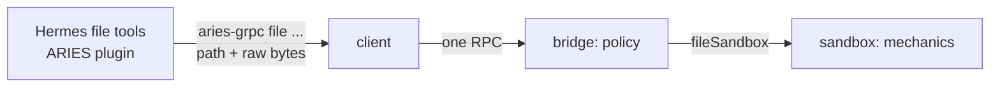

# Sandbox RPC interface

The typed interface between a harness and a task sandbox, as the Hermes gRPC bridge serves it.
It spans three components: the client staged into the harness container (`cmd/aries-grpc`), the
bridge in the ARIES process (`pkg/bridge/hermesgrpc`), and the sandbox. Bridge-specific decisions
(transport, revocation, audit) are in [the gRPC bridge design](grpc-bridge.md); this
document is the contract. The wire definition with every field documented is
`pkg/bridge/hermesgrpc/sandboxv1/sandbox.proto`.

**Status.** All five procedures are implemented in the client, the bridge and the Docker sandbox.
A sandbox without the file capability gets every file call recorded and answered
`UNIMPLEMENTED`.

## Layers


```mermaid
flowchart LR
    H["Hermes file tools<br/>ARIES plugin"] -->|"aries-grpc file ...<br/>path + raw bytes"| C["client"]
    C -->|"one RPC"| B["bridge: policy"]
    B -->|"fileSandbox"| S["sandbox: mechanics"]
```

- **The caller decides what the bytes are.** Hermes keeps its content semantics: the syntax gate,
  BOM and line-ending preservation, lint, line numbering, and the size check before a read.
- **The client forwards.** A path and raw bytes, one call per process, no knowledge of how bytes
  land.
- **The bridge owns policy.** Authorization, the absolute-path rule, the write-size check,
  status mapping, and one audit record per call, with the content's size and `sha256`.
- **The sandbox owns mechanics**, through a capability the bridge asserts on the sandbox it adapts:

  ```go
  type fileSandbox interface {
      StatFile(ctx context.Context, path string) (fs.FileInfo, error)
      OpenFile(ctx context.Context, path string) (io.ReadCloser, fs.FileInfo, error)
      WriteFile(ctx context.Context, path string, content io.Reader, size int64) (created bool, err error)
  }
  ```

  Errors use `fs.ErrNotExist`, `fs.ErrPermission` and `syscall.EISDIR`, so no sandbox imports the
  bridge. `ReadFile` and `ReadLines` are both served from `OpenFile`.

## Procedures

| Procedure | Request | Response | Serves in Hermes |
| --- | --- | --- | --- |
| `Exec` | script, stdin | exit code, stdout, stderr | the terminal tool, via `AriesEnvironment` |
| `Stat` | path | exists, type, size, mode | the size and regular-file probe |
| `ReadFile` | path, offset, max bytes | stream: header (size, truncated), then content chunks | whole reads, the 3-, 1000- and 4096-byte probes |
| `ReadLines` | path, first line, max lines, max line bytes | stream: window chunks, then a summary (total lines, size, final newline, more) | `read_file`'s paginated window |
| `WriteFile` | stream: header (path, size), then content chunks | bytes written, created | the atomic write under `write_file` and patching |

`Exec` and `Stat` are unary. The three content procedures stream in chunks of up to 64 KiB, with
their metadata inside the stream as a typed header or summary, so file content has no size bound
and the bridge holds one chunk at a time. The sandbox needs a write's size before its first byte,
which is why the header carries it.

`ReadLines` equals `sed -n 'first,lastp' | cut -b1-max_line_bytes` plus `wc -l` plus a
trailing-newline check, computed next to the data in one pass, so only the window crosses the
wire. A test holds it to that pipeline.

## Postconditions

What a sandbox implementation must guarantee; how it does so is its own business.

- **`WriteFile`.** The file changes only if exactly the header's size arrived and the stream then
  ended; anything else leaves it as it was. The sandbox method gets a reader and the size, and
  must read to `io.EOF` before committing. The path holds exactly the content; missing parents
  exist; a concurrent reader
  sees the old file or the new one, never a prefix; an existing file keeps its mode, a new one gets
  the sandbox's default; the owner is the sandbox's exec user; a symlink at the path is followed.
- **`ReadFile`.** Content is bytes `[offset, offset+n)` of the file as it was at some instant during
  the call; `size` is its length then; `truncated` iff `offset+n < size`.
- **`Stat`.** A snapshot. Absence is `exists=false`, not an error.

## Status codes

| Code | Meaning | Client exit |
| --- | --- | --- |
| `OK` | done | 0 |
| `NOT_FOUND` | path absent (not for `Stat`) | 1 |
| `PERMISSION_DENIED` | the sandbox refused | 2 |
| `INVALID_ARGUMENT` | relative path, negative offset or `max_bytes`, bad window, a write stream that does not match its header | 3 |
| `RESOURCE_EXHAUSTED` | `Exec` stdin over 16 MiB; no file procedure returns it | 4 |
| `FAILED_PRECONDITION` | not a regular file | 5 |
| `UNAVAILABLE` | session revoked | 255 |
| `UNIMPLEMENTED` | the sandbox offers no file access | 255 |
| `CANCELLED`, other | transport cut, sandbox failure | 255 |

The client prints the payload on stdout as chunks arrive and, after the stream ends, exactly one
line on stderr: JSON metadata on success, a message on failure. A failure after some content
leaves that content on stdout with a non-zero exit, so the caller checks the exit code first. A
`ReadLines` stream without its summary is a failure (exit 255). `file write` takes the size as
`--size N` and streams stdin.

## Docker implementation

`pkg/sandbox/docker/files.go`, on the Docker archive API: no binaries needed in the task image and
no process per read, about 5 ms per small read against 50-70 ms for any exec.

- **`StatFile`** uses `ContainerStatPath`. **`OpenFile`** uses `CopyFromContainer` and hands the
  bridge the tar entry as a stream; closing it early stops the transfer. Both follow a symlink
  through the daemon's fully resolved `LinkTarget`.
- **`WriteFile`** matches Hermes's own `_atomic_write`. Missing parents are created `0755` and
  owned by the exec user, existing ones are untouched, an existing file keeps its mode (special bits
  included), a new one gets `0644`. The daemon's extraction deletes the old file and writes in
  place, so the bytes land under a temporary name in the target's directory and one exec renames
  them into place: a reader sees the old file or the new one, and a failed write leaves the
  original intact. The bytes stream from the bridge straight into the tar entry. After `size`
  bytes the method reads once more and requires the end, so over-long content fails and a streamed
  write finishes before the rename. One exec per write; reads need none.
- **A 404 is absence only if the container is alive**, the rule `Download` already applies.

Known limits:

- **The archive API acts as root**, not as the sandbox's exec user, so on a benchmark that runs the
  agent unprivileged (SWE-bench Pro, `65532:65532`) typed file calls can reach paths the agent's
  own shell cannot. Accepted for performance. Upgrade path: run the three methods as exec scripts
  under the exec user.
- **tmpfs mounts are invisible** to the archive API (`/dev/shm` reads as not found). Upgrade path:
  an exec `cat` fallback for paths under a tmpfs mount.

## Bounds and what comes later

File content has no size bound anywhere on the route. What still bounds it is outside ARIES's
policy: the harness container's memory, because Hermes holds a whole file as one string, and the
sandbox's disk. `Exec` stays unary, with stdin and each output stream limited to 16 MiB.
`Delete`, `Move` and `ListDir` arrive when Hermes's delete, move and directory listings move off
the shell.
