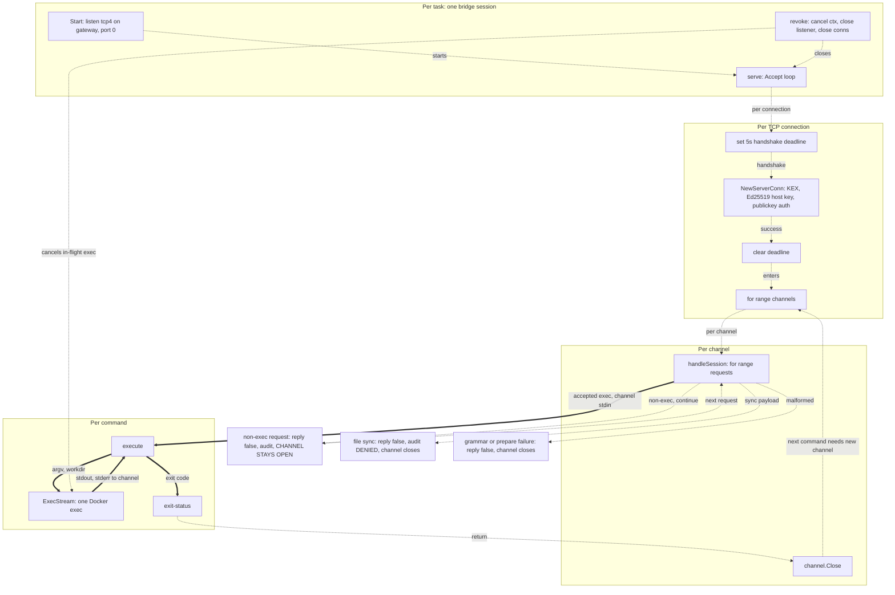

# SSH connection lifecycle

## Overview

The Hermes bridge listens on one TCP port per task and turns accepted `exec` requests into
sandbox commands. Three lifetimes are nested inside that, and confusing them is the usual source
of error:

- **The connection is established once** — key exchange, host key, and public-key authentication
  happen per TCP connection, not per command.
- **The connection is reused** for the whole run, because the client multiplexes.
- **The channel is never reused.** Each channel carries at most one command and then closes.

Fifteen distinct branches end a request without executing anything. Only two of them are policy
refusals; the rest are malformed input or transport failure.



Dashed arrows are control and lifecycle; thick arrows are data.

- [Section 1](#1-what-is-created-per-task) — what `Start` builds and what owns each piece.
- [Section 2](#2-establishment-once-per-connection) — the handshake, and the deadline that is
  deliberately cleared.
- [Section 3](#3-reuse-channels-and-commands) — why a channel is single-use.
- [Section 4](#4-the-request-funnel) — every branch that never reaches execution.
- [Section 5](#5-execution-and-exit) — what one accepted command costs.
- [Section 6](#6-revocation) — what `Stop` closes, and in what order.
- [Section 7](#7-counts-per-task) — the numbers in one table.

## 1. What is created per task

`Start` (`pkg/bridge/hermesssh/bridge.go:555-654`) builds, in order: the session struct and its
connection set; a private artifact directory at `<outputDir>/<taskID>/bridge/`, mode `0700`; a
fresh `Ed25519` host signer and client keypair (`:1036-1058`); the client identity written
`O_EXCL` at `0600`; the listener; the `known_hosts` evidence line; the audit files and their
writer goroutine; the serve context; the shared `ssh.ServerConfig`; and the accept goroutine.

The listener takes a kernel-assigned port on the task network's gateway (`:606`):

```go
	listener, err := net.Listen("tcp4", net.JoinHostPort(gateway, "0"))
```

The server configuration is the whole authentication policy (`:666-674`):

```go
	configuration := &ssh.ServerConfig{
		MaxAuthTries: 3,
		PublicKeyCallback: func(metadata ssh.ConnMetadata, key ssh.PublicKey) (*ssh.Permissions, error) {
			if metadata.User() != lockedUsername || !bytes.Equal(key.Marshal(), authorized.Marshal()) {
				return nil, errors.New("public key rejected")
			}
			return &ssh.Permissions{}, nil
		},
	}
```

No password callback, no keyboard-interactive, no `NoClientAuth`. Public key is the only method,
the username is locked to `aries`, and the key must byte-equal the one generated for this task.

The accept loop registers each connection **before** spawning its handler (`:681-694`), which is
what lets revocation close a connection that has not finished handshaking. There is no connection
cap, no rate limit, and no source-address check.

**Sources:** `pkg/bridge/hermesssh/bridge.go`.

## 2. Establishment: once per connection

`handleConnection` (`:697-738`) is the only place a handshake happens:

```go
	_ = connection.SetDeadline(time.Now().Add(lockedConnectTimeout))
	server, channels, requests, err := ssh.NewServerConn(connection, session.configuration)
	if err != nil {
		return
	}
	defer server.Close()
	// Hermes holds one ControlMaster connection open for the whole run and
	// multiplexes every later command onto it, so the handshake deadline must
	// not survive into the session channels.
	_ = connection.SetDeadline(time.Time{})
```

Key exchange, host-key presentation, and the entire authentication loop happen inside that single
`NewServerConn` call, bounded by a 5-second deadline. The deadline is then cleared, so **after the
handshake the connection has no idle timeout at all**.

A handshake or authentication failure returns silently — no log line and no audit record. That is
an evidence gap worth knowing about when reading `tool-calls.jsonl`.

Two goroutines start per connection and are deliberately not tracked by the session's wait group:
a watcher on `server.Wait()` that cancels the connection context, and `serveGlobalRequests`, which
accepts `keepalive@openssh.com` with an empty payload and refuses everything else (`:740-747`).
Global requests never enter [the request funnel](#4-the-request-funnel).

**Sources:** `pkg/bridge/hermesssh/bridge.go`.

## 3. Reuse: channels and commands

The channel loop (`:722-737`) accepts an unbounded number of concurrent `session` channels on the
established connection; twelve at once is pinned by `bridge_test.go:378-417`. Anything that is not
a `session` channel, or carries extra data, is rejected while the connection stays open.

Each channel then carries **at most one command**. `handleSession` returns after the single `exec`
it accepts (`:795-797`), and the deferred `channel.Close()` fires:

```go
		exitCode := session.execute(ctx, channel, prepared, audit)
		_, _ = channel.SendRequest("exit-status", false, ssh.Marshal(struct{ Status uint32 }{uint32(exitCode)}))
		return
```

So the next command requires a **new channel**, never a new connection. Nothing carries across
channels — the refused `env` request, the `stdin` stream, the working directory are all
per-channel. Cross-command continuity, where it exists, lives in the sandbox filesystem rather
than in the transport.

**Sources:** `pkg/bridge/hermesssh/bridge.go`, `pkg/bridge/hermesssh/bridge_test.go`.

## 4. The request funnel

Fifteen branches terminate without reaching `execute()`. *Policy* means a refusal ARIES chose;
*malformed* means the peer sent something the grammar or protocol does not permit; *transport*
means the peer or network failed.

| # | Where | Condition | Audited? | Channel | Class |
| --- | --- | --- | --- | --- | --- |
| 1 | `:682-688` | `Accept` error | no — warns unless the listener is closed | — | transport |
| 2 | `:706-709` | handshake fails, deadline expires, or auth is exhausted | **no log, no record** | — | transport |
| 3 | `:668-671` | wrong username or non-matching key | no | — | policy |
| 4 | `:667` | three auth failures | no | — | policy |
| 5 | `:723-725` | channel type is not `session` — blocks port forwarding | **no record** | stays open | policy |
| 6 | `:723-725` | `session` channel with extra data | **no record** | stays open | malformed |
| 7 | `:727-730` | `incoming.Accept()` fails | **no record** | stays open | transport |
| 8 | `:740-747` | any global request other than empty `keepalive` | **no record** | stays open | policy |
| 9 | `:752-763` | request type is not `exec` | `unsupported` | **stays open** | policy |
| 10 | `:764-767` | `exec` without `WantReply` | `rejected` | closes | malformed |
| 11 | `:768-773` | exec payload fails `ssh.Unmarshal` | `rejected` | closes | malformed |
| 12 | `:775-783` | payload matches a file-sync prefix | **`denied`, kind `sync`** | closes | **policy** |
| 13 | `:775-783` | any other grammar failure | `rejected` | closes | malformed |
| 14 | `:785-790` | `prepareRemoteCommand` fails, e.g. an unsafe workdir | `rejected`, keeping the kind decoded so far | closes | malformed |
| 15 | `:791-794` | the accept reply itself fails | `failed` | closes | transport |

Branch 9 is the load-bearing one, and the only one that uses `continue` rather than `return`
(`:752-763`):

```go
		if request.Type != "exec" {
			// OpenSSH sends an `env` request on every channel before the exec.
			// Refusing it is correct and expected, but the channel must stay
			// open or Hermes loses every command it ever issues.
			if request.WantReply {
				_ = session.reply(request, false)
			}
			session.logRequestFailure(audit, kindUnknown, "unsupported", "channel request type is not exec")
			continue
		}
```

Every command is therefore preceded by a refused request on the same channel, and that refusal is
recorded rather than dropped.

Two further cases reach `execute()` but produce no tool-call record: recorded `stdin` exceeding
16 MiB latches an audit error instead of writing a record (`:836-840`), and a channel whose
request stream closes without any `exec` simply ends.

**Sources:** `pkg/bridge/hermesssh/bridge.go`, `pkg/bridge/hermesssh/grammar.go`,
`pkg/bridge/hermesssh/workspace.go`.

## 5. Execution and exit

`execute` wires the channel directly to the process (`:809-812`):

```go
	stdin := &recordedInput{reader: channel}
	stdout := &byteCounter{writer: channel}
	stderr := &byteCounter{writer: channel.Stderr()}
	result, err := session.sandbox.ExecStream(ctx, prepared.command, stdin, stdout, stderr)
```

Nothing is buffered in between. `stdin` is tapped for the audit up to 16 MiB; `stdout` and
`stderr` are only counted, never recorded.

One accepted command costs **one** Docker exec, and **two** if it is aborted. `ExecStream` runs
the real argv under `setsid` in its own process group and records the PID; on cancellation,
output-limit overflow, or a stream error, `terminateExec` starts a **second, detached** exec that
`SIGTERM`s then `SIGKILL`s that process group and confirms absence by polling the container's
process table (`pkg/sandbox/docker/docker.go:44-45`, `:668-706`).

The exit code is clamped to 0-255 and forced to 255 on any sandbox error, with status `failed`, or
`canceled` when the error carries a context cancellation (`:825-835`). `exit-status` is sent with
no reply wanted, so a channel already torn down by revocation produces no failure.

**Sources:** `pkg/bridge/hermesssh/bridge.go`, `pkg/sandbox/docker/docker.go`.

## 6. Revocation

`revoke` (`:997-1011`) cancels the serve context, closes the listener, then closes every
registered connection. `Stop` calls it, waits for every tracked goroutine, and only then
finalizes — sealing the audit and removing the private identity while deliberately retaining
`known_hosts` as evidence.

A command in flight is aborted rather than awaited. The cancelled context reaches `ExecStream`,
which terminates the process group as described in [section 5](#5-execution-and-exit). An error
returned after cancellation that cannot be proven to be pure cancellation is preserved, so `Stop`
fails closed (`:813-822`).

An idle multiplexed connection is closed directly from the connection set, so no new channel can
be opened on it afterwards.

**One narrow ordering gap, covered by no test.** The listener is closed at `:1002-1004` *before*
the lock is taken at `:1005`, so a connection accepted but not yet registered escapes the close
loop. The consequence is fail-closed rather than fail-open: any command on it dies on the already
cancelled context, and `waitFor` timing out makes `Stop` return an error, which blocks evaluation.
Reaching it requires a client dialing concurrently with `Stop`, which the
harness-stopped-before-bridge ordering makes unlikely.

**Sources:** `pkg/bridge/hermesssh/bridge.go`, `pkg/runner/runner.go`.

## 7. Counts per task

| Object | Count | Determined by |
| --- | --- | --- |
| Bridge sessions | exactly 1 | `Start` rejects a second; the Runner calls `Start`/`Stop` once per task |
| Listeners | exactly 1 | `bridge.go:606` |
| TCP connections | unbounded server-side; client's choice in practice | no cap in the accept loop |
| Handshakes and authentications | one per connection | `bridge.go:706` |
| Channels | unbounded, concurrent | one per command |
| `execute()` calls | at most one per channel | `bridge.go:797` |
| Docker execs | one per command, plus one on abort | `docker.go:433`, `:686` |

How many TCP connections a harness actually opens is **not determinable from this repository**.
ARIES supplies only host, port, username, and identity path, and stages no client for this
harness; every client option is the harness's own. `docs/design/bridge.md:56-58` records that a
harness may open more than one session per run.

**Sources:** `pkg/bridge/hermesssh/bridge.go`, `pkg/sandbox/docker/docker.go`,
`pkg/bridge/hermesssh/bridge_test.go`, `pkg/bridge/hermesssh/integration_test.go`,
`docs/design/bridge.md`.

## Related documents

- Every guarantee this bridge carries, as a migration checklist:
  [hermes-bridge-inventory](hermes-bridge-inventory.md).
- The container topology the connection sits in: [containers](containers.md).
- The role contracts: [bridge](bridge.md).
