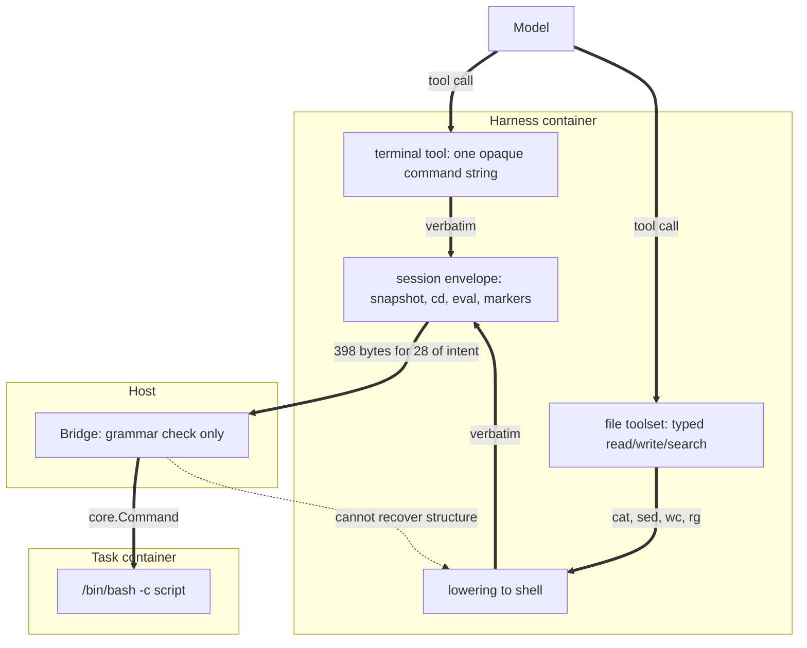

# What actually runs in the sandbox

## Overview

This report answers one question: in `ssh {do-smth}`, what is `{do-smth}`? It exists to inform the
design of a gRPC replacement for the SSH tool bridge — specifically, whether a typed API
(`Ls`, `Grep`, `ReadFile`, `WriteFile`) can absorb real traffic, or whether the surface is really
one `Bash(script)` method with decoration.

**No recorded tool-call log exists.** All seven runs under `runs/` failed at
`harness=not_started`; no `bridge/` directory was ever written. Every figure below is derived from
proxies — 89 Terminal-Bench 2 reference solutions, the benchmark packages' own code, and eleven
verbatim payloads recorded from real Hermes traffic and checked into a test file. Inference is
labelled as inference throughout.

Four findings, in descending order of consequence for the schema:

1. **On the wire today, 90-98% of every byte is envelope, not intent.** A recorded Hermes payload
   carrying `echo hello-from-agent && pwd` is 398 bytes, of which 28 are the agent's command.
   See [section 2](#2-the-wire-90-98-envelope).
2. **No typed shape survives to the bridge.** The agent's intent is flattened to an opaque shell
   string inside the harness, before transport. `Ls`/`Grep`/`ReadFile`/`WriteFile` cannot be
   recovered at the bridge; they must be introduced at the harness.
   See [section 3](#3-nothing-typed-reaches-the-bridge).
3. **But an un-lowered typed source does exist, one layer up.** Hermes's `file` toolset has
   structured read, write, and search operations that it lowers to `cat`/`sed`/`wc`/`rg` *inside
   Hermes*. An ARIES backend would receive them un-lowered.
   See [section 4](#4-the-typed-source-that-already-exists).
4. **The corpus is dominated by file writes, not commands.** 88% of all reference-solution lines
   are heredoc *bodies* — file content, not commands — and `cat > file` appears in 74% of tasks.
   Only 9-13% of commands genuinely need a shell, though those are concentrated in 27% of tasks.
   See [section 5](#5-the-terminal-bench-2-corpus).

The two benchmarks that are not Terminal-Bench pull in opposite directions and are easy to
over-fit against: see [section 6](#6-the-other-two-benchmarks-are-not-shell-centric).
[Section 7](#7-candidate-method-surface) collects the per-method verdicts, and
[section 8](#8-two-open-design-branches) lays out the two design questions the evidence raises
without settling.



Thick arrows are the data path; the dashed arrow marks where type information is destroyed and
cannot be rebuilt downstream.

## 1. Evidence and its limits

| Source | What it is | Strength |
| --- | --- | --- |
| 89 × `solution/solve.sh` in `.cache/terminal-bench-2/` | 24,751 lines of expert reference solutions | Strong proxy for *the kind of work*; not agent traffic |
| `pkg/bridge/hermesssh/grammar_test.go:15-16` | 2 payloads recorded from Hermes v2026.5.29.2 driving a logging SSH server | **Genuine recorded traffic**, but only a bootstrap and one trivial command |
| `pkg/bridge/*/grammar.go`, `workspace.go` | the accepted wire grammars | Definitive on what is *possible* |
| `pkg/harness/*/config.go` | the tool surface each harness exposes to the model | Definitive |
| `pkg/benchmark/*/` | what each benchmark requires of the sandbox | Definitive on ARIES-issued commands |
| upstream `tools/file_operations.py` @ `v2026.5.29.2` | how Hermes lowers its `file` toolset | Primary source, fetched at the pinned tag |
| `runs/*/` | seven failed runs | **Negative result**: no command traffic exists locally |

Two systematic gaps to keep in mind. Reference solutions are success paths: they contain no
exploration, no failures, and no retries, and they encode constants — exact line numbers, byte
offsets — that could only have come from reads that were then deleted. And nothing here measures
how the harness presents tools to the model, which shapes what the model emits regardless of what
the sandbox could accept.

**Sources:** `.cache/terminal-bench-2/`, `pkg/bridge/hermesssh/grammar_test.go`, `runs/`.

## 2. The wire: 90-98% envelope

The two payloads in `pkg/bridge/hermesssh/grammar_test.go:15-16` are the only genuine recorded
traffic in the repository. Decoded, the agent payload is:

```sh
source /tmp/hermes-snap-5db98cc5d0bd.sh >/dev/null 2>&1 || true
builtin cd -- /tmp || exit 126
eval 'echo hello-from-agent && pwd'
__hermes_ec=$?
export -p > /tmp/hermes-snap-5db98cc5d0bd.sh 2>/dev/null || true
pwd -P > /tmp/hermes-cwd-5db98cc5d0bd.txt 2>/dev/null || true
printf '\n__HERMES_CWD_5db98cc5d0bd__%s__HERMES_CWD_5db98cc5d0bd__\n' "$(pwd -P)"
exit $__hermes_ec
```

One line is the agent's intent. The rest is Hermes faking a persistent shell over a stateless,
one-exec-per-channel transport: restore a snapshot, restore the working directory, stash the exit
code, re-snapshot, and smuggle the resulting `cwd` back through `stdout` between sentinel markers.

| Payload | Wire bytes | Intent bytes | Envelope |
| --- | ---: | ---: | ---: |
| `capturedAgentPayload` | 398 | 28 | **93.0%** |
| `capturedLoginPayload` | 557 | 0 | **100%** |

The envelope is a fixed 344 bytes, so the ratio only improves with command length — and worsens for
short ones. Modelled against plausible commands using the captured envelope's exact structure:

| Agent intent | Hermes wire | Envelope | OpenClaw wire | Envelope |
| --- | ---: | ---: | ---: | ---: |
| `ls -la` | 376 | 98.4% | 267 | 97.8% |
| `cat src/main.py` | 385 | 96.1% | 276 | 94.6% |
| `grep -rn 'TODO' .` | 419 | 95.9% | 286 | 94.1% |
| `echo hello-from-agent && pwd` (recorded) | 398 | 93.0% | 289 | 90.3% |
| a 56-byte heredoc write | 458 | 87.8% | 325 | 82.8% |

Quoting compounds it. The command is quoted twice — once by `eval '…'`, once by the outer
`shlex.quote` — so a single `'` in an agent command expands to **17 wire bytes**. `it's` becomes 37
bytes for 4 bytes of text. A length-delimited field has no such expansion.

The login payload is 557 bytes of pure protocol: it captures `export -p`, `declare -f`, `alias -p`,
appends `shopt -s expand_aliases`/`set +e`/`set +u`, then probes the working directory. Under a
transport that carries session state, it has no analogue at all. The snapshot files
(`/tmp/hermes-snap-*.sh`, `/tmp/hermes-cwd-*.txt`) are left behind in the container the verifier
later inspects.

OpenClaw's shape is different but comparable: 261 constant bytes of `env` assignments plus a
`cd '<virtual workspace>' && ` prefix into a namespace that does not exist on any filesystem.

**Sources:** `pkg/bridge/hermesssh/grammar_test.go`, `pkg/bridge/hermesssh/grammar.go`,
`pkg/bridge/openclawssh/workspace.go`, `pkg/bridge/openclawssh/workspace_test.go`,
`.agents/BRIDGE-ALTERNATIVES.md`.

## 3. Nothing typed reaches the bridge

The model-facing tool takes one opaque string. The integration test drives Hermes's own tool
directly — `terminal_tool(command="echo aries-integration-ok && pwd")`
(`pkg/bridge/hermesssh/integration_test.go:85`, described at `:71-73` as "the exact path the agent
takes when it runs a command") — and the recorded payload shows that string landing verbatim inside
`eval '…'`. By the time anything leaves the harness it is a shell script.

The bridge is also contractually forbidden from reconstructing structure.
`.agents/BRIDGE-ALTERNATIVES.md:196-199` states that a future upstream change "must update and
re-test this adapter rather than relaxing it into heuristic command rewriting."

Verdict per candidate method, answered strictly from code:

| Method | Distinguishable at the bridge? | Why |
| --- | --- | --- |
| `Ls` | No | Inside an opaque `eval`; the grammar's four shapes carry no operands |
| `Grep` | No | Same. The only `grep` in recorded traffic is Hermes's own envelope |
| `ReadFile` | No | OpenClaw denies `read` outright; Hermes lowers before transport |
| `WriteFile` | No | `write`, `edit`, `apply_patch` all denied on the OpenClaw path |
| `Exec(argv)` | Partially, and misleadingly | OpenClaw's wire decodes to a real `argv`, but it is always the same 8-token wrapper whose last token is a script |
| `Bash(script)` | **Yes** | The only shape that survives faithfully on both paths |

Two structural openings do exist. OpenClaw's five transport controls are already recognized by
byte-exact `argv` match, and three of them — skills clear, skills upload, runtime remove — are
answered by the bridge without touching the sandbox at all (`ExecStream` never called, `stdin`
drained, exit 0). That is an RPC surface in shell clothing. And **neither bridge ever calls
`Upload` or `Download`**, though `bridgeSandbox` embeds `runner.Sandbox` and so has them available
(`pkg/bridge/hermesssh/bridge.go:73-83`). A typed file-transfer path exists in the sandbox and is
simply unreachable from the agent side, which is why every agent file operation must become a
command.

**Sources:** `pkg/bridge/hermesssh/grammar.go`, `pkg/bridge/hermesssh/bridge.go`,
`pkg/bridge/hermesssh/integration_test.go`, `pkg/bridge/openclawssh/workspace.go`,
`pkg/harness/openclaw/config.go`, `.agents/BRIDGE-ALTERNATIVES.md`.

## 4. The typed source that already exists

Hermes enables three toolsets — `terminal`, `file`, `code_execution`
(`pkg/harness/hermes/config.go:91-95`). The `file` toolset is not a thin alias for the terminal: it
has structured operations that Hermes itself lowers to shell. From upstream
`tools/file_operations.py` at the pinned tag `v2026.5.29.2`:

```text
File operations implemented via shell commands.

Works with ANY terminal backend that has execute(command, cwd) method.
This includes local, docker, singularity, ssh, modal, and daytona environments.
```

| Typed operation | Lowered to |
| --- | --- |
| paginated read | `sed -n '{offset},{end}p' {path}` |
| full read | `cat {path}` |
| size, line count | `wc -c < {path}`, `wc -l < {path}` |
| binary detection | `head -c 1000 {path}` |
| **write** | `mkdir -p {parent}`, then `cat > {path}` with content piped through **`stdin`** |
| content search | `rg --line-number --no-heading --with-filename`, falling back to `grep -rnH --exclude-dir='.*'` |
| file listing | `rg --files --sortr=modified -g {pattern}`, or `find {path} -type f -name {pattern}` |

Three consequences.

**A typed `Filesystem` service has a real source.** These operations arrive at
`ShellFileOperations` with structure intact — a path, an offset, a limit, a pattern, content — and
lose it on the way out. An ARIES backend registered as a Hermes terminal environment would receive
them before that lowering.

**The write path already matches an RPC shape.** Content goes through `stdin` explicitly to bypass
`ARG_MAX`, not embedded in the command string. `WriteFile{path, content}` is a direct
correspondence, not a redesign.

**`rg` is a task-image dependency on the Hermes path**, alongside the already-documented `/bin/bash`
requirement. Nothing in ARIES declares it.

On the OpenClaw side there is no equivalent source: `read`, `write`, `edit`, and `apply_patch` are
on the deny list by deliberate choice, because OpenClaw's native filesystem helpers require
`python3` in the task image, which Terminal-Bench images do not promise
(`pkg/harness/openclaw/config.go:238-241`). Every OpenClaw file operation is therefore *already*
a shell string with no un-lowered ancestor.

**Sources:** `pkg/harness/hermes/config.go`, `pkg/harness/openclaw/config.go`, upstream
`tools/file_operations.py` at `v2026.5.29.2`.

## 5. The Terminal-Bench 2 corpus

89 tasks, 24,751 lines of reference solution, analyzed by script rather than by reading. All
figures are proxies for the *kind of work*, not measurements of agent traffic.

### The corpus is mostly file content

| Quantity | Value |
| --- | --- |
| Total lines | 24,751 |
| Heredoc **body** lines | 21,797 (**88.1%**) |
| Classified simple commands | 1,376 |
| Commands per task | median **6**, mean 15.5 |
| Tasks that are a single command | 20 (22%) — 18 of them one `cat > file <<'EOF'` |
| Heredocs | 94, in 67 tasks (75%) |

**96.9% of heredoc body bytes sit in quoted `<<'EOF'`** — literal content with no shell expansion.
These are genuine file writes rather than generated from templates, so a typed `WriteFile` absorbs them without
semantic loss. Destinations skew heavily to source files: 50 of 94 target a `.py` file.

### Ranked operations

Scaffolding-discounted (narration `echo`, `set`, `exit`, assignments removed), 1,019 commands.
The `% tasks` column is the better guide to API design: it measures how many tasks break if a method
is missing.

| Operation | % commands | % tasks |
| --- | ---: | ---: |
| `echo >` (write) | 29.8% | 20% |
| `cat >` (write) | 9.2% | **74%** |
| `apt-get` | 5.6% | 25% |
| `cat` (read) | 3.4% | 16% |
| `cd` | 3.2% | 22% |
| `sed` | 3.1% | 11% |
| `test` / `[` | 2.9% | 10% |
| `mkdir` | 2.9% | 17% |
| `git` | 2.6% | 12% |
| `python` / `python3` | 4.9% | 36% |
| `grep` | 2.3% | 10% |
| `ls` | 1.7% | 12% |

**137 distinct verbs in total**, with an irreducibly domain-specific tail: `povray`, `coqc`, `cobc`,
`ccomp`, `qemu-system-x86_64`, `john`, `websockify`, `pdflatex`, `gdb`, `fsck`, `expect`, `tmux`.
No typed API can enumerate these. The top 40 verbs cover most volume; the tail covers the tasks that
are hard.

### How often the shell is genuinely load-bearing

Defining load-bearing as *cannot be expressed as one `argv` even with `stdin` and `stdout` fields* —
so a heredoc file write does not count, because a typed `WriteFile` absorbs it:

| Population | % of commands | % of tasks |
| --- | ---: | ---: |
| All 89 tasks | 9.2% | **27%** |
| Excluding one degenerate outlier | 12.7% | 27% |
| Excluding three outliers | 12.0% | 27% |

The task-level figure is invariant at 27% under every exclusion. It decomposes into pipelines (58
commands, 16% of tasks), command substitution (32 commands, 10% of tasks), and globs as the sole
shell feature (13 commands). The recurring idioms are not decomposable: streaming decrypt
(`openssl enc -d … | tar -xzf -`), boolean probes (`netstat -tlnp | grep -q ":80 "`), fused
search-and-edit (`find … -exec grep -l … + | xargs sed -i`), and tee-while-running.

Absorbability, all 1,019 commands, each assigned once:

| Bucket | % (all) | % (excl. outlier) |
| --- | ---: | ---: |
| File write via heredoc or redirect → `WriteFile` | 39.4% | 16.4% |
| Redirect or heredoc as `stdin` → `Exec` with `stdin`/`stdout_to` | 2.3% | 3.1% |
| Glob → needs shell or server-side expansion | 1.3% | 1.8% |
| Pipeline or substitution → needs shell | 7.9% | 11.0% |
| **Plain `argv`, no metacharacters** | **49.2%** | **67.8%** |

### What `sed -i` costs

`sed -i` appears in 37 places across 11 tasks and is the pattern `WriteFile` does *not* absorb. It
is a surgical transform of a file the agent did not author — `fix-ocaml-gc`'s entire solution is
`sed -i '650s/Whsize_hd(hd)/wh/'`, and `build-cython-ext` applies eight distinct substitutions across
eight files of a freshly cloned repository. Replacing these with read-modify-write requires the
client to hold the whole file, which is fine for small files and bad for large ones.

### Timeouts

Agent budgets from `task.toml`, identical to verifier budgets in all 89 tasks: median **900 s**,
range **600 s to 12,000 s**. Fourteen tasks are at 2,400 s or above; `build-pov-ray` is 3h20m.
Long-running streaming is mandatory regardless of how the method surface is split.

### What the solutions do not show

This is inference, resting on three pieces of extracted evidence.

The corpus authors say so directly. A comment shipped inside one solution reads: *"Ideally this
script should not rely on your a-priori knowledge of the solution. For example, if your task
requires you to find a specific file, use the `ls` command as if you were really searching for it."*

The solutions encode constants that could only come from prior reads, with the reads deleted:
exact line numbers (5 tasks), byte-range `cut` offsets (2), `dd` offsets (2). And instructions are
short — median 111 words — with 10% naming neither a path nor a filename.

So real traffic should skew substantially further toward read, list, stat, and search than the table
above suggests, and should contain failures and retries that no reference solution has. **That skew
argues for a typed API rather than against it**: the under-represented operations are precisely the
ones that are cheap, side-effect-free, and cleanly typeable. What does not change is the
27%-of-tasks figure — those pipelines must run somewhere.

**Sources:** `.cache/terminal-bench-2/*/solution/solve.sh`, `*/task.toml`, `*/instruction.md`,
`*/tests/test.sh`, `pkg/benchmark/terminalbench/evaluate.go`,
`pkg/benchmark/terminalbench/terminalbench.go`.

## 6. The other two benchmarks are not shell-centric

Designing from Terminal-Bench alone would over-fit. The other two bracket the range from opposite
ends.

**SWE-bench Pro** never asks the agent for a patch. The deliverable is the *state of the worktree*;
ARIES reconstructs the diff itself with `git add -A` followed by
`git diff --cached --no-ext-diff --binary` against a privately restored baseline
(`pkg/benchmark/swebenchpro/evaluate.go:173-180`). The instruction is a prose problem statement plus
requirements and interfaces (`swebenchpro.go:165`) and names no commands at all, so the agent's verbs
are entirely emergent. What ARIES itself runs is a fixed set of about 66 sandbox operations —
`git` (~28), `/bin/sh -c <predicate>` (9), `tar` (6), `chmod` (3), `rm`, `mkdir`, `chown`, `bash`,
`env python` — none of which traverse the bridge.

**Deep Research Bench** is the non-shell end. The deliverable is one markdown file at
`/tmp/aries-report.md`, and the prompt actively discourages shell work: *"Do not write a custom
script (curl, wget, a Python HTML parser, etc.)… Prefer your web fetch/extract tool over shell
commands"* (`deepresearchbench.go:91-95`, `:175-177`). ARIES's entire sandbox surface for this
benchmark is four commands and one `Download`; grading runs no code in the sandbox at all. The
agent's shell surface is a single write of a several-thousand-word document — which, without a
typed write path, must go through `bash -c 'cat > file <<EOF'`, exactly the shape the prompt warns
against.

Three requirements visible only from these two:

- **Per-call UID switching.** SWE-bench Pro runs as `0:0` and `65532:65532` within one task and
  proves the non-root boundary. `core.Command.User` exists but is `json:"-"` — deliberately never
  serialized. Neither bridge sets it, so the sandbox falls back to the container default
  (`pkg/sandbox/docker/docker.go:429-431`) and the agent inherits `65532:65532` implicitly.
- **256 MiB per output stream**, written straight to host files and never buffered
  (`evaluate.go:301-305`, `maxVerifierLogSize`). A unary RPC returning `stdout` as a string cannot
  carry the verifier run. Per-command timeouts of one hour sit on individual calls, not the session.
- **Backgrounded processes that outlive the call.** Deep Research Bench launches SearXNG with
  `nohup … &` and then polls loopback up to 40 times (`sandbox.go:21-22`, `:79-93`). Neither a unary
  exec nor a simple stream models this.

One incidental finding: `Options.TaskTimeout` is never populated for Deep Research Bench in wiring,
so `core.Task.Timeout` is `0` for every task in that benchmark
(`deepresearchbench.go:451`, `cmd/aries/wiring.go:154-163`).

**Sources:** `pkg/benchmark/swebenchpro/{swebenchpro,sandbox,evaluate,dataset,command}.go`,
`pkg/benchmark/deepresearchbench/{deepresearchbench,sandbox,evaluate}.go`,
`pkg/sandbox/docker/docker.go`, `cmd/aries/wiring.go`, `pkg/core/types.go`.

## 7. Candidate method surface

Collecting the evidence per method. "Recoverable" means the shape can be obtained without changing
the harness; "source exists" means a typed form exists somewhere above the wire today.

| Method | Corpus support | Recoverable at bridge? | Typed source exists? | Notes |
| --- | --- | --- | --- | --- |
| `WriteFile` | **74% of tasks**; 88% of corpus lines are file content | No | **Yes** (Hermes `file`, `stdin`-piped) | The single highest-value method. Absorbs heredocs losslessly |
| `ReadFile` | 16% in solutions, much higher in real traffic (§5) | No | **Yes** (Hermes `file`, with offset and limit) | Under-counted by the corpus for structural reasons |
| `Search` (`Grep`) | 10% of tasks | No | **Yes** (Hermes `file` → `rg`/`grep`) | `find … \| xargs sed -i` is a fused idiom no typed pair reproduces |
| `List` / `Stat` | 22% of tasks (`ls`, `test`, `wc`) | No | **Yes** (Hermes `file` → `find`/`rg --files`) | `test` is a predicate; better as a `Stat` returning fields than as a command |
| `Exec(argv)` | ~50-68% of commands are plain `argv` | Partially, misleadingly | n/a | The largest single bucket |
| `Bash(script)` | 9-13% of commands, **27% of tasks** | **Yes** | n/a | Load-bearing. Cannot be removed |
| `Upload` / `Download` | ARIES uses both; agents cannot reach either | n/a — already typed | **Yes**, unreachable | Exists on `runner.Sandbox`; no bridge calls it |
| Environment probe | `echo $HOME`, `pwd -P`, `[ -d "$1" ]` | Yes (already byte-matched) | n/a | Currently questions about the environment asked through a command channel |
| Transport controls | 5 OpenClaw controls; 3 never touch the sandbox | **Yes** (already byte-matched) | n/a | Already an RPC surface in shell clothing |

The shape of the answer: **a typed `Filesystem` service plus `Exec(argv)` covers the large
majority, and `Bash(script)` is not optional** — 27% of Terminal-Bench tasks contain a pipeline or
substitution that has to run somewhere. The 137-verb tail settles it independently: no enumeration
of typed methods can cover `coqc`, `qemu-system-x86_64`, or `pdflatex`.

**Sources:** all of the above.

## 8. Two open design branches

The research raises two questions it cannot settle, because they are choices rather than facts.
Both are recorded here with the evidence that bears on them.

### Session state: carried by the server, or reconstructed by the client?

`cd` appears in **22% of Terminal-Bench tasks** and variable assignment in 15%, and both are only
meaningful if state persists between calls. Today Hermes reconstructs that state itself, paying
344 bytes of envelope on every command and leaving snapshot files in the evaluated container.

- **Session-scoped RPC** — the server holds `cwd`, environment, and shell state for the session.
  The entire Hermes envelope disappears, along with the `stdout` marker channel and the `/tmp`
  residue. Costs: server-side session lifetime, and a decision about what happens to that state when
  a call fails or the stream drops.
- **Stateless calls with an explicit `cwd` field** — simpler server, no lifetime questions. The
  client must track `cwd` and shell variables itself, which is what Hermes already does; the
  envelope shrinks but does not vanish.

Note that the bridge currently forces `Dir` to the sandbox workdir unconditionally
(`pkg/bridge/hermesssh/workspace.go:48`), so Hermes's `builtin cd --` line is *already* redundant.

### The escape hatch: `Bash(script)` or strict `Exec(argv)`?

The 27%-of-tasks figure is the cost of getting this wrong.

- **`Bash(script)`** — matches what actually crosses the wire today, keeps every idiom working, and
  requires `/bin/bash` in every task image (already a documented requirement on the Hermes path).
  Accepts that the schema carries an opaque string.
- **`Exec(argv)` with no shell** — a stricter, more auditable surface: exact argument boundaries,
  no quoting layer, no injection surface. But pipelines, command substitution, and globs must then
  be composed client-side or expanded server-side, and the fused idioms in
  [section 5](#5-the-terminal-bench-2-corpus) have no clean decomposition.

A third position is available and worth stating: both, with `Bash` explicitly marked as the fallback
and the typed methods preferred, so the audit log can distinguish structured calls from opaque ones.
That is close to what the OpenClaw transport controls already do — byte-exact recognition of known
shapes, with everything else falling through.

**Sources:** `pkg/bridge/hermesssh/workspace.go`, `pkg/bridge/openclawssh/workspace.go`,
`.cache/terminal-bench-2/`.

## 9. Related documents

- What the current bridge guarantees, as a migration checklist:
  [hermes-bridge-inventory](../design/hermes-bridge-inventory.md).
- How the Hermes harness works end to end: [hermes-integration](../design/hermes-integration.md).
- E2B and `envd` as a reference design, including their Process/Filesystem split:
  [e2b-tool-bridge](e2b-tool-bridge.md).
- Where the roles sit and how backends are selected:
  [code-structure](../design/code-structure.md).
